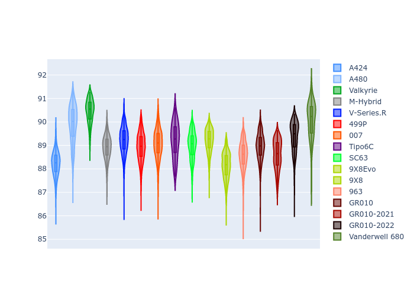

# Combined Plots

## Metadata

- BoP Accuracy: 91.68%
- Overall BoP Grade: A2
- Track: INTERLAGOS
- Threshhold: 210.0kph
- Average Laptime: 1:29.11
- Average Quali Laptime: 1:25.30
- Average Topspeed: 282.54kph

## BoP Table
| Manufacturer     | Car            | Weight   | Power   | PINC   | E/Stint   | FDS    | RDP    | QDP    | TDP    |
|:-----------------|:---------------|:---------|:--------|:-------|:----------|:-------|:-------|:-------|:-------|
| Alpine           | A424           | 1047kg   | 520.0kw | -      | 917MJ     | -      | 51.64% | 59.31% | 26.80% |
| Alpine           | A480           | 952kg    | 432.0kw | -      | 766MJ     | -      | 53.05% | 74.07% | 48.97% |
| Aston Martin     | Valkyrie       | 1042kg   | 504.0kw | +0.40% | 899MJ     | -      | 53.50% | 53.33% | 21.51% |
| BMW              | M-Hybrid       | 1041kg   | 512.0kw | -      | 908MJ     | -      | 52.89% | 56.22% | 33.41% |
| Cadillac         | V-Series.R     | 1034kg   | 510.0kw | -      | 902MJ     | -      | 48.63% | 60.80% | 19.01% |
| Ferrari          | 499P           | 1063kg   | 508.0kw | -      | 905MJ     | 190kph | 51.38% | 44.98% | 9.83%  |
| Glickenhaus      | 007            | 1030kg   | 520.0kw | -      | 910MJ     | -      | 46.15% | 49.30% | 41.45% |
| Isotta Fraschini | Tipo6C         | 1059kg   | 520.0kw | -      | 917MJ     | 190kph | 43.95% | 47.22% | 31.53% |
| Lamborghini      | SC63           | 1042kg   | 519.0kw | -      | 912MJ     | -      | 48.33% | 60.95% | 28.65% |
| Peugeot          | 9X8Evo         | 1050kg   | 510.0kw | -      | 909MJ     | 190kph | 48.87% | 52.78% | 15.41% |
| Peugeot          | 9X8            | 1030kg   | 520.0kw | -      | 904MJ     | 150kph | 54.54% | 58.39% | 9.69%  |
| Porsche          | 963            | 1047kg   | 516.0kw | -      | 911MJ     | -      | 50.70% | 44.30% | 29.51% |
| Toyota           | GR010          | 1080kg   | 512.0kw | -      | 912MJ     | 190kph | 51.09% | 52.71% | 11.46% |
| Toyota           | GR010-2021     | 1065kg   | 513.0kw | -      | 906MJ     | 150kph | 54.08% | 54.81% | 9.72%  |
| Toyota           | GR010-2022     | 1080kg   | 512.0kw | -      | 904MJ     | 190kph | 53.45% | 68.83% | 9.58%  |
| Vanwall          | Vanderwell 680 | 1030kg   | 520.0kw | -      | 908MJ     | -      | 49.68% | 60.93% | 34.43% |

## Performance Table
| Manufacturer     | Car            | RP      | QP      | Vavg      |   RDLC | BOP-Grade   | Match   |
|:-----------------|:---------------|:--------|:--------|:----------|-------:|:------------|:--------|
| Alpine           | A424           | 1:28.22 | 1:24.17 | 283.08kph |   1.05 | ~A1         | 99.79%  |
| Alpine           | A480           | 1:29.90 | 1:26.91 | 279.06kph |   1.03 | +C2         | 70.99%  |
| Aston Martin     | Valkyrie       | 1:30.46 | 1:25.85 | 280.19kph |   1.05 | +Ω1         | 41.44%  |
| BMW              | M-Hybrid       | 1:28.91 | 1:24.51 | 281.53kph |   1.05 | ~A1         | 100.00% |
| Cadillac         | V-Series.R     | 1:29.21 | 1:24.83 | 279.50kph |   1.05 | ~A1         | 99.38%  |
| Ferrari          | 499P           | 1:28.93 | 1:24.50 | 283.73kph |   1.05 | ~A1         | 99.94%  |
| Glickenhaus      | 007            | 1:29.06 | 1:25.91 | 284.35kph |   1.04 | ~A1         | 99.02%  |
| Isotta Fraschini | Tipo6C         | 1:29.20 | 1:26.86 | 282.42kph |   1.03 | ~A1         | 97.01%  |
| Lamborghini      | SC63           | 1:29.00 | 1:25.41 | 281.78kph |   1.04 | ~A1         | 100.00% |
| Peugeot          | 9X8Evo         | 1:29.21 | 1:24.99 | 282.39kph |   1.05 | ~A1         | 100.00% |
| Peugeot          | 9X8            | 1:28.14 | 1:24.53 | 282.77kph |   1.04 | ~A1         | 99.67%  |
| Porsche          | 963            | 1:28.58 | 1:24.52 | 284.21kph |   1.05 | ~A1         | 99.53%  |
| Toyota           | GR010          | 1:28.95 | 1:24.40 | 283.59kph |   1.05 | ~A1         | 99.76%  |
| Toyota           | GR010-2021     | 1:28.60 | 1:24.85 | 286.72kph |   1.04 | ~A1         | 100.00% |
| Toyota           | GR010-2022     | 1:29.37 | 1:26.45 | 286.04kph |   1.03 | ~A1         | 99.75%  |
| Vanwall          | Vanderwell 680 | 1:30.06 | 1:26.09 | 279.34kph |   1.05 | +D2         | 60.66%  |

## Race Laptimes

## Quali Laptimes

## Topspeeds

## Laptimes Lineplot

