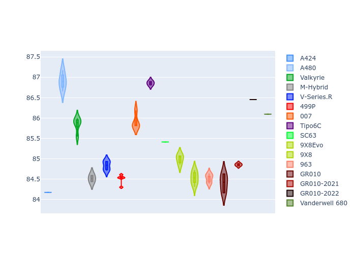
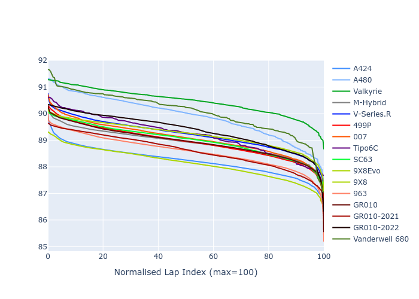

# Combined Plots

## Metadata

- BoP Accuracy: 90.83%
- Overall BoP Grade: A2
- Track: INTERLAGOS
- Threshhold: 210.0kph

## BoP Table
| Manufacturer     | Car            | Weight   | Power   | PINC   | E/Stint   | FDS    |
|:-----------------|:---------------|:---------|:--------|:-------|:----------|:-------|
| Alpine           | A424           | 1047kg   | 520.0kw | -      | 917MJ     | -      |
| Alpine           | A480           | 1052kg   | 432.0kw | -      | 766MJ     | -      |
| Aston Martin     | Valkyrie       | 1042kg   | 504.0kw | +0.40% | 899MJ     | -      |
| BMW              | M-Hybrid       | 1041kg   | 512.0kw | -      | 908MJ     | -      |
| Cadillac         | V-Series.R     | 1034kg   | 510.0kw | -      | 902MJ     | -      |
| Ferrari          | 499P           | 1063kg   | 508.0kw | -      | 905MJ     | 190kph |
| Glickenhaus      | 007            | 1030kg   | 520.0kw | -      | 910MJ     | -      |
| Isotta Fraschini | Tipo6C         | 1059kg   | 520.0kw | -      | 917MJ     | 190kph |
| Lamborghini      | SC63           | 1042kg   | 519.0kw | -      | 912MJ     | -      |
| Peugeot          | 9X8Evo         | 1050kg   | 510.0kw | -      | 909MJ     | 190kph |
| Peugeot          | 9X8            | 1030kg   | 520.0kw | -      | 904MJ     | 150kph |
| Porsche          | 963            | 1047kg   | 516.0kw | -      | 911MJ     | -      |
| Toyota           | GR010          | 1080kg   | 512.0kw | -      | 913MJ     | 190kph |
| Toyota           | GR010OLD       | 1065kg   | 513.0kw | -      | 960MJ     | 150kph |
| Vanwall          | Vanderwell 680 | 1030kg   | 520.0kw | -      | 903MJ     | -      |

## Performance Table
| Manufacturer     | Car            | RP      | QP      | Vavg      |   RDLC | BOP-Grade   | Match   |
|:-----------------|:---------------|:--------|:--------|:----------|-------:|:------------|:--------|
| Alpine           | A424           | 1:25.79 | 1:22.69 | 281.51kph |   1.04 | -A2         | 91.48%  |
| Alpine           | A480           | 1:27.81 | 1:25.47 | 271.11kph |   1.03 | -C1         | 76.05%  |
| Aston Martin     | Valkyrie       | 1:28.21 | 1:24.35 | 278.20kph |   1.05 | +C2         | 72.73%  |
| BMW              | M-Hybrid       | 1:26.74 | 1:23.31 | 279.51kph |   1.04 | ~A1         | 99.96%  |
| Cadillac         | V-Series.R     | 1:27.25 | 1:23.85 | 276.69kph |   1.04 | ~A1         | 99.50%  |
| Ferrari          | 499P           | 1:26.75 | 1:23.26 | 280.02kph |   1.04 | ~A1         | 99.83%  |
| Glickenhaus      | 007            | 1:26.93 | 1:24.39 | 278.46kph |   1.03 | ~A1         | 98.45%  |
| Isotta Fraschini | Tipo6C         | 1:27.43 | 1:25.68 | 278.27kph |   1.02 | ~A1         | 96.27%  |
| Lamborghini      | SC63           | 1:26.97 | 1:24.22 | 279.72kph |   1.03 | ~A1         | 99.76%  |
| Peugeot          | 9X8Evo         | 1:27.26 | 1:23.81 | 281.00kph |   1.04 | ~A1         | 97.07%  |
| Peugeot          | 9X8            | 1:26.82 | 1:23.70 | 274.93kph |   1.04 | ~A1         | 99.96%  |
| Porsche          | 963            | 1:26.27 | 1:22.93 | 279.88kph |   1.04 | ~A1         | 98.89%  |
| Toyota           | GR010          | 1:26.38 | 1:22.83 | 279.69kph |   1.04 | ~A1         | 98.66%  |
| Toyota           | GR010OLD       | 1:25.82 | 1:23.32 | 276.04kph |   1.03 | -A2         | 91.74%  |
| Vanwall          | Vanderwell 680 | 1:28.60 | 1:24.88 | 272.98kph |   1.04 | +Ω1         | 42.11%  |

## Race Laptimes

## Quali Laptimes

## Topspeeds

## Laptimes Lineplot

