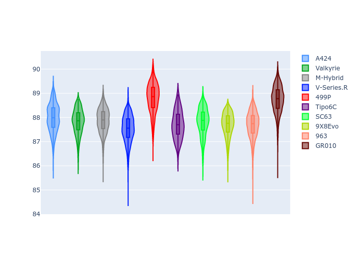
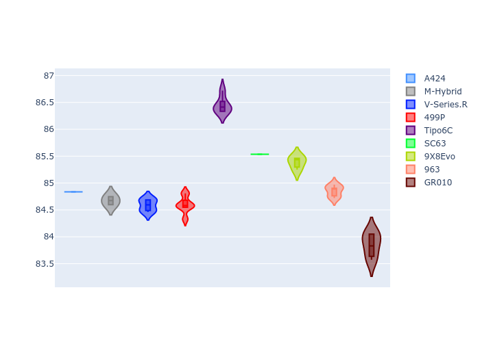
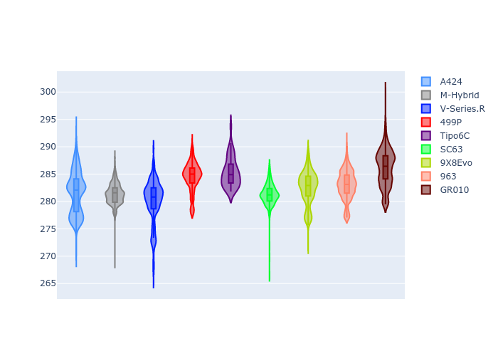
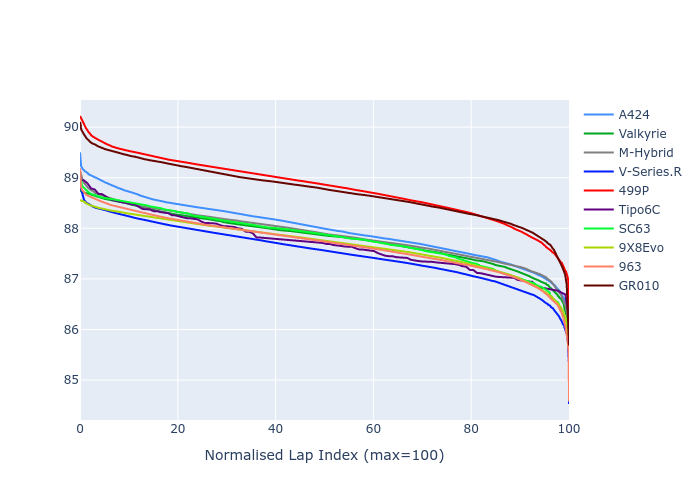

# Combined Plots

## Metadata

- BoP Accuracy: 99.53%
- Overall BoP Grade: A1
- Track: INTERLAGOS
- Threshhold: 250.0kph
- Average Laptime: 1:28.63
- Average Quali Laptime: 1:24.71
- Laptime Std Dev: 0.25 seconds
- Filtered Average Topspeed: 282.85kph

## BoP Table
| Manufacturer     | Car        | Weight   | Power   | PINC   | E/Stint   | FDS    | RDP    | QDP    | TDP    |
|:-----------------|:-----------|:---------|:--------|:-------|:----------|:-------|:-------|:-------|:-------|
| Alpine           | A424       | 1044kg   | 516.0kw | -1.30% | 910MJ     | -      | 51.38% | 57.54% | 26.10% |
| BMW              | M-Hybrid   | 1044kg   | 512.0kw | -      | 908MJ     | -      | 52.62% | 53.36% | 32.99% |
| Cadillac         | V-Series.R | 1039kg   | 519.0kw | -1.50% | 907MJ     | -      | 48.29% | 59.47% | 18.65% |
| Ferrari          | 499P       | 1060kg   | 503.0kw | +1.80% | 905MJ     | 190kph | 51.25% | 43.28% | 10.17% |
| Isotta Fraschini | Tipo6C     | 1030kg   | 520.0kw | -      | 914MJ     | 190kph | 43.95% | 47.22% | 31.53% |
| Lamborghini      | SC63       | 1039kg   | 519.0kw | -1.00% | 909MJ     | -      | 48.33% | 60.95% | 28.65% |
| Peugeot          | 9X8Evo     | 1051kg   | 510.0kw | -      | 909MJ     | 190kph | 48.70% | 50.83% | 18.68% |
| Porsche          | 963        | 1051kg   | 512.0kw | -      | 908MJ     | -      | 50.57% | 42.80% | 29.05% |
| Toyota           | GR010      | 1060kg   | 506.0kw | +2.80% | 912MJ     | 190kph | 51.03% | 51.78% | 14.64% |

## Performance Table
| Manufacturer     | Car        | RP      | QP      | Vavg      |   RDLC | BOP-Grade   | Match   |
|:-----------------|:-----------|:--------|:--------|:----------|-------:|:------------|:--------|
| Alpine           | A424       | 1:28.41 | 1:24.50 | 281.58kph |   1.05 | ~A1         | 99.76%  |
| BMW              | M-Hybrid   | 1:28.58 | 1:24.38 | 281.37kph |   1.05 | ~A1         | 100.00% |
| Cadillac         | V-Series.R | 1:28.60 | 1:24.37 | 279.90kph |   1.05 | ~A1         | 99.77%  |
| Ferrari          | 499P       | 1:28.53 | 1:24.09 | 284.46kph |   1.05 | ~A1         | 99.97%  |
| Isotta Fraschini | Tipo6C     | 1:28.69 | 1:26.42 | 285.28kph |   1.03 | ~A1         | 97.76%  |
| Lamborghini      | SC63       | 1:28.98 | 1:25.43 | 281.26kph |   1.04 | ~A1         | 99.04%  |
| Peugeot          | 9X8Evo     | 1:29.05 | 1:25.02 | 282.30kph |   1.05 | ~A1         | 100.00% |
| Porsche          | 963        | 1:28.63 | 1:24.39 | 283.09kph |   1.05 | ~A1         | 99.89%  |
| Toyota           | GR010      | 1:28.18 | 1:23.75 | 286.37kph |   1.05 | ~A1         | 99.55%  |

## Race Laptimes

## Quali Laptimes

## Topspeeds

## Laptimes Lineplot

