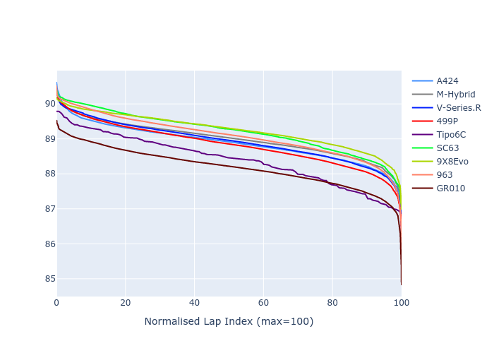

# Combined Plots

## Metadata

- BoP Accuracy: 99.67%
- Overall BoP Grade: A1
- Track: INTERLAGOS
- Threshhold: 250.0kph
- Average Laptime: 1:28.86
- Average Quali Laptime: 1:24.86
- Average Topspeed: 282.80kph

## BoP Table
| Manufacturer     | Car        | Weight   | Power   | PINC   | E/Stint   | FDS    | RDP    | QDP    | TDP    |
|:-----------------|:-----------|:---------|:--------|:-------|:----------|:-------|:-------|:-------|:-------|
| Alpine           | A424       | 1044kg   | 516.0kw | -1.30% | 910MJ     | -      | 51.64% | 59.31% | 26.80% |
| BMW              | M-Hybrid   | 1044kg   | 512.0kw | -      | 908MJ     | -      | 52.89% | 56.22% | 33.41% |
| Cadillac         | V-Series.R | 1039kg   | 519.0kw | -1.50% | 907MJ     | -      | 48.63% | 60.80% | 19.01% |
| Ferrari          | 499P       | 1060kg   | 503.0kw | +1.80% | 905MJ     | 190kph | 51.38% | 44.98% | 9.83%  |
| Isotta Fraschini | Tipo6C     | 1030kg   | 520.0kw | -      | 914MJ     | 190kph | 43.95% | 47.22% | 31.53% |
| Lamborghini      | SC63       | 1039kg   | 519.0kw | -1.00% | 909MJ     | -      | 48.33% | 60.95% | 28.65% |
| Peugeot          | 9X8Evo     | 1051kg   | 510.0kw | -      | 909MJ     | 190kph | 48.87% | 52.78% | 15.41% |
| Porsche          | 963        | 1051kg   | 512.0kw | -      | 908MJ     | -      | 50.70% | 44.30% | 29.51% |
| Toyota           | GR010      | 1060kg   | 506.0kw | +2.80% | 912MJ     | 190kph | 51.09% | 52.71% | 11.46% |

## Performance Table
| Manufacturer     | Car        | RP      | QP      | Vavg      |   RDLC | BOP-Grade   | Match   |
|:-----------------|:-----------|:--------|:--------|:----------|-------:|:------------|:--------|
| Alpine           | A424       | 1:28.87 | 1:24.78 | 281.52kph |   1.05 | ~A1         | 99.08%  |
| BMW              | M-Hybrid   | 1:29.00 | 1:24.59 | 281.24kph |   1.05 | ~A1         | 99.59%  |
| Cadillac         | V-Series.R | 1:28.92 | 1:24.56 | 279.58kph |   1.05 | ~A1         | 99.63%  |
| Ferrari          | 499P       | 1:28.82 | 1:24.40 | 284.45kph |   1.05 | ~A1         | 99.98%  |
| Isotta Fraschini | Tipo6C     | 1:28.38 | 1:26.07 | 285.28kph |   1.03 | ~A1         | 100.00% |
| Lamborghini      | SC63       | 1:29.21 | 1:25.61 | 281.26kph |   1.04 | ~A1         | 99.52%  |
| Peugeot          | 9X8Evo     | 1:29.24 | 1:25.02 | 282.29kph |   1.05 | ~A1         | 100.00% |
| Porsche          | 963        | 1:29.08 | 1:24.98 | 283.02kph |   1.05 | ~A1         | 99.61%  |
| Toyota           | GR010      | 1:28.19 | 1:23.71 | 286.57kph |   1.05 | ~A1         | 99.62%  |

## Race Laptimes

## Quali Laptimes

## Topspeeds

## Laptimes Lineplot

