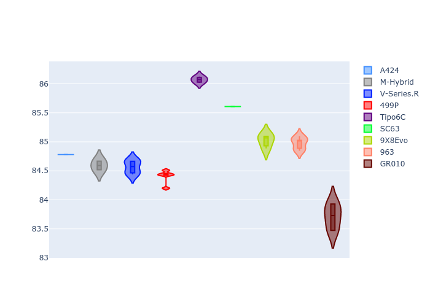

# Combined Plots

## Metadata

- BoP Accuracy: 98.17%
- Overall BoP Grade: A1
- Track: INTERLAGOS
- Threshhold: 250.0kph

## BoP Table
| Manufacturer     | Car        | Weight   | Power   | PINC   | E/Stint   | FDS    | RDP    | QDP    | TDP    |
|:-----------------|:-----------|:---------|:--------|:-------|:----------|:-------|:-------|:-------|:-------|
| Alpine           | A424       | 1044kg   | 516.0kw | -1.30% | 910MJ     | -      | 52.35% | 61.85% | 27.84% |
| BMW              | M-Hybrid   | 1044kg   | 512.0kw | -      | 908MJ     | -      | 53.26% | 57.23% | 34.54% |
| Cadillac         | V-Series.R | 1039kg   | 519.0kw | -1.50% | 907MJ     | -      | 47.80% | 56.73% | 19.63% |
| Ferrari          | 499P       | 1060kg   | 503.0kw | +1.80% | 905MJ     | 190kph | 53.02% | 42.32% | 9.88%  |
| Isotta Fraschini | Tipo6C     | 1030kg   | 520.0kw | -      | 914MJ     | 190kph | 43.95% | 47.22% | 31.53% |
| Lamborghini      | SC63       | 1039kg   | 519.0kw | -1.00% | 909MJ     | -      | 46.33% | 59.50% | 29.33% |
| Peugeot          | 9X8Evo     | 1051kg   | 510.0kw | -      | 909MJ     | 190kph | 48.47% | 51.26% | 16.02% |
| Porsche          | 963        | 1051kg   | 512.0kw | -      | 908MJ     | -      | 50.87% | 45.25% | 30.77% |
| Toyota           | GR010      | 1060kg   | 506.0kw | +2.80% | 912MJ     | 190kph | 52.43% | 57.12% | 12.82% |

## Performance Table
| Manufacturer     | Car        | RP      | QP      | Vavg      |   RDLC | BOP-Grade   | Match   |
|:-----------------|:-----------|:--------|:--------|:----------|-------:|:------------|:--------|
| Alpine           | A424       | 1:26.62 | 1:23.35 | 279.80kph |   1.04 | ~A1         | 99.75%  |
| BMW              | M-Hybrid   | 1:26.72 | 1:23.15 | 279.17kph |   1.04 | ~A1         | 99.82%  |
| Cadillac         | V-Series.R | 1:26.69 | 1:23.15 | 276.57kph |   1.04 | ~A1         | 99.85%  |
| Ferrari          | 499P       | 1:26.70 | 1:22.75 | 280.64kph |   1.05 | ~A1         | 99.71%  |
| Isotta Fraschini | Tipo6C     | 1:27.44 | 1:25.77 | 281.08kph |   1.02 | +A2         | 91.04%  |
| Lamborghini      | SC63       | 1:27.37 | 1:24.55 | 279.23kph |   1.03 | ~A1         | 98.55%  |
| Peugeot          | 9X8Evo     | 1:27.35 | 1:23.88 | 280.91kph |   1.04 | ~A1         | 97.03%  |
| Porsche          | 963        | 1:26.86 | 1:23.33 | 279.04kph |   1.04 | ~A1         | 99.83%  |
| Toyota           | GR010      | 1:26.26 | 1:22.26 | 282.98kph |   1.05 | ~A1         | 97.97%  |

## Race Laptimes

## Quali Laptimes

## Topspeeds

## Laptimes Lineplot

