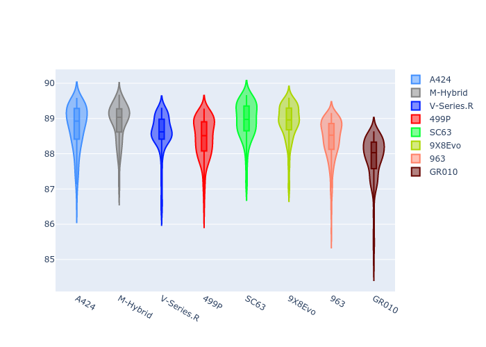
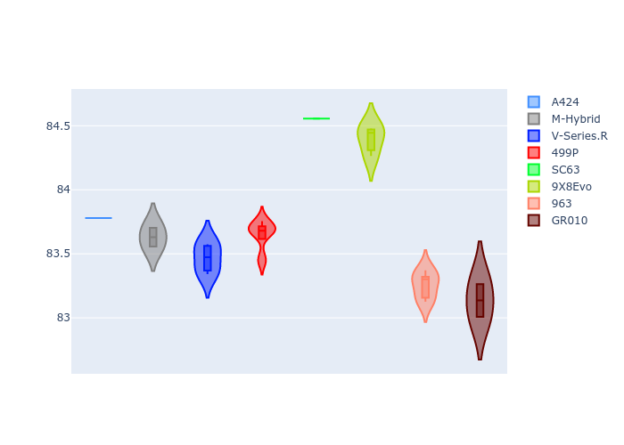
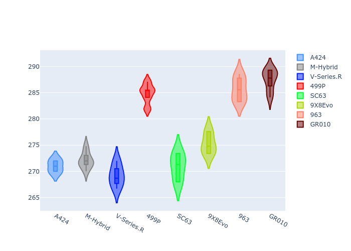
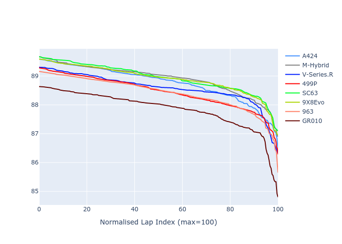

# Combined Plots

## Metadata

- BoP Accuracy: 89.81%
- Overall BoP Grade: B1
- Track: INTERLAGOS
- Threshhold: 250.0kph

## BoP Table
| Manufacturer   | Car        | Weight   | Power   | PINC   | E/Stint   | FDS    |
|:---------------|:-----------|:---------|:--------|:-------|:----------|:-------|
| Alpine         | A424       | 1044kg   | 516.0kw | -1.30% | 910MJ     | -      |
| BMW            | M-Hybrid   | 1044kg   | 512.0kw | -      | 908MJ     | -      |
| Cadillac       | V-Series.R | 1039kg   | 519.0kw | -1.50% | 907MJ     | -      |
| Ferrari        | 499P       | 1060kg   | 503.0kw | +1.80% | 905MJ     | 190kph |
| Lamborghini    | SC63       | 1039kg   | 519.0kw | -1.00% | 909MJ     | -      |
| Peugeot        | 9X8Evo     | 1051kg   | 510.0kw | -      | 909MJ     | 190kph |
| Porsche        | 963        | 1051kg   | 512.0kw | -      | 908MJ     | -      |
| Toyota         | GR010      | 1060kg   | 506.0kw | +2.80% | 912MJ     | 190kph |

## Performance Table
| Manufacturer   | Car        | RP      | QP      | Vavg      |   RDLC | BOP-Grade   | Match   |
|:---------------|:-----------|:--------|:--------|:----------|-------:|:------------|:--------|
| Alpine         | A424       | 1:28.77 | 1:23.79 | 271.00kph |   1.06 | +B2         | 83.56%  |
| BMW            | M-Hybrid   | 1:28.90 | 1:23.64 | 272.11kph |   1.06 | +B2         | 83.27%  |
| Cadillac       | V-Series.R | 1:28.58 | 1:23.47 | 269.20kph |   1.06 | ~A1         | 99.19%  |
| Ferrari        | 499P       | 1:28.45 | 1:23.61 | 284.82kph |   1.06 | ~A1         | 99.73%  |
| Lamborghini    | SC63       | 1:28.93 | 1:24.57 | 270.90kph |   1.05 | +C1         | 76.09%  |
| Peugeot        | 9X8Evo     | 1:28.90 | 1:24.43 | 275.27kph |   1.05 | +B2         | 81.82%  |
| Porsche        | 963        | 1:28.41 | 1:23.25 | 285.68kph |   1.06 | ~A1         | 99.34%  |
| Toyota         | GR010      | 1:27.85 | 1:23.09 | 287.48kph |   1.06 | ~A1         | 95.45%  |

## Race Laptimes

## Quali Laptimes

## Topspeeds

## Laptimes Lineplot

