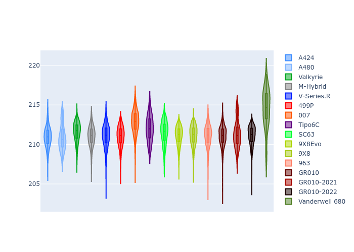
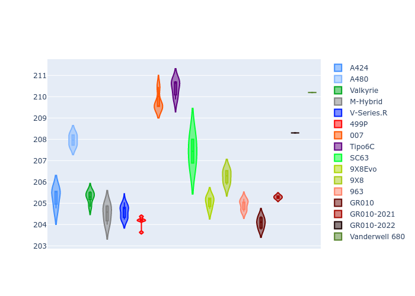
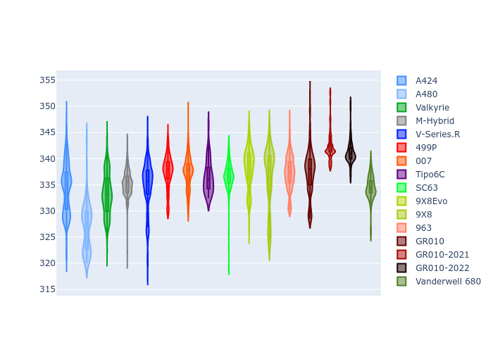
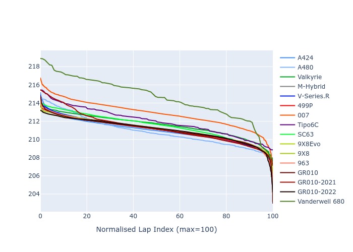

# Combined Plots

## Metadata

- BoP Accuracy: 96.13%
- Overall BoP Grade: A1
- Track: LEMANS
- Threshhold: 250.0kph
- Average Laptime: 3:32.31
- Average Quali Laptime: 3:28.39
- Laptime Std Dev: 0.93 seconds
- Filtered Average Topspeed: 336.24kph

## BoP Table
| Manufacturer     | Car            | Weight   | Power   | PINC   | E/Stint   | FDS    | RDP    | QDP    | TDP    |
|:-----------------|:---------------|:---------|:--------|:-------|:----------|:-------|:-------|:-------|:-------|
| Alpine           | A424           | 1066kg   | 511.0kw | +0.10% | 898MJ     | -      | 52.20% | 54.51% | 24.58% |
| Alpine           | A480           | 988kg    | 422.0kw | +0.10% | 761MJ     | -      | 53.05% | 74.07% | 48.97% |
| Aston Martin     | Valkyrie       | 1033kg   | 503.0kw | -      | 897MJ     | -      | 53.39% | 54.11% | 23.71% |
| BMW              | M-Hybrid       | 1060kg   | 513.0kw | +0.10% | 921MJ     | -      | 53.47% | 52.95% | 33.73% |
| Cadillac         | V-Series.R     | 1057kg   | 519.0kw | -      | 910MJ     | -      | 49.22% | 60.31% | 18.04% |
| Ferrari          | 499P           | 1072kg   | 503.0kw | -0.10% | 893MJ     | 190kph | 51.56% | 44.72% | 9.86%  |
| Glickenhaus      | 007            | 1034kg   | 509.0kw | -      | 904MJ     | -      | 46.14% | 49.30% | 41.45% |
| Isotta Fraschini | Tipo6C         | 1032kg   | 500.0kw | -      | 898MJ     | 190kph | 43.95% | 47.22% | 31.53% |
| Lamborghini      | SC63           | 1050kg   | 520.0kw | +0.10% | 909MJ     | -      | 48.25% | 60.95% | 28.65% |
| Peugeot          | 9X8Evo         | 1062kg   | 518.0kw | -0.10% | 903MJ     | 190kph | 50.17% | 49.36% | 17.73% |
| Peugeot          | 9X8            | 1056kg   | 524.0kw | -      | 917MJ     | 150kph | 54.54% | 58.39% | 9.69%  |
| Porsche          | 963            | 1066kg   | 511.0kw | +0.10% | 917MJ     | -      | 50.78% | 41.25% | 27.61% |
| Toyota           | GR010          | 1081kg   | 502.0kw | +0.10% | 903MJ     | 190kph | 51.68% | 51.25% | 14.48% |
| Toyota           | GR010-2021     | 1065kg   | 509.0kw | -0.10% | 956MJ     | 150kph | 54.04% | 54.81% | 9.72%  |
| Toyota           | GR010-2022     | 1070kg   | 503.0kw | -0.10% | 895MJ     | 190kph | 53.24% | 64.49% | 9.72%  |
| Vanwall          | Vanderwell 680 | 1030kg   | 520.0kw | -      | 908MJ     | -      | 49.68% | 60.93% | 34.43% |

## Performance Table
| Manufacturer     | Car            | RP      | QP      | Vavg      |   RDLC | BOP-Grade   | Match   |
|:-----------------|:---------------|:--------|:--------|:----------|-------:|:------------|:--------|
| Alpine           | A424           | 3:32.19 | 3:27.35 | 334.40kph |   1.02 | ~A1         | 99.94%  |
| Alpine           | A480           | 3:33.23 | 3:32.63 | 326.94kph |   1    | -B1         | 88.89%  |
| Aston Martin     | Valkyrie       | 3:33.23 | 3:28.37 | 333.22kph |   1.02 | ~A1         | 99.93%  |
| BMW              | M-Hybrid       | 3:31.79 | 3:26.45 | 335.28kph |   1.03 | ~A1         | 99.98%  |
| Cadillac         | V-Series.R     | 3:31.52 | 3:26.23 | 334.87kph |   1.03 | ~A1         | 99.95%  |
| Ferrari          | 499P           | 3:31.70 | 3:26.27 | 337.50kph |   1.03 | ~A1         | 99.99%  |
| Glickenhaus      | 007            | 3:33.22 | 3:30.63 | 337.35kph |   1.01 | -A2         | 94.20%  |
| Isotta Fraschini | Tipo6C         | 3:33.23 | 3:32.61 | 336.50kph |   1    | +A2         | 94.78%  |
| Lamborghini      | SC63           | 3:31.95 | 3:28.49 | 336.75kph |   1.02 | ~A1         | 100.00% |
| Peugeot          | 9X8Evo         | 3:31.99 | 3:27.06 | 338.19kph |   1.02 | ~A1         | 100.00% |
| Peugeot          | 9X8            | 3:31.78 | 3:27.81 | 336.44kph |   1.02 | ~A1         | 99.98%  |
| Porsche          | 963            | 3:31.97 | 3:26.82 | 337.25kph |   1.02 | ~A1         | 99.94%  |
| Toyota           | GR010          | 3:32.22 | 3:26.54 | 337.25kph |   1.03 | ~A1         | 99.85%  |
| Toyota           | GR010-2021     | 3:30.48 | 3:26.38 | 342.23kph |   1.02 | ~A1         | 100.00% |
| Toyota           | GR010-2022     | 3:31.95 | 3:30.41 | 341.17kph |   1.01 | ~A1         | 99.48%  |
| Vanwall          | Vanderwell 680 | 3:34.58 | 3:30.14 | 334.45kph |   1.02 | +D2         | 61.14%  |

## Race Laptimes

## Quali Laptimes

## Topspeeds

## Laptimes Lineplot

