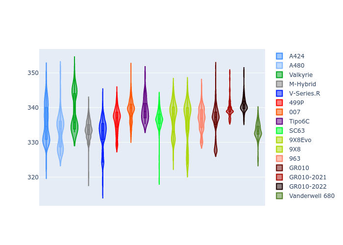

# Combined Plots

## Metadata

- BoP Accuracy: 91.37%
- Overall BoP Grade: A2
- Track: LEMANS
- Threshhold: 250.0kph

## BoP Table
| Manufacturer     | Car            | Weight   | Power   | PINC   | E/Stint   | FDS    | RDP    | QDP    | TDP    |
|:-----------------|:---------------|:---------|:--------|:-------|:----------|:-------|:-------|:-------|:-------|
| Alpine           | A424           | 1067kg   | 520.0kw | -0.10% | 916MJ     | -      | 52.35% | 61.85% | 27.84% |
| Alpine           | A480           | 952kg    | 432.0kw | +0.10% | 767MJ     | -      | 54.51% | 76.19% | 54.04% |
| Aston Martin     | Valkyrie       | 1042kg   | 504.0kw | +0.10% | 898MJ     | -      | 53.59% | 53.33% | 21.51% |
| BMW              | M-Hybrid       | 1061kg   | 512.0kw | -0.10% | 908MJ     | -      | 53.26% | 57.23% | 34.54% |
| Cadillac         | V-Series.R     | 1054kg   | 510.0kw | +0.10% | 903MJ     | -      | 47.80% | 56.73% | 19.63% |
| Ferrari          | 499P           | 1083kg   | 508.0kw | -0.10% | 896MJ     | 190kph | 53.02% | 42.32% | 9.88%  |
| Glickenhaus      | 007            | 1050kg   | 520.0kw | -      | 915MJ     | -      | 46.49% | 46.07% | 47.78% |
| Isotta Fraschini | Tipo6C         | 1059kg   | 520.0kw | -      | 919MJ     | 190kph | 43.95% | 47.22% | 31.53% |
| Lamborghini      | SC63           | 1056kg   | 519.0kw | -0.10% | 908MJ     | -      | 46.33% | 59.50% | 29.33% |
| Peugeot          | 9X8Evo         | 1070kg   | 510.0kw | -0.10% | 900MJ     | 190kph | 48.47% | 51.26% | 16.02% |
| Peugeot          | 9X8            | 1050kg   | 520.0kw | -      | 912MJ     | 150kph | 54.07% | 57.08% | 10.80% |
| Porsche          | 963            | 1067kg   | 516.0kw | -0.10% | 911MJ     | -      | 50.87% | 45.25% | 30.77% |
| Toyota           | GR010          | 1100kg   | 512.0kw | -0.10% | 913MJ     | 190kph | 52.43% | 57.12% | 12.82% |
| Toyota           | GR010-2021     | 1085kg   | 513.0kw | +0.10% | 962MJ     | 150kph | 54.09% | 52.67% | 26.37% |
| Toyota           | GR010-2022     | 1100kg   | 512.0kw | +0.10% | 907MJ     | 190kph | 53.48% | 69.44% | 7.86%  |
| Vanwall          | Vanderwell 680 | 1030kg   | 520.0kw | -      | 908MJ     | -      | 53.41% | 56.28% | 29.85% |

## Performance Table
| Manufacturer     | Car            | RP      | QP      | Vavg      |   RDLC | BOP-Grade   | Match   |
|:-----------------|:---------------|:--------|:--------|:----------|-------:|:------------|:--------|
| Alpine           | A424           | 3:28.89 | 3:23.97 | 333.30kph |   1.02 | ~A1         | 99.68%  |
| Alpine           | A480           | 3:26.11 | 3:23.19 | 325.50kph |   1.01 | -C2         | 73.61%  |
| Aston Martin     | Valkyrie       | 3:31.15 | 3:24.91 | 331.67kph |   1.03 | ~A1         | 97.81%  |
| BMW              | M-Hybrid       | 3:29.62 | 3:23.94 | 331.09kph |   1.03 | ~A1         | 100.00% |
| Cadillac         | V-Series.R     | 3:30.13 | 3:24.48 | 327.69kph |   1.03 | ~A1         | 99.57%  |
| Ferrari          | 499P           | 3:28.04 | 3:21.52 | 331.72kph |   1.03 | ~A1         | 97.20%  |
| Glickenhaus      | 007            | 3:30.93 | 3:27.75 | 329.96kph |   1.02 | +B1         | 88.26%  |
| Isotta Fraschini | Tipo6C         | 3:31.17 | 3:30.17 | 332.03kph |   1    | +B1         | 85.07%  |
| Lamborghini      | SC63           | 3:31.17 | 3:27.35 | 332.08kph |   1.02 | +A2         | 92.76%  |
| Peugeot          | 9X8Evo         | 3:29.75 | 3:24.40 | 332.93kph |   1.03 | ~A1         | 99.16%  |
| Peugeot          | 9X8            | 3:28.91 | 3:23.70 | 324.22kph |   1.03 | ~A1         | 99.38%  |
| Porsche          | 963            | 3:29.36 | 3:23.82 | 331.99kph |   1.03 | ~A1         | 99.81%  |
| Toyota           | GR010          | 3:28.00 | 3:21.27 | 331.91kph |   1.03 | ~A1         | 97.75%  |
| Toyota           | GR010-2021     | 3:28.40 | 3:23.59 | 323.48kph |   1.02 | ~A1         | 99.19%  |
| Toyota           | GR010-2022     | 3:28.15 | 3:24.88 | 329.59kph |   1.02 | ~A1         | 99.71%  |
| Vanwall          | Vanderwell 680 | 3:33.99 | 3:28.09 | 325.73kph |   1.03 | +Ω1         | 32.89%  |

## Race Laptimes

## Quali Laptimes

## Topspeeds

## Laptimes Lineplot

