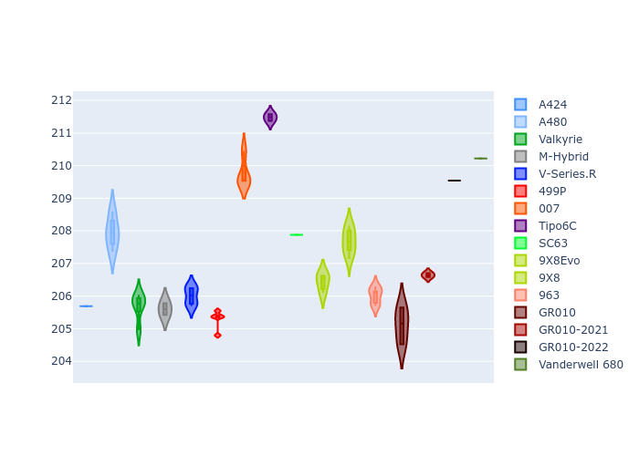
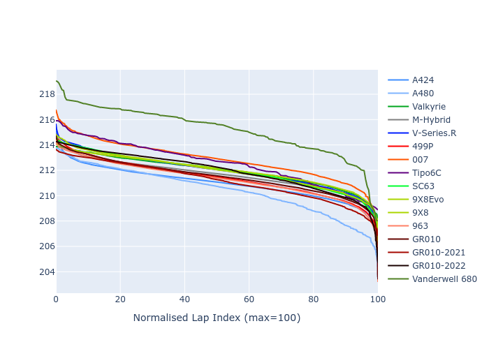

# Combined Plots

## Metadata

- BoP Accuracy: 95.42%
- Overall BoP Grade: A1
- Track: LEMANS
- Threshhold: 250.0kph
- Average Laptime: 3:31.92
- Average Quali Laptime: 3:27.31
- Average Topspeed: 336.57kph

## BoP Table
| Manufacturer     | Car            | Weight   | Power   | PINC   | E/Stint   | FDS    | RDP    | QDP    | TDP    |
|:-----------------|:---------------|:---------|:--------|:-------|:----------|:-------|:-------|:-------|:-------|
| Alpine           | A424           | 1067kg   | 520.0kw | -      | 916MJ     | -      | 51.64% | 59.31% | 26.80% |
| Alpine           | A480           | 952kg    | 432.0kw | +0.10% | 767MJ     | -      | 53.05% | 74.07% | 48.97% |
| Aston Martin     | Valkyrie       | 1033kg   | 520.0kw | -      | 911MJ     | -      | 53.50% | 53.33% | 21.51% |
| BMW              | M-Hybrid       | 1061kg   | 512.0kw | +0.10% | 909MJ     | -      | 52.89% | 56.22% | 33.41% |
| Cadillac         | V-Series.R     | 1045kg   | 510.0kw | +0.10% | 902MJ     | -      | 48.63% | 60.80% | 19.01% |
| Ferrari          | 499P           | 1083kg   | 508.0kw | +0.10% | 896MJ     | 190kph | 51.38% | 44.98% | 9.83%  |
| Glickenhaus      | 007            | 1030kg   | 520.0kw | -      | 913MJ     | -      | 46.15% | 49.30% | 41.45% |
| Isotta Fraschini | Tipo6C         | 1039kg   | 520.0kw | -      | 917MJ     | 190kph | 43.95% | 47.22% | 31.53% |
| Lamborghini      | SC63           | 1035kg   | 518.0kw | -      | 905MJ     | -      | 48.33% | 60.95% | 28.65% |
| Peugeot          | 9X8Evo         | 1050kg   | 511.0kw | -      | 899MJ     | 190kph | 48.87% | 52.78% | 15.41% |
| Peugeot          | 9X8            | 1037kg   | 517.0kw | -      | 908MJ     | 150kph | 54.54% | 58.39% | 9.69%  |
| Porsche          | 963            | 1067kg   | 516.0kw | -0.10% | 911MJ     | -      | 50.70% | 44.30% | 29.51% |
| Toyota           | GR010          | 1100kg   | 512.0kw | +0.10% | 913MJ     | 190kph | 51.09% | 52.71% | 11.46% |
| Toyota           | GR010-2021     | 1085kg   | 513.0kw | -0.10% | 962MJ     | 150kph | 54.08% | 54.81% | 9.72%  |
| Toyota           | GR010-2022     | 1083kg   | 512.0kw | -0.10% | 904MJ     | 190kph | 53.45% | 68.83% | 9.58%  |
| Vanwall          | Vanderwell 680 | 1030kg   | 520.0kw | -      | 908MJ     | -      | 49.68% | 60.93% | 34.43% |

## Performance Table
| Manufacturer     | Car            | RP      | QP      | Vavg      |   RDLC | BOP-Grade   | Match   |
|:-----------------|:---------------|:--------|:--------|:----------|-------:|:------------|:--------|
| Alpine           | A424           | 3:30.97 | 3:25.69 | 335.46kph |   1.03 | ~A1         | 99.94%  |
| Alpine           | A480           | 3:30.43 | 3:27.95 | 333.06kph |   1.01 | ~A1         | 98.94%  |
| Aston Martin     | Valkyrie       | 3:31.96 | 3:25.68 | 338.82kph |   1.03 | ~A1         | 100.00% |
| BMW              | M-Hybrid       | 3:31.64 | 3:25.60 | 333.70kph |   1.03 | ~A1         | 100.00% |
| Cadillac         | V-Series.R     | 3:31.97 | 3:26.00 | 332.31kph |   1.03 | ~A1         | 99.53%  |
| Ferrari          | 499P           | 3:31.40 | 3:25.29 | 336.36kph |   1.03 | ~A1         | 99.94%  |
| Glickenhaus      | 007            | 3:32.82 | 3:29.76 | 339.30kph |   1.01 | -A2         | 94.00%  |
| Isotta Fraschini | Tipo6C         | 3:32.53 | 3:31.48 | 339.33kph |   1    | +A2         | 94.78%  |
| Lamborghini      | SC63           | 3:31.96 | 3:27.88 | 336.81kph |   1.02 | ~A1         | 100.00% |
| Peugeot          | 9X8Evo         | 3:32.02 | 3:26.43 | 337.19kph |   1.03 | ~A1         | 100.00% |
| Peugeot          | 9X8            | 3:31.95 | 3:27.69 | 335.88kph |   1.02 | ~A1         | 100.00% |
| Porsche          | 963            | 3:31.29 | 3:26.01 | 336.73kph |   1.03 | ~A1         | 99.82%  |
| Toyota           | GR010          | 3:31.49 | 3:25.11 | 336.23kph |   1.03 | ~A1         | 99.76%  |
| Toyota           | GR010-2021     | 3:31.15 | 3:26.64 | 339.74kph |   1.02 | ~A1         | 100.00% |
| Toyota           | GR010-2022     | 3:31.95 | 3:29.54 | 340.88kph |   1.01 | ~A1         | 99.66%  |
| Vanwall          | Vanderwell 680 | 3:35.20 | 3:30.22 | 333.32kph |   1.02 | +Ω1         | 40.28%  |

## Race Laptimes

## Quali Laptimes

## Topspeeds

## Laptimes Lineplot

