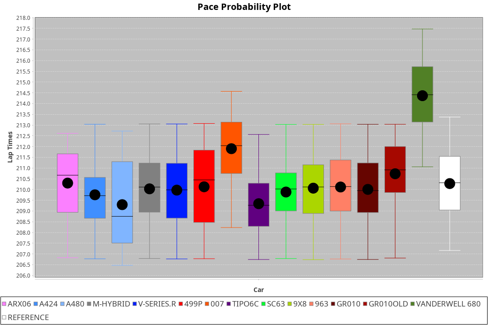
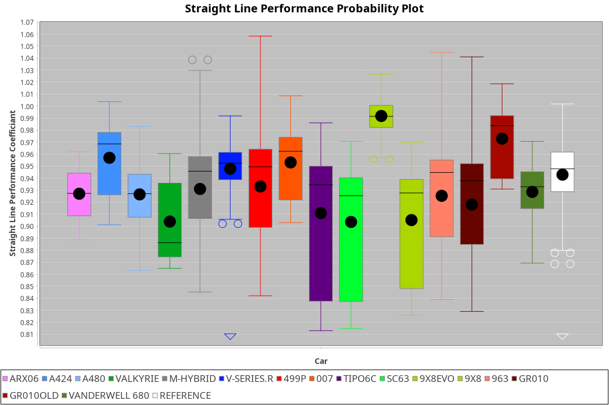
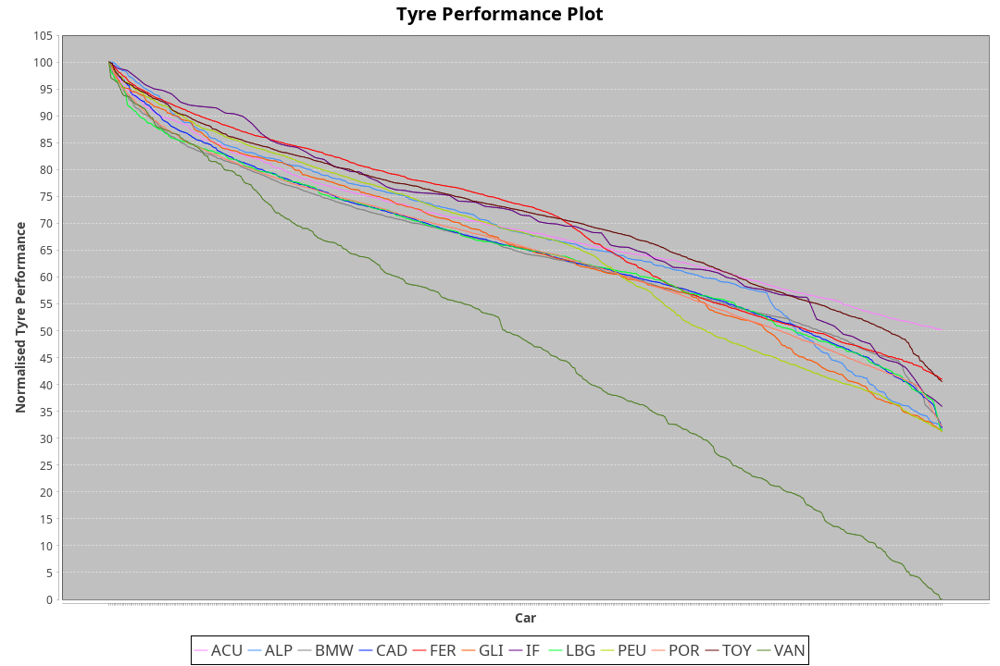

|Manufacturer|Car|Weight|Power|PINC|E/Stint|FDS|
|:-|:-|:-|:-|:-|:-|:-|
|Acura|ARX06|1070kg|513kw|-|912MJ|-|
|Alpine|A424|1062kg|513kw|-|911MJ|-|
|Alpine|A480|952kg|413kw|-|749MJ|-|
|BMW|M Hybrid V8 LMDh|1040kg|510kw|-|903MJ|-|
|Cadillac|V-Series.R|1032kg|504kw|-|892MJ|-|
|Ferrari|499P|1075kg|501kw|-|894MJ|190kph|
|Glickenhaus|007|1030kg|520kw|-|910MJ|-|
|Issotta Fraschini|Tipo6C|1030kg|520kw|-|916MJ|190kph|
|Lamborghini|SC63|1045kg|515kw|-|907MJ|-|
|Peugeot|9X8|1030kg|520kw|-|904MJ|150kph|
|Porsche|963|1048kg|511kw|-|898MJ|-|
|Toyota|GR010|1090kg|507kw|-|901MJ|190kph|
|Toyota|GR010OLD|1077kg|512kw|-|906MJ|190kph|
|Vanwall|Vanderwell 680|1030kg|520kw|-|903MJ|-|

### BoP Accuracy: 87.10%; Overall BoP Grade: B1
|Manufacturer|Car|Type|RP|QP|Weight|Power¹|Threshhold|PINC|Power²|E/Stint|AVG Vmax|FDS|RDLC|L/Stint|BOP-Grade|ModelAccuracy|ModelPoints|Match%|
|:-|:-|:-|:-|:-|:-|:-|:-|:-|:-|:-|:-|:-|:-|:-|:-|:-|:-|:-|
|Acura|ARX06|LMDH|3:31.58|3:23.24|1070kg|513kw|210.0kph|-|513kw|912MJ|327.76kph|-|0.99|12|-C1|100.00%|995|77.23%|
|Alpine|A424|LMDH|3:31.61|3:27.72|1062kg|513kw|210.0kph|-|513kw|911MJ|327.79kph|-|1.00|12|~A1|81.15%|521|99.61%|
|Alpine|A480|LMP1|3:31.57|3:26.05|952kg|413kw|210.0kph|-|413kw|749MJ|323.15kph|-|0.97|11|~A1|67.92%|957|100.00%|
|BMW|M Hybrid V8 LMDh|LMDH|3:31.59|3:25.01|1040kg|510kw|210.0kph|-|510kw|903MJ|324.66kph|-|1.03|12|-A2|98.60%|1690|90.40%|
|Cadillac|V-Series.R|LMDH|3:31.60|3:24.51|1032kg|504kw|210.0kph|-|504kw|892MJ|329.20kph|-|1.03|12|+A2|91.10%|1770|94.60%|
|Ferrari|499P|LMHHU|3:31.57|3:24.77|1075kg|501kw|210.0kph|-|501kw|894MJ|328.71kph|190kph|1.02|12|~A1|84.26%|2292|98.22%|
|Glickenhaus|007|LMHNH|3:32.39|3:26.93|1030kg|520kw|210.0kph|-|520kw|910MJ|333.44kph|-|0.96|12|~A1|94.63%|1605|100.00%|
|Issotta Fraschini|Tipo6C|LMHHU|3:32.21|3:29.96|1030kg|520kw|210.0kph|-|520kw|916MJ|331.32kph|190kph|1.08|12|+B1|66.67%|96|86.68%|
|Lamborghini|SC63|LMDH|3:31.49|3:29.64|1045kg|515kw|210.0kph|-|515kw|907MJ|326.86kph|-|1.05|12|+B1|96.77%|419|88.28%|
|Peugeot|9X8|LMHHE|3:31.59|3:25.31|1030kg|520kw|210.0kph|-|520kw|904MJ|330.17kph|150kph|1.04|12|~A1|83.63%|2468|99.10%|
|Porsche|963|LMDH|3:31.60|3:24.39|1048kg|511kw|210.0kph|-|511kw|898MJ|329.24kph|-|1.01|12|-A2|93.14%|5746|94.16%|
|Toyota|GR010|LMHHU|3:31.57|3:24.79|1090kg|507kw|210.0kph|-|507kw|901MJ|328.55kph|190kph|1.00|12|~A1|87.37%|3154|96.44%|
|Toyota|GR010OLD|LMHHE|3:31.59|3:24.56|1077kg|512kw|210.0kph|-|512kw|906MJ|331.88kph|190kph|1.01|12|~A1|89.81%|1393|95.68%|
|Vanwall|Vanderwell 680|LMHNH|3:36.60|3:28.42|1030kg|520kw|210.0kph|-|520kw|903MJ|325.93kph|-|1.01|12|+Ω2|90.28%|604|-0.94%|

## Power below Threshhold
|N/Nmax|ARX06|A424|MHYBRIDV8LMDH|VSERIES.R|499P|007|TIPO6C|SC63|9X8|963|GR010|GR010OLD|VANDERWELL680|​|RPM|A480|
|:-|:-|:-|:-|:-|:-|:-|:-|:-|:-|:-|:-|:-|:-|:-|:-|:-|
|0.550|253|253|251|248|247|256|256|254|256|252|250|252|256|​|--|-|
|0.575|276|276|274|271|270|279|279|277|279|275|273|275|279|​|--|-|
|0.600|296|296|295|291|290|300|300|297|300|295|293|296|300|​|--|-|
|0.625|317|317|316|312|310|322|322|319|322|316|314|317|322|​|--|-|
|0.650|338|338|337|333|331|343|343|340|343|337|335|338|343|​|--|-|
|0.675|360|360|358|354|352|365|365|362|365|359|356|359|365|​|--|-|
|0.700|382|382|380|375|373|387|387|383|387|380|377|381|387|​|--|-|
|0.725|403|403|401|396|394|409|409|405|409|402|399|403|409|​|--|-|
|0.750|424|424|422|416|414|430|430|426|430|422|419|423|430|​|--|-|
|0.775|443|443|441|435|433|449|449|445|449|441|438|442|449|​|5000|242|
|0.800|461|461|458|453|450|467|467|463|467|459|455|460|467|​|5500|286|
|0.825|476|476|473|468|465|482|482|478|482|474|470|475|482|​|6000|320|
|0.850|487|487|485|479|476|494|494|489|494|485|482|486|494|​|6500|361|
|0.875|498|498|495|489|486|505|505|500|505|496|492|497|505|​|7000|404|
|0.900|505|505|502|496|493|512|512|507|512|503|499|504|512|​|7500|414|
|0.925|510|510|507|501|498|517|517|512|517|508|504|509|517|​|8000|410|
|**0.950**|**513**|**513**|**510**|**504**|**501**|**520**|**520**|**515**|**520**|**511**|**507**|**512**|**520**|**​**|**8500**|**413**|
|0.975|511|511|508|502|499|518|518|513|518|509|505|510|518|​|9000|207|
|1.000|507|507|505|499|496|514|514|509|514|505|502|506|514|​|--|-|
|1.025|438|438|436|430|428|444|444|440|444|436|433|437|444|​|--|-|

## Power above Threshhold
|N/Nmax|ARX06|A424|MHYBRIDV8LMDH|VSERIES.R|499P|007|TIPO6C|SC63|9X8|963|GR010|GR010OLD|VANDERWELL680|​|RPM|A480|
|:-|:-|:-|:-|:-|:-|:-|:-|:-|:-|:-|:-|:-|:-|:-|:-|:-|
|0.550|253|253|251|248|247|256|256|254|256|252|250|252|256|​|--|-|
|0.575|276|276|274|271|270|279|279|277|279|275|273|275|279|​|--|-|
|0.600|296|296|295|291|290|300|300|297|300|295|293|296|300|​|--|-|
|0.625|317|317|316|312|310|322|322|319|322|316|314|317|322|​|--|-|
|0.650|338|338|337|333|331|343|343|340|343|337|335|338|343|​|--|-|
|0.675|360|360|358|354|352|365|365|362|365|359|356|359|365|​|--|-|
|0.700|382|382|380|375|373|387|387|383|387|380|377|381|387|​|--|-|
|0.725|403|403|401|396|394|409|409|405|409|402|399|403|409|​|--|-|
|0.750|424|424|422|416|414|430|430|426|430|422|419|423|430|​|--|-|
|0.775|443|443|441|435|433|449|449|445|449|441|438|442|449|​|5000|242|
|0.800|461|461|458|453|450|467|467|463|467|459|455|460|467|​|5500|286|
|0.825|476|476|473|468|465|482|482|478|482|474|470|475|482|​|6000|320|
|0.850|487|487|485|479|476|494|494|489|494|485|482|486|494|​|6500|361|
|0.875|498|498|495|489|486|505|505|500|505|496|492|497|505|​|7000|404|
|0.900|505|505|502|496|493|512|512|507|512|503|499|504|512|​|7500|414|
|0.925|510|510|507|501|498|517|517|512|517|508|504|509|517|​|8000|410|
|**0.950**|**513**|**513**|**510**|**504**|**501**|**520**|**520**|**515**|**520**|**511**|**507**|**512**|**520**|**​**|**8500**|**413**|
|0.975|511|511|508|502|499|518|518|513|518|509|505|510|518|​|9000|207|
|1.000|507|507|505|499|496|514|514|509|514|505|502|506|514|​|--|-|
|1.025|438|438|436|430|428|444|444|440|444|436|433|437|444|​|--|-|
