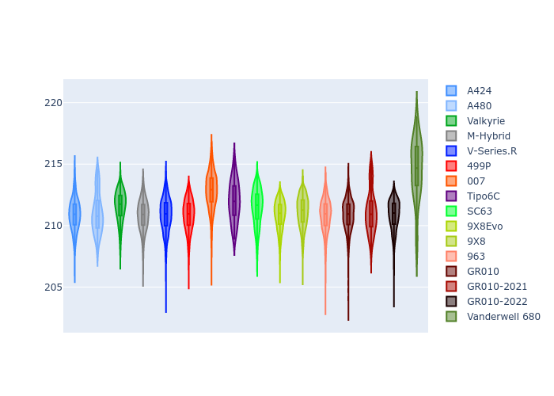
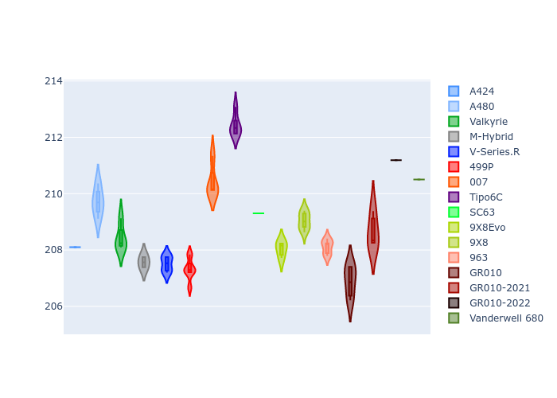
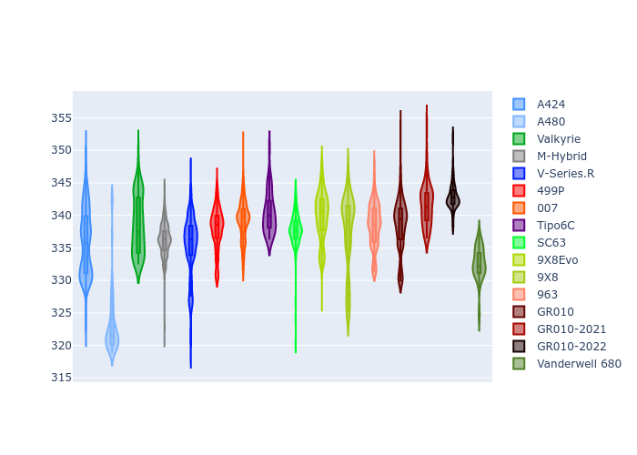
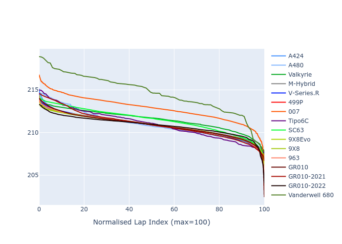

# Combined Plots

## Metadata

- BoP Accuracy: 96.09%
- Overall BoP Grade: A1
- Track: LEMANS
- Threshhold: 0.0kph
- Average Laptime: 3:31.28
- Average Quali Laptime: 3:26.69
- Average Topspeed: 336.61kph

## BoP Table
| Manufacturer     | Car            | Weight   | Power   | PINC   | E/Stint   | FDS    | RDP    | QDP    | TDP    |
|:-----------------|:---------------|:---------|:--------|:-------|:----------|:-------|:-------|:-------|:-------|
| Alpine           | A424           | 1037kg   | 507.0kw | -      | 901MJ     | -      | 51.64% | 59.31% | 26.80% |
| Alpine           | A480           | 975kg    | 410.0kw | -      | 749MJ     | -      | 54.81% | 80.56% | 55.69% |
| Aston Martin     | Valkyrie       | 1030kg   | 520.0kw | -      | 911MJ     | -      | 53.50% | 53.33% | 21.51% |
| BMW              | M-Hybrid       | 1038kg   | 511.0kw | -      | 905MJ     | -      | 52.89% | 56.22% | 33.41% |
| Cadillac         | V-Series.R     | 1042kg   | 520.0kw | -      | 910MJ     | -      | 48.63% | 60.80% | 19.01% |
| Ferrari          | 499P           | 1059kg   | 495.0kw | -      | 882MJ     | 190kph | 51.38% | 44.98% | 9.83%  |
| Glickenhaus      | 007            | 1030kg   | 520.0kw | -      | 913MJ     | -      | 46.15% | 49.30% | 41.45% |
| Isotta Fraschini | Tipo6C         | 1030kg   | 520.0kw | -      | 916MJ     | 170kph | 43.95% | 47.22% | 31.53% |
| Lamborghini      | SC63           | 1030kg   | 520.0kw | -      | 907MJ     | -      | 48.33% | 60.95% | 28.65% |
| Peugeot          | 9X8Evo         | 1032kg   | 504.0kw | -      | 891MJ     | 190kph | 48.87% | 52.78% | 15.41% |
| Peugeot          | 9X8            | 1031kg   | 517.0kw | -      | 908MJ     | 150kph | 54.54% | 58.39% | 9.69%  |
| Porsche          | 963            | 1034kg   | 506.0kw | -      | 899MJ     | -      | 50.70% | 44.30% | 29.51% |
| Toyota           | GR010          | 1058kg   | 494.0kw | -      | 892MJ     | 190kph | 51.09% | 52.71% | 11.46% |
| Toyota           | GR010-2021     | 1057kg   | 509.0kw | -      | 955MJ     | 150kph | 53.89% | 50.91% | 25.87% |
| Toyota           | GR010-2022     | 1054kg   | 500.0kw | -      | 891MJ     | 190kph | 53.24% | 64.49% | 9.72%  |
| Vanwall          | Vanderwell 680 | 1030kg   | 520.0kw | -      | 908MJ     | -      | 35.83% | 59.29% | 34.15% |

## Performance Table
| Manufacturer     | Car            | RP      | QP      | Vavg      |   RDLC | BOP-Grade   | Match   |
|:-----------------|:---------------|:--------|:--------|:----------|-------:|:------------|:--------|
| Alpine           | A424           | 3:30.85 | 3:25.64 | 335.85kph |   1.03 | ~A1         | 99.79%  |
| Alpine           | A480           | 3:30.84 | 3:28.32 | 323.12kph |   1.01 | ~A1         | 100.00% |
| Aston Martin     | Valkyrie       | 3:31.52 | 3:25.29 | 339.17kph |   1.03 | ~A1         | 100.00% |
| BMW              | M-Hybrid       | 3:30.86 | 3:24.89 | 336.04kph |   1.03 | ~A1         | 100.00% |
| Cadillac         | V-Series.R     | 3:30.85 | 3:24.95 | 334.93kph |   1.03 | ~A1         | 99.93%  |
| Ferrari          | 499P           | 3:30.84 | 3:24.46 | 335.84kph |   1.03 | ~A1         | 99.93%  |
| Glickenhaus      | 007            | 3:32.82 | 3:29.77 | 339.30kph |   1.01 | +A2         | 90.05%  |
| Isotta Fraschini | Tipo6C         | 3:30.85 | 3:30.00 | 340.40kph |   1    | ~A1         | 97.76%  |
| Lamborghini      | SC63           | 3:31.47 | 3:27.44 | 337.87kph |   1.02 | ~A1         | 100.00% |
| Peugeot          | 9X8Evo         | 3:30.85 | 3:25.42 | 337.62kph |   1.03 | ~A1         | 99.93%  |
| Peugeot          | 9X8            | 3:30.85 | 3:26.60 | 336.58kph |   1.02 | ~A1         | 99.92%  |
| Porsche          | 963            | 3:30.86 | 3:25.28 | 338.26kph |   1.03 | ~A1         | 99.86%  |
| Toyota           | GR010          | 3:30.87 | 3:24.46 | 336.53kph |   1.03 | ~A1         | 99.61%  |
| Toyota           | GR010-2021     | 3:30.85 | 3:25.64 | 340.47kph |   1.03 | ~A1         | 100.00% |
| Toyota           | GR010-2022     | 3:30.84 | 3:28.65 | 341.22kph |   1.01 | ~A1         | 99.63%  |
| Vanwall          | Vanderwell 680 | 3:34.46 | 3:30.20 | 332.63kph |   1.02 | +E2         | 50.98%  |

## Race Laptimes

## Quali Laptimes

## Topspeeds

## Laptimes Lineplot

