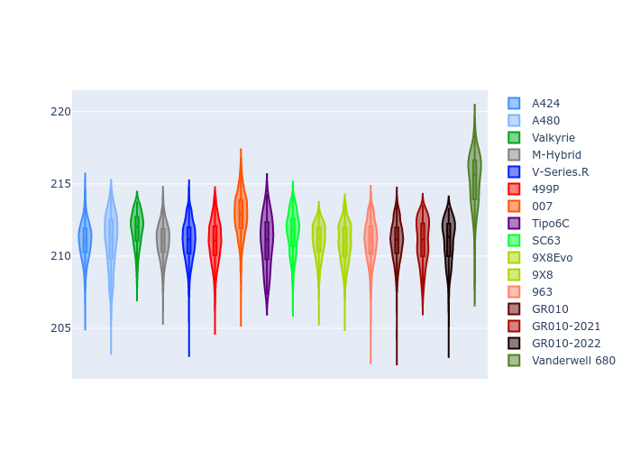
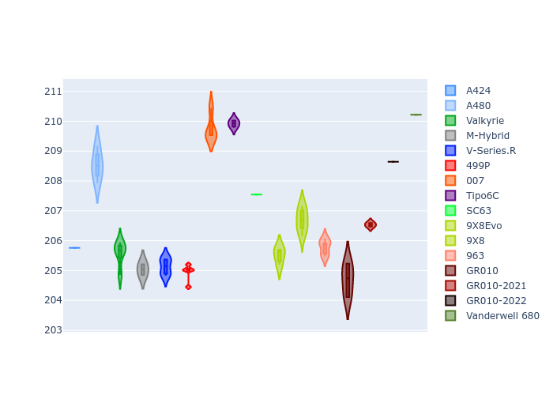
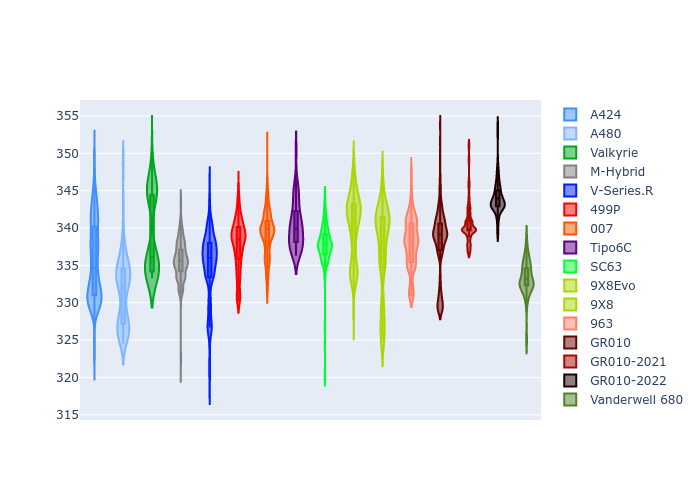

# Combined Plots

## Metadata

- BoP Accuracy: 99.41%
- Overall BoP Grade: A1
- Track: LEMANS
- Threshhold: 0.0kph

## BoP Table
| Manufacturer     | Car            | Weight   | Power   | PINC   | E/Stint   | FDS    |
|:-----------------|:---------------|:---------|:--------|:-------|:----------|:-------|
| Alpine           | A424           | 1045kg   | 480.0kw | -      | 878MJ     | -      |
| Alpine           | A480           | 1047kg   | 410.0kw | -      | 746MJ     | -      |
| Aston Martin     | Valkyrie       | 1032kg   | 487.0kw | -      | 882MJ     | -      |
| BMW              | M-Hybrid       | 1041kg   | 480.0kw | -      | 878MJ     | -      |
| Cadillac         | V-Series.R     | 1048kg   | 488.0kw | -      | 883MJ     | -      |
| Ferrari          | 499P           | 1072kg   | 480.0kw | -      | 870MJ     | 190kph |
| Glickenhaus      | 007            | 1031kg   | 492.0kw | -      | 888MJ     | -      |
| Isotta Fraschini | Tipo6C         | 1087kg   | 520.0kw | -      | 922MJ     | 190kph |
| Lamborghini      | SC63           | 1065kg   | 507.0kw | -      | 899MJ     | -      |
| Peugeot          | 9X8Evo         | 1043kg   | 480.0kw | -      | 871MJ     | 190kph |
| Peugeot          | 9X8            | 1044kg   | 493.0kw | -      | 888MJ     | 150kph |
| Porsche          | 963            | 1043kg   | 480.0kw | -      | 876MJ     | -      |
| Toyota           | GR010          | 1070kg   | 480.0kw | -      | 881MJ     | 190kph |
| Toyota           | GR010OLD       | 1085kg   | 480.0kw | -      | 931MJ     | 150kph |
| Vanwall          | Vanderwell 680 | 1030kg   | 520.0kw | -      | 908MJ     | -      |

## Performance Table
| Manufacturer     | Car            | RP      | QP      | Vavg      |   RDLC | BOP-Grade   | Match   |
|:-----------------|:---------------|:--------|:--------|:----------|-------:|:------------|:--------|
| Alpine           | A424           | 3:34.05 | 3:29.14 | 326.53kph |   1.02 | ~A1         | 99.54%  |
| Alpine           | A480           | 3:34.02 | 3:31.34 | 318.03kph |   1.01 | ~A1         | 96.53%  |
| Aston Martin     | Valkyrie       | 3:34.05 | 3:27.65 | 328.64kph |   1.03 | ~A1         | 100.00% |
| BMW              | M-Hybrid       | 3:34.02 | 3:28.42 | 325.81kph |   1.03 | ~A1         | 100.00% |
| Cadillac         | V-Series.R     | 3:34.00 | 3:28.58 | 323.34kph |   1.03 | ~A1         | 99.96%  |
| Ferrari          | 499P           | 3:34.02 | 3:28.26 | 326.34kph |   1.03 | ~A1         | 99.98%  |
| Glickenhaus      | 007            | 3:34.00 | 3:30.71 | 325.55kph |   1.02 | ~A1         | 97.68%  |
| Isotta Fraschini | Tipo6C         | 3:34.03 | 3:32.78 | 328.91kph |   1.01 | ~A1         | 100.00% |
| Lamborghini      | SC63           | 3:34.05 | 3:30.23 | 328.35kph |   1.02 | ~A1         | 99.52%  |
| Peugeot          | 9X8Evo         | 3:34.03 | 3:28.47 | 328.81kph |   1.03 | ~A1         | 98.95%  |
| Peugeot          | 9X8            | 3:34.02 | 3:29.23 | 320.20kph |   1.02 | ~A1         | 99.96%  |
| Porsche          | 963            | 3:34.04 | 3:28.58 | 325.77kph |   1.03 | ~A1         | 99.89%  |
| Toyota           | GR010          | 3:34.00 | 3:28.03 | 327.12kph |   1.03 | ~A1         | 99.97%  |
| Toyota           | GR010OLD       | 3:34.02 | 3:30.68 | 319.37kph |   1.02 | ~A1         | 100.00% |
| Vanwall          | Vanderwell 680 | 3:34.07 | 3:28.09 | 325.73kph |   1.03 | ~A1         | 99.26%  |

## Race Laptimes

## Quali Laptimes

## Topspeeds

## Laptimes Lineplot

