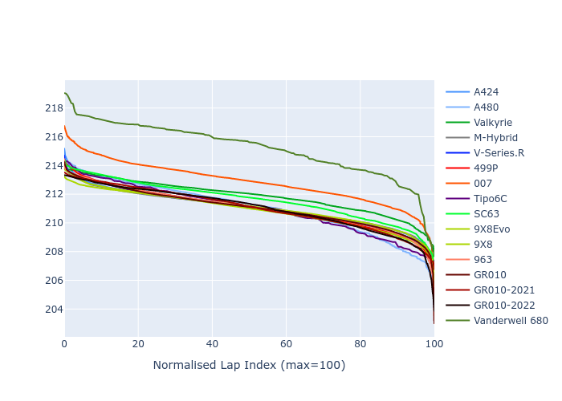

# Combined Plots

## Metadata

- BoP Accuracy: 96.35%
- Overall BoP Grade: A1
- Track: LEMANS
- Threshhold: 0.0kph

## BoP Table
| Manufacturer     | Car            | Weight   | Power   | PINC   | E/Stint   | FDS    | RDP    | QDP    | TDP    |
|:-----------------|:---------------|:---------|:--------|:-------|:----------|:-------|:-------|:-------|:-------|
| Alpine           | A424           | 1050kg   | 480.0kw | -      | 879MJ     | -      | 52.35% | 61.85% | 27.84% |
| Alpine           | A480           | 952kg    | 410.0kw | -      | 747MJ     | -      | 54.51% | 76.19% | 54.04% |
| Aston Martin     | Valkyrie       | 1032kg   | 490.0kw | -      | 884MJ     | -      | 53.59% | 53.33% | 21.51% |
| BMW              | M-Hybrid       | 1044kg   | 480.0kw | -      | 878MJ     | -      | 53.26% | 57.23% | 34.54% |
| Cadillac         | V-Series.R     | 1047kg   | 487.0kw | -      | 881MJ     | -      | 47.80% | 56.73% | 19.63% |
| Ferrari          | 499P           | 1100kg   | 480.0kw | -      | 873MJ     | 200kph | 53.02% | 42.32% | 9.88%  |
| Glickenhaus      | 007            | 1032kg   | 498.0kw | -      | 894MJ     | -      | 46.49% | 46.07% | 47.78% |
| Isotta Fraschini | Tipo6C         | 1087kg   | 520.0kw | -      | 922MJ     | 190kph | 43.95% | 47.22% | 31.53% |
| Lamborghini      | SC63           | 1066kg   | 512.0kw | -      | 903MJ     | -      | 46.33% | 59.50% | 29.33% |
| Peugeot          | 9X8Evo         | 1056kg   | 480.0kw | -      | 872MJ     | 190kph | 48.47% | 51.26% | 16.02% |
| Peugeot          | 9X8            | 1048kg   | 487.0kw | -      | 883MJ     | 150kph | 54.07% | 57.08% | 10.80% |
| Porsche          | 963            | 1047kg   | 480.0kw | -      | 877MJ     | -      | 50.87% | 45.25% | 30.77% |
| Toyota           | GR010          | 1100kg   | 480.0kw | -      | 884MJ     | 200kph | 52.43% | 57.12% | 12.82% |
| Toyota           | GR010-2021     | 1097kg   | 480.0kw | -      | 932MJ     | 150kph | 54.09% | 52.67% | 26.37% |
| Toyota           | GR010-2022     | 1100kg   | 480.0kw | -      | 878MJ     | 200kph | 53.48% | 69.44% | 7.86%  |
| Vanwall          | Vanderwell 680 | 1030kg   | 520.0kw | -      | 908MJ     | -      | 53.41% | 56.28% | 29.85% |

## Performance Table
| Manufacturer     | Car            | RP      | QP      | Vavg      |   RDLC | BOP-Grade   | Match   |
|:-----------------|:---------------|:--------|:--------|:----------|-------:|:------------|:--------|
| Alpine           | A424           | 3:32.27 | 3:27.17 | 325.74kph |   1.02 | ~A1         | 99.19%  |
| Alpine           | A480           | 3:28.63 | 3:25.63 | 319.32kph |   1.01 | -C1         | 75.60%  |
| Aston Martin     | Valkyrie       | 3:32.25 | 3:25.94 | 329.37kph |   1.03 | ~A1         | 100.00% |
| BMW              | M-Hybrid       | 3:32.27 | 3:26.43 | 325.42kph |   1.03 | ~A1         | 99.42%  |
| Cadillac         | V-Series.R     | 3:32.26 | 3:26.49 | 322.96kph |   1.03 | ~A1         | 99.74%  |
| Ferrari          | 499P           | 3:31.69 | 3:24.92 | 323.22kph |   1.03 | ~A1         | 99.77%  |
| Glickenhaus      | 007            | 3:32.27 | 3:29.04 | 326.87kph |   1.02 | ~A1         | 95.74%  |
| Isotta Fraschini | Tipo6C         | 3:32.26 | 3:31.24 | 328.91kph |   1    | ~A1         | 95.52%  |
| Lamborghini      | SC63           | 3:32.26 | 3:28.39 | 329.40kph |   1.02 | ~A1         | 99.76%  |
| Peugeot          | 9X8Evo         | 3:32.25 | 3:26.76 | 327.34kph |   1.03 | ~A1         | 98.95%  |
| Peugeot          | 9X8            | 3:32.25 | 3:26.84 | 316.82kph |   1.03 | ~A1         | 99.94%  |
| Porsche          | 963            | 3:32.28 | 3:26.57 | 325.71kph |   1.03 | ~A1         | 99.84%  |
| Toyota           | GR010          | 3:31.40 | 3:24.43 | 324.32kph |   1.03 | ~A1         | 99.80%  |
| Toyota           | GR010-2021     | 3:32.25 | 3:27.24 | 314.45kph |   1.02 | ~A1         | 98.90%  |
| Toyota           | GR010-2022     | 3:31.63 | 3:28.22 | 321.89kph |   1.02 | ~A1         | 100.00% |
| Vanwall          | Vanderwell 680 | 3:33.99 | 3:28.09 | 325.73kph |   1.03 | +C1         | 79.46%  |

## Race Laptimes

## Quali Laptimes

## Topspeeds

## Laptimes Lineplot

