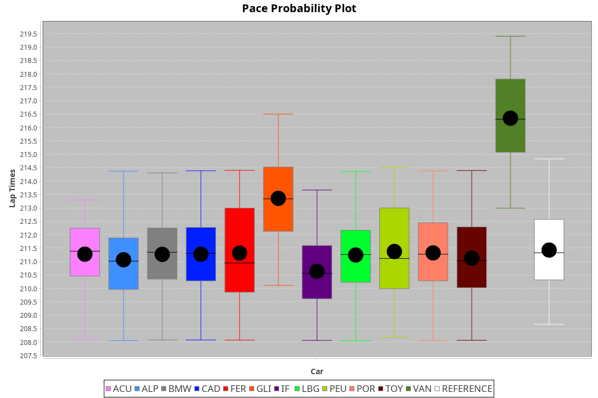
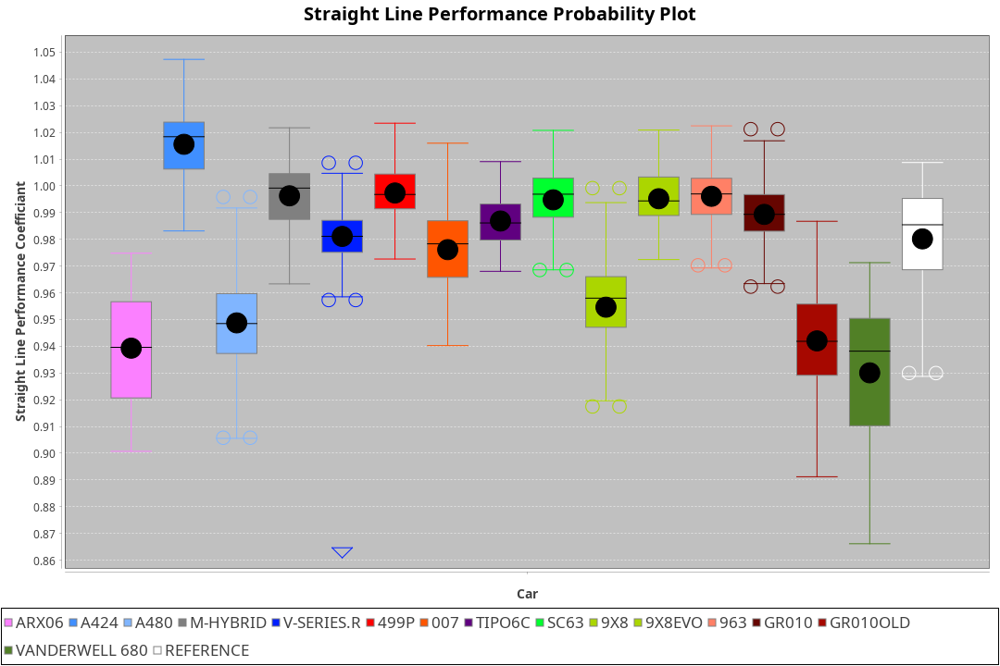
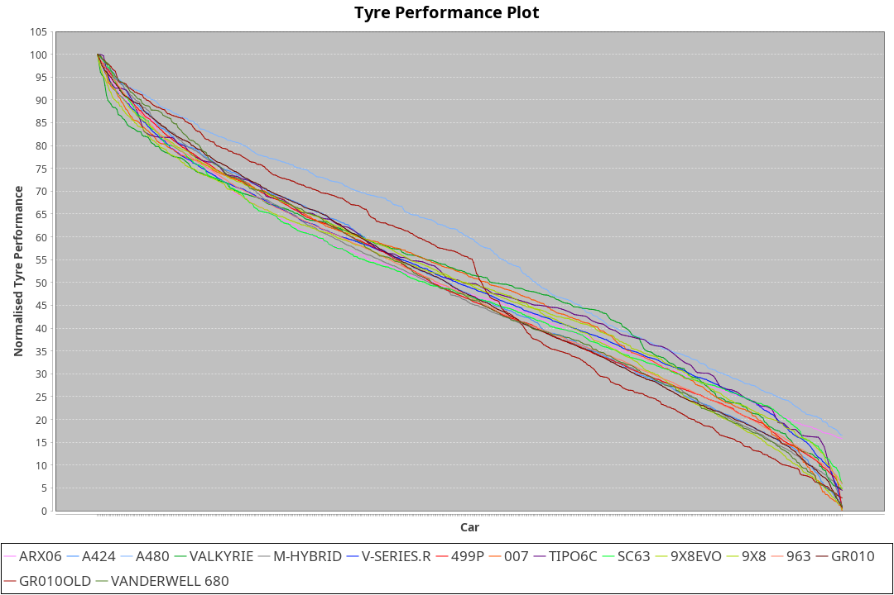

| Manufacturer     | Car            | Weight | Power   | PINC    | E/Stint | FDS     |
|:-|:-|:-|:-|:-|:-|:-|
| Acura            | ARX06          | 1055kg | 491.0kw |    -    | 891MJ   |    -    |
| Alpine           | A424           | 1039kg | 492.0kw |    -    | 888MJ   |    -    |
| Alpine           | A480           | 938kg  | 410.0kw |    -    | 745MJ   |    -    |
| BMW              | M-Hybrid       | 1044kg | 494.0kw |    -    | 891MJ   |    -    |
| Cadillac         | V-Series.R     | 1051kg | 494.0kw |    -    | 888MJ   |    -    |
| Ferrari          | 499P           | 1070kg | 491.0kw |    -    | 879MJ   | 190kph  |
| Glickenhaus      | 007            | 1030kg | 497.0kw |    -    | 893MJ   |    -    |
| Isotta Fraschini | Tipo6C         | 1090kg | 520.0kw |    -    | 923MJ   | 190kph  |
| Lamborghini      | SC63           | 1065kg | 508.0kw |    -    | 900MJ   |    -    |
| Peugeot          | 9X8Evo         | 1030kg | 484.0kw |    -    | 873MJ   | 190kph  |
| Peugeot          | 9X8            | 1041kg | 501.0kw |    -    | 895MJ   | 150kph  |
| Porsche          | 963            | 1045kg | 491.0kw |    -    | 886MJ   |    -    |
| Toyota           | GR010          | 1072kg | 491.0kw |    -    | 891MJ   | 190kph  |
| Toyota           | GR010OLD       | 1078kg | 480.0kw |    -    | 930MJ   | 150kph  |
| Vanwall          | Vanderwell 680 | 1030kg | 520.0kw |    -    | 908MJ   |    -    |

### BoP Accuracy: 93.61%; Overall BoP Grade: A2
| Manufacturer     | Car            | Type  | RP      | QP      | Weight | Power¹  | Threshhold | PINC    | Power²   | E/Stint | AVG Vmax  | FDS     | RDLC | L/Stint | BOP-Grade | Model Accuracy | Model Points | Match%  | SimDiff |
|:-|:-|:-|:-|:-|:-|:-|:-|:-|:-|:-|:-|:-|:-|:-|:-|:-|:-|:-|:-|
| Acura            | ARX06          | LMDH  | 3:33.33 | 3:26.97 | 1055kg | 491.0kw | 0.0kph     |    -    | 491.00kw |  891MJ  | 318.13kph |    -    | 1.01 | 12      | +B1       | 100.00%        | 996          | 85.71%  | #       |
| Alpine           | A424           | LMDH  | 3:33.34 | 3:27.91 | 1039kg | 492.0kw | 0.0kph     |    -    | 492.00kw |  888MJ  | 329.89kph |    -    | 1.01 | 12      | ~A1       | 100.00%        | 870          | 95.78%  | ±1.35s  |
| Alpine           | A480           | LMP1  | 3:33.37 | 3:29.77 |  938kg | 410.0kw | 0.0kph     |    -    | 410.00kw |  745MJ  | 315.93kph |    -    | 0.99 | 11      | ~A1       | 96.26%         | 1337         | 100.00% | ±1.07s  |
| BMW              | M-Hybrid       | LMDH  | 3:33.37 | 3:27.27 | 1044kg | 494.0kw | 0.0kph     |    -    | 494.00kw |  891MJ  | 327.46kph |    -    | 1.01 | 12      | -A2       | 100.00%        | 1914         | 93.90%  | ±1.02s  |
| Cadillac         | V-Series.R     | LMDH  | 3:33.37 | 3:27.25 | 1051kg | 494.0kw | 0.0kph     |    -    | 494.00kw |  888MJ  | 323.66kph |    -    | 1.01 | 12      | ~A1       | 98.03%         | 3773         | 96.48%  | ±0.66s  |
| Ferrari          | 499P           | LMHHU | 3:33.37 | 3:27.04 | 1070kg | 491.0kw | 0.0kph     |    -    | 491.00kw |  879MJ  | 327.05kph | 190kph  | 1.02 | 12      | ~A1       | 100.00%        | 4212         | 100.00% | ±0.61s  |
| Glickenhaus      | 007            | LMHNH | 3:33.35 | 3:29.33 | 1030kg | 497.0kw | 0.0kph     |    -    | 497.00kw |  893MJ  | 323.48kph |    -    | 0.97 | 12      | ~A1       | 98.78%         | 1936         | 95.35%  | ±0.48s  |
| Isotta Fraschini | Tipo6C         | LMHHU | 3:33.37 | 3:30.90 | 1090kg | 520.0kw | 0.0kph     |    -    | 520.00kw |  923MJ  | 327.14kph | 190kph  | 1.01 | 12      | +D1       | 100.00%        | 105          | 68.49%  | ±0.45s  |
| Lamborghini      | SC63           | LMDH  | 3:33.34 | 3:29.02 | 1065kg | 508.0kw | 0.0kph     |    -    | 508.00kw |  900MJ  | 327.55kph |    -    | 1.02 | 12      | ~A1       | 100.00%        | 597          | 100.00% | ±0.22s  |
| Peugeot          | 9X8Evo         | LMHHU | 3:33.34 | 3:28.54 | 1030kg | 484.0kw | 0.0kph     |    -    | 484.00kw |  873MJ  | 329.07kph | 190kph  | 1.02 | 12      | +B2       | 100.00%        | 463          | 81.81%  | ±0.53s  |
| Peugeot          | 9X8            | LMHHE | 3:33.33 | 3:27.94 | 1041kg | 501.0kw | 0.0kph     |    -    | 501.00kw |  895MJ  | 325.94kph | 150kph  | 1.02 | 12      | ~A1       | 99.48%         | 4559         | 100.00% | ±1.81s  |
| Porsche          | 963            | LMDH  | 3:33.34 | 3:26.89 | 1045kg | 491.0kw | 0.0kph     |    -    | 491.00kw |  886MJ  | 326.83kph |    -    | 1.01 | 12      | ~A1       | 99.21%         | 10753        | 100.00% | ±0.60s  |
| Toyota           | GR010          | LMHHU | 3:33.32 | 3:26.67 | 1072kg | 491.0kw | 0.0kph     |    -    | 491.00kw |  891MJ  | 326.04kph | 190kph  | 1.01 | 12      | ~A1       | 99.54%         | 3271         | 100.00% | ±0.62s  |
| Toyota           | GR010OLD       | LMHHE | 3:33.35 | 3:28.74 | 1078kg | 480.0kw | 0.0kph     |    -    | 480.00kw |  930MJ  | 320.35kph | 150kph  | 1.01 | 12      | +B1       | 100.00%        | 730          | 86.61%  | ±1.11s  |
| Vanwall          | Vanderwell 680 | LMHNH | 3:33.48 | 3:27.33 | 1030kg | 520.0kw | 0.0kph     |    -    | 520.00kw |  908MJ  | 325.30kph |    -    | 1.01 | 12      | ~A1       | 98.54%         | 541          | 100.00% | ±0.94s  |

## Power below Threshhold
| N/Nmax    | ARX06   | A424    | M-HYBRID | V-SERIES.R | 499P    | 007     | TIPO6C  | SC63    | 9X8EVO  | 9X8     | 963     | GR010   | GR010OLD | VANDERWELL 680 | ​     | RPM      | A480    |
|:-|:-|:-|:-|:-|:-|:-|:-|:-|:-|:-|:-|:-|:-|:-|:-|:-|:-|
|  0.550    |  242    |  242    |  243     |  243       |  242    |  245    |  256    |  250    |  238    |  247    |  242    |  242    |  236     |  256           |  ​    |   --     |   -     |
|  0.575    |  264    |  265    |  266     |  266       |  264    |  267    |  279    |  273    |  260    |  270    |  264    |  264    |  258     |  279           |  ​    |   --     |   -     |
|  0.600    |  284    |  284    |  285     |  285       |  284    |  287    |  300    |  293    |  279    |  290    |  284    |  284    |  277     |  300           |  ​    |   --     |   -     |
|  0.625    |  304    |  304    |  305     |  305       |  304    |  307    |  322    |  314    |  299    |  310    |  304    |  304    |  297     |  322           |  ​    |   --     |   -     |
|  0.650    |  324    |  325    |  326     |  326       |  324    |  328    |  343    |  335    |  320    |  331    |  324    |  324    |  317     |  343           |  ​    |   --     |   -     |
|  0.675    |  345    |  345    |  347     |  347       |  345    |  349    |  365    |  357    |  340    |  352    |  345    |  345    |  337     |  365           |  ​    |   --     |   -     |
|  0.700    |  366    |  366    |  368     |  368       |  366    |  370    |  387    |  378    |  361    |  373    |  366    |  366    |  358     |  387           |  ​    |   --     |   -     |
|  0.725    |  386    |  387    |  389     |  389       |  386    |  391    |  409    |  399    |  381    |  394    |  386    |  386    |  378     |  409           |  ​    |   --     |   -     |
|  0.750    |  406    |  407    |  408     |  408       |  406    |  411    |  430    |  420    |  400    |  414    |  406    |  406    |  397     |  430           |  ​    |   --     |   -     |
|  0.775    |  424    |  425    |  427     |  427       |  424    |  429    |  449    |  439    |  418    |  433    |  424    |  424    |  415     |  449           |  ​    |  5000    |  241    |
|  0.800    |  441    |  442    |  444     |  444       |  441    |  446    |  467    |  456    |  435    |  450    |  441    |  441    |  431     |  467           |  ​    |  5500    |  284    |
|  0.825    |  455    |  456    |  458     |  458       |  455    |  461    |  482    |  471    |  449    |  465    |  455    |  455    |  445     |  482           |  ​    |  6000    |  318    |
|  0.850    |  466    |  467    |  469     |  469       |  466    |  472    |  494    |  483    |  460    |  476    |  466    |  466    |  456     |  494           |  ​    |  6500    |  359    |
|  0.875    |  476    |  477    |  479     |  479       |  476    |  482    |  505    |  493    |  470    |  486    |  476    |  476    |  466     |  505           |  ​    |  7000    |  401    |
|  0.900    |  483    |  484    |  486     |  486       |  483    |  489    |  512    |  500    |  476    |  493    |  483    |  483    |  472     |  512           |  ​    |  7500    |  411    |
|  0.925    |  488    |  489    |  491     |  491       |  488    |  494    |  517    |  505    |  481    |  498    |  488    |  488    |  477     |  517           |  ​    |  8000    |  407    |
| **0.950** | **491** | **492** | **494**  | **494**    | **491** | **497** | **520** | **508** | **484** | **501** | **491** | **491** | **480**  | **520**        | **​** | **8500** | **410** |
|  0.975    |  489    |  490    |  492     |  492       |  489    |  495    |  518    |  506    |  482    |  499    |  489    |  489    |  478     |  518           |  ​    |  9000    |  205    |
|  1.000    |  486    |  487    |  489     |  489       |  486    |  492    |  514    |  503    |  479    |  496    |  486    |  486    |  475     |  514           |  ​    |   --     |   -     |
|  1.025    |  419    |  420    |  422     |  422       |  419    |  424    |  444    |  434    |  413    |  428    |  419    |  419    |  410     |  444           |  ​    |   --     |   -     |

## Power above Threshhold
| N/Nmax    | ARX06   | A424    | M-HYBRID | V-SERIES.R | 499P    | 007     | TIPO6C  | SC63    | 9X8EVO  | 9X8     | 963     | GR010   | GR010OLD | VANDERWELL 680 | ​     | RPM      | A480    |
|:-|:-|:-|:-|:-|:-|:-|:-|:-|:-|:-|:-|:-|:-|:-|:-|:-|:-|
|  0.550    |  242    |  242    |  243     |  243       |  242    |  245    |  256    |  250    |  238    |  247    |  242    |  242    |  236     |  256           |  ​    |   --     |   -     |
|  0.575    |  264    |  265    |  266     |  266       |  264    |  267    |  279    |  273    |  260    |  270    |  264    |  264    |  258     |  279           |  ​    |   --     |   -     |
|  0.600    |  284    |  284    |  285     |  285       |  284    |  287    |  300    |  293    |  279    |  290    |  284    |  284    |  277     |  300           |  ​    |   --     |   -     |
|  0.625    |  304    |  304    |  305     |  305       |  304    |  307    |  322    |  314    |  299    |  310    |  304    |  304    |  297     |  322           |  ​    |   --     |   -     |
|  0.650    |  324    |  325    |  326     |  326       |  324    |  328    |  343    |  335    |  320    |  331    |  324    |  324    |  317     |  343           |  ​    |   --     |   -     |
|  0.675    |  345    |  345    |  347     |  347       |  345    |  349    |  365    |  357    |  340    |  352    |  345    |  345    |  337     |  365           |  ​    |   --     |   -     |
|  0.700    |  366    |  366    |  368     |  368       |  366    |  370    |  387    |  378    |  361    |  373    |  366    |  366    |  358     |  387           |  ​    |   --     |   -     |
|  0.725    |  386    |  387    |  389     |  389       |  386    |  391    |  409    |  399    |  381    |  394    |  386    |  386    |  378     |  409           |  ​    |   --     |   -     |
|  0.750    |  406    |  407    |  408     |  408       |  406    |  411    |  430    |  420    |  400    |  414    |  406    |  406    |  397     |  430           |  ​    |   --     |   -     |
|  0.775    |  424    |  425    |  427     |  427       |  424    |  429    |  449    |  439    |  418    |  433    |  424    |  424    |  415     |  449           |  ​    |  5000    |  241    |
|  0.800    |  441    |  442    |  444     |  444       |  441    |  446    |  467    |  456    |  435    |  450    |  441    |  441    |  431     |  467           |  ​    |  5500    |  284    |
|  0.825    |  455    |  456    |  458     |  458       |  455    |  461    |  482    |  471    |  449    |  465    |  455    |  455    |  445     |  482           |  ​    |  6000    |  318    |
|  0.850    |  466    |  467    |  469     |  469       |  466    |  472    |  494    |  483    |  460    |  476    |  466    |  466    |  456     |  494           |  ​    |  6500    |  359    |
|  0.875    |  476    |  477    |  479     |  479       |  476    |  482    |  505    |  493    |  470    |  486    |  476    |  476    |  466     |  505           |  ​    |  7000    |  401    |
|  0.900    |  483    |  484    |  486     |  486       |  483    |  489    |  512    |  500    |  476    |  493    |  483    |  483    |  472     |  512           |  ​    |  7500    |  411    |
|  0.925    |  488    |  489    |  491     |  491       |  488    |  494    |  517    |  505    |  481    |  498    |  488    |  488    |  477     |  517           |  ​    |  8000    |  407    |
| **0.950** | **491** | **492** | **494**  | **494**    | **491** | **497** | **520** | **508** | **484** | **501** | **491** | **491** | **480**  | **520**        | **​** | **8500** | **410** |
|  0.975    |  489    |  490    |  492     |  492       |  489    |  495    |  518    |  506    |  482    |  499    |  489    |  489    |  478     |  518           |  ​    |  9000    |  205    |
|  1.000    |  486    |  487    |  489     |  489       |  486    |  492    |  514    |  503    |  479    |  496    |  486    |  486    |  475     |  514           |  ​    |   --     |   -     |
|  1.025    |  419    |  420    |  422     |  422       |  419    |  424    |  444    |  434    |  413    |  428    |  419    |  419    |  410     |  444           |  ​    |   --     |   -     |
