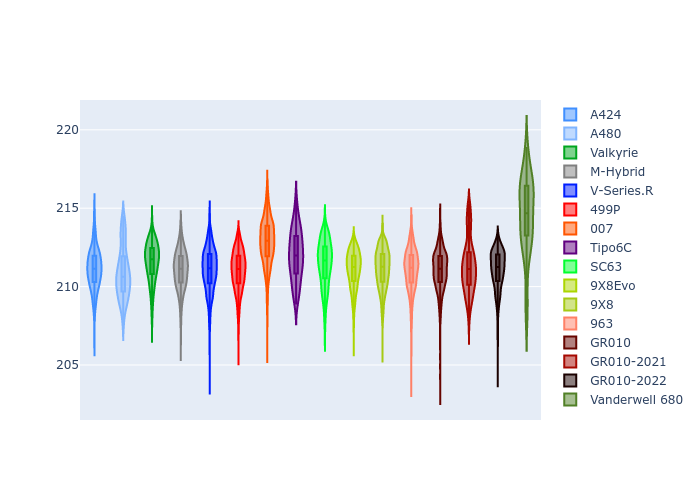
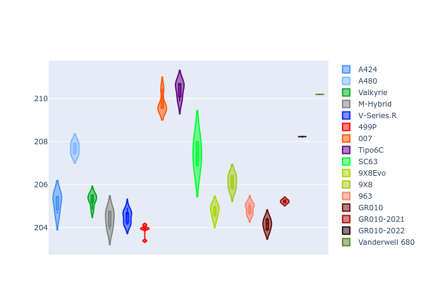
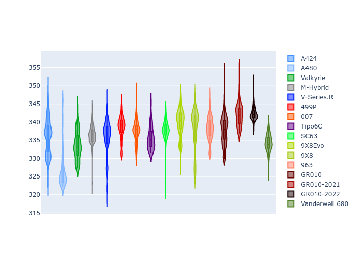
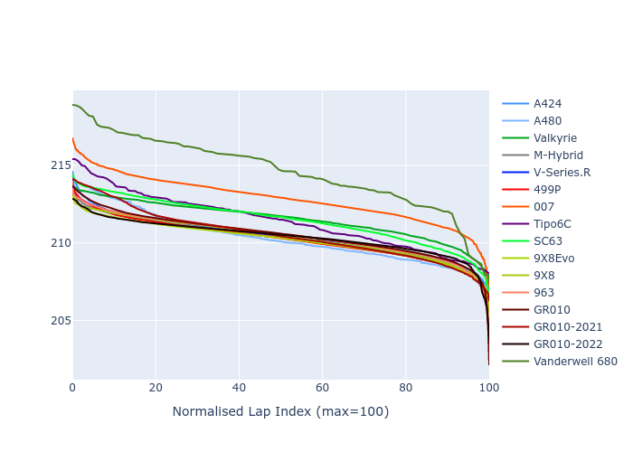

# Combined Plots

## Metadata

- BoP Accuracy: 93.98%
- Overall BoP Grade: A2
- Track: LEMANS
- Threshhold: 250.0kph
- Average Laptime: 3:31.74
- Average Quali Laptime: 3:27.73
- Laptime Std Dev: 1.23 seconds
- Filtered Average Topspeed: 336.86kph

## BoP Table
| Manufacturer     | Car            | Weight   | Power   | PINC   | E/Stint   | FDS    | RDP    | QDP    | TDP    |
|:-----------------|:---------------|:---------|:--------|:-------|:----------|:-------|:-------|:-------|:-------|
| Alpine           | A424           | 1056kg   | 511.0kw | +0.10% | 897MJ     | -      | 51.45% | 55.09% | 24.89% |
| Alpine           | A480           | 990kg    | 421.0kw | +0.10% | 760MJ     | -      | 54.77% | 76.19% | 54.04% |
| Aston Martin     | Valkyrie       | 1034kg   | 497.0kw | -      | 891MJ     | -      | 53.07% | 48.70% | 24.00% |
| BMW              | M-Hybrid       | 1050kg   | 513.0kw | +0.10% | 920MJ     | -      | 52.63% | 52.34% | 34.06% |
| Cadillac         | V-Series.R     | 1047kg   | 519.0kw | -      | 909MJ     | -      | 48.80% | 57.26% | 18.10% |
| Ferrari          | 499P           | 1062kg   | 503.0kw | -0.10% | 892MJ     | 190kph | 51.39% | 44.34% | 9.89%  |
| Glickenhaus      | 007            | 1040kg   | 512.0kw | -      | 907MJ     | -      | 46.14% | 49.30% | 41.45% |
| Isotta Fraschini | Tipo6C         | 1036kg   | 498.0kw | -      | 897MJ     | 190kph | 43.95% | 47.22% | 31.53% |
| Lamborghini      | SC63           | 1040kg   | 520.0kw | +0.10% | 908MJ     | -      | 48.32% | 60.95% | 28.65% |
| Peugeot          | 9X8Evo         | 1052kg   | 518.0kw | -0.10% | 902MJ     | 190kph | 49.16% | 50.25% | 18.00% |
| Peugeot          | 9X8            | 1046kg   | 524.0kw | -      | 915MJ     | 150kph | 54.54% | 58.39% | 9.69%  |
| Porsche          | 963            | 1056kg   | 511.0kw | +0.10% | 916MJ     | -      | 50.61% | 41.90% | 27.68% |
| Toyota           | GR010          | 1071kg   | 502.0kw | +0.10% | 902MJ     | 190kph | 51.33% | 51.71% | 14.89% |
| Toyota           | GR010-2021     | 1055kg   | 509.0kw | -0.10% | 955MJ     | 150kph | 54.02% | 52.67% | 26.37% |
| Toyota           | GR010-2022     | 1060kg   | 503.0kw | -0.10% | 894MJ     | 190kph | 53.24% | 64.49% | 9.72%  |
| Vanwall          | Vanderwell 680 | 1030kg   | 520.0kw | -      | 908MJ     | -      | 50.86% | 59.83% | 31.84% |

## Performance Table
| Manufacturer     | Car            | RP      | QP      | Vavg      |   RDLC | BOP-Grade   | Match   |
|:-----------------|:---------------|:--------|:--------|:----------|-------:|:------------|:--------|
| Alpine           | A424           | 3:31.19 | 3:26.45 | 335.94kph |   1.02 | ~A1         | 99.93%  |
| Alpine           | A480           | 3:33.12 | 3:29.93 | 326.81kph |   1.02 | +A2         | 91.90%  |
| Aston Martin     | Valkyrie       | 3:33.12 | 3:28.64 | 333.42kph |   1.02 | +A2         | 91.91%  |
| BMW              | M-Hybrid       | 3:30.81 | 3:25.59 | 336.51kph |   1.03 | ~A1         | 99.98%  |
| Cadillac         | V-Series.R     | 3:30.89 | 3:25.61 | 335.82kph |   1.03 | ~A1         | 99.91%  |
| Ferrari          | 499P           | 3:30.69 | 3:25.21 | 338.58kph |   1.03 | ~A1         | 99.88%  |
| Glickenhaus      | 007            | 3:33.13 | 3:30.62 | 337.36kph |   1.01 | +B1         | 88.32%  |
| Isotta Fraschini | Tipo6C         | 3:33.12 | 3:32.64 | 335.54kph |   1    | +B1         | 86.57%  |
| Lamborghini      | SC63           | 3:31.24 | 3:27.69 | 337.92kph |   1.02 | ~A1         | 100.00% |
| Peugeot          | 9X8Evo         | 3:31.20 | 3:26.44 | 339.89kph |   1.02 | ~A1         | 99.89%  |
| Peugeot          | 9X8            | 3:31.13 | 3:27.33 | 337.61kph |   1.02 | ~A1         | 99.96%  |
| Porsche          | 963            | 3:30.93 | 3:26.21 | 338.12kph |   1.02 | ~A1         | 99.83%  |
| Toyota           | GR010          | 3:31.16 | 3:25.23 | 337.69kph |   1.03 | ~A1         | 99.75%  |
| Toyota           | GR010-2021     | 3:30.23 | 3:26.07 | 342.05kph |   1.02 | ~A1         | 100.00% |
| Toyota           | GR010-2022     | 3:31.11 | 3:29.44 | 342.33kph |   1.01 | ~A1         | 99.40%  |
| Vanwall          | Vanderwell 680 | 3:34.76 | 3:30.50 | 334.24kph |   1.02 | +Ω1         | 46.44%  |

## Race Laptimes

## Quali Laptimes

## Topspeeds

## Laptimes Lineplot

