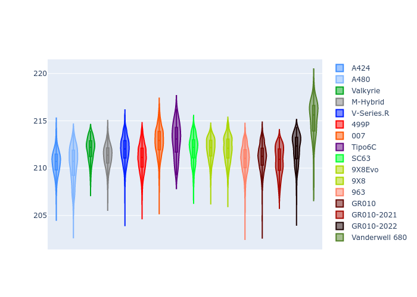

# Combined Plots

## Metadata

- BoP Accuracy: 94.98%
- Overall BoP Grade: A2
- Track: LEMANS
- Threshhold: 210.0kph

## BoP Table
| Manufacturer     | Car            | Weight   | Power   | PINC   | E/Stint   | FDS    |
|:-----------------|:---------------|:---------|:--------|:-------|:----------|:-------|
| Alpine           | A424           | 1057kg   | 520.0kw | -1.00% | 914MJ     | -      |
| Alpine           | A480           | 1052kg   | 432.0kw | +1.00% | 767MJ     | -      |
| Aston Martin     | Valkyrie       | 1045kg   | 504.0kw | +1.00% | 899MJ     | -      |
| BMW              | M-Hybrid       | 1051kg   | 512.0kw | -1.00% | 906MJ     | -      |
| Cadillac         | V-Series.R     | 1044kg   | 510.0kw | +1.00% | 903MJ     | -      |
| Ferrari          | 499P           | 1073kg   | 508.0kw | -1.00% | 894MJ     | 190kph |
| Glickenhaus      | 007            | 1040kg   | 520.0kw | -      | 914MJ     | -      |
| Isotta Fraschini | Tipo6C         | 1059kg   | 520.0kw | -      | 919MJ     | 190kph |
| Lamborghini      | SC63           | 1052kg   | 519.0kw | -1.00% | 907MJ     | -      |
| Peugeot          | 9X8Evo         | 1060kg   | 510.0kw | -1.00% | 898MJ     | 190kph |
| Peugeot          | 9X8            | 1040kg   | 520.0kw | -      | 911MJ     | 150kph |
| Porsche          | 963            | 1057kg   | 516.0kw | -1.00% | 909MJ     | -      |
| Toyota           | GR010          | 1090kg   | 512.0kw | -1.00% | 911MJ     | 190kph |
| Toyota           | GR010OLD       | 1075kg   | 513.0kw | +1.00% | 962MJ     | 150kph |
| Vanwall          | Vanderwell 680 | 1030kg   | 520.0kw | -      | 908MJ     | -      |

## Performance Table
| Manufacturer     | Car            | RP      | QP      | Vavg      |   RDLC | BOP-Grade   | Match   |
|:-----------------|:---------------|:--------|:--------|:----------|-------:|:------------|:--------|
| Alpine           | A424           | 3:29.16 | 3:24.51 | 334.00kph |   1.02 | ~A1         | 99.08%  |
| Alpine           | A480           | 3:30.50 | 3:27.93 | 324.21kph |   1.01 | ~A1         | 97.65%  |
| Aston Martin     | Valkyrie       | 3:32.20 | 3:25.93 | 331.98kph |   1.03 | ~A1         | 97.02%  |
| BMW              | M-Hybrid       | 3:30.11 | 3:24.73 | 331.62kph |   1.03 | ~A1         | 99.96%  |
| Cadillac         | V-Series.R     | 3:30.30 | 3:25.09 | 329.73kph |   1.03 | ~A1         | 99.96%  |
| Ferrari          | 499P           | 3:30.05 | 3:24.52 | 332.26kph |   1.03 | ~A1         | 99.79%  |
| Glickenhaus      | 007            | 3:30.79 | 3:27.62 | 331.10kph |   1.02 | ~A1         | 96.90%  |
| Isotta Fraschini | Tipo6C         | 3:32.17 | 3:30.96 | 332.03kph |   1.01 | +A2         | 94.03%  |
| Lamborghini      | SC63           | 3:31.58 | 3:27.87 | 331.88kph |   1.02 | ~A1         | 97.35%  |
| Peugeot          | 9X8Evo         | 3:30.88 | 3:25.50 | 333.41kph |   1.03 | ~A1         | 98.16%  |
| Peugeot          | 9X8            | 3:29.78 | 3:25.20 | 326.90kph |   1.02 | ~A1         | 99.80%  |
| Porsche          | 963            | 3:29.83 | 3:24.61 | 332.07kph |   1.03 | ~A1         | 99.83%  |
| Toyota           | GR010          | 3:30.68 | 3:24.91 | 331.88kph |   1.03 | ~A1         | 99.97%  |
| Toyota           | GR010OLD       | 3:28.36 | 3:25.23 | 328.99kph |   1.02 | ~A1         | 95.71%  |
| Vanwall          | Vanderwell 680 | 3:34.07 | 3:28.09 | 325.73kph |   1.03 | +Ω1         | 49.55%  |

## Race Laptimes

## Quali Laptimes

## Topspeeds

## Laptimes Lineplot

