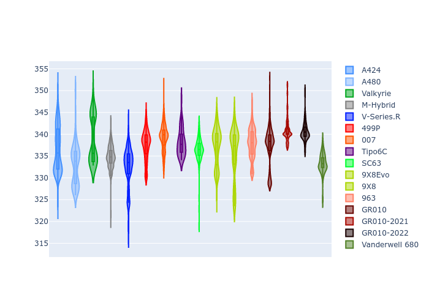

# Combined Plots

## Metadata

- BoP Accuracy: 94.82%
- Overall BoP Grade: A2
- Track: LEMANS
- Threshhold: 250.0kph
- Average Laptime: 3:31.83
- Average Quali Laptime: 3:27.22
- Average Topspeed: 336.89kph

## BoP Table
| Manufacturer     | Car            | Weight   | Power   | PINC   | E/Stint   | FDS    | RDP    | QDP    | TDP    |
|:-----------------|:---------------|:---------|:--------|:-------|:----------|:-------|:-------|:-------|:-------|
| Alpine           | A424           | 1057kg   | 520.0kw | -      | 915MJ     | -      | 51.64% | 59.31% | 26.80% |
| Alpine           | A480           | 952kg    | 432.0kw | +0.10% | 767MJ     | -      | 53.05% | 74.07% | 48.97% |
| Aston Martin     | Valkyrie       | 1032kg   | 519.0kw | -      | 910MJ     | -      | 53.50% | 53.33% | 21.51% |
| BMW              | M-Hybrid       | 1051kg   | 512.0kw | +0.10% | 907MJ     | -      | 52.89% | 56.22% | 33.41% |
| Cadillac         | V-Series.R     | 1044kg   | 510.0kw | +0.10% | 902MJ     | -      | 48.63% | 60.80% | 19.01% |
| Ferrari          | 499P           | 1073kg   | 508.0kw | +0.10% | 895MJ     | 190kph | 51.38% | 44.98% | 9.83%  |
| Glickenhaus      | 007            | 1030kg   | 520.0kw | -      | 913MJ     | -      | 46.15% | 49.30% | 41.45% |
| Isotta Fraschini | Tipo6C         | 1049kg   | 520.0kw | -      | 918MJ     | 190kph | 43.95% | 47.22% | 31.53% |
| Lamborghini      | SC63           | 1039kg   | 519.0kw | -      | 907MJ     | -      | 48.33% | 60.95% | 28.65% |
| Peugeot          | 9X8Evo         | 1050kg   | 511.0kw | -      | 899MJ     | 190kph | 48.87% | 52.78% | 15.41% |
| Peugeot          | 9X8            | 1034kg   | 515.0kw | -      | 906MJ     | 150kph | 54.54% | 58.39% | 9.69%  |
| Porsche          | 963            | 1057kg   | 516.0kw | -0.10% | 910MJ     | -      | 50.70% | 44.30% | 29.51% |
| Toyota           | GR010          | 1090kg   | 512.0kw | +0.10% | 912MJ     | 190kph | 51.09% | 52.71% | 11.46% |
| Toyota           | GR010-2021     | 1075kg   | 513.0kw | -0.10% | 961MJ     | 150kph | 54.08% | 54.81% | 9.72%  |
| Toyota           | GR010-2022     | 1085kg   | 512.0kw | -0.10% | 905MJ     | 190kph | 53.45% | 68.83% | 9.58%  |
| Vanwall          | Vanderwell 680 | 1030kg   | 520.0kw | -      | 908MJ     | -      | 49.68% | 60.93% | 34.43% |

## Performance Table
| Manufacturer     | Car            | RP      | QP      | Vavg      |   RDLC | BOP-Grade   | Match   |
|:-----------------|:---------------|:--------|:--------|:----------|-------:|:------------|:--------|
| Alpine           | A424           | 3:30.60 | 3:25.35 | 336.61kph |   1.03 | ~A1         | 99.97%  |
| Alpine           | A480           | 3:30.43 | 3:27.95 | 333.06kph |   1.01 | ~A1         | 99.07%  |
| Aston Martin     | Valkyrie       | 3:32.01 | 3:25.72 | 338.70kph |   1.03 | ~A1         | 100.00% |
| BMW              | M-Hybrid       | 3:31.28 | 3:25.26 | 334.85kph |   1.03 | ~A1         | 100.00% |
| Cadillac         | V-Series.R     | 3:31.93 | 3:25.97 | 332.43kph |   1.03 | ~A1         | 99.51%  |
| Ferrari          | 499P           | 3:31.06 | 3:24.97 | 337.49kph |   1.03 | ~A1         | 99.91%  |
| Glickenhaus      | 007            | 3:32.82 | 3:29.76 | 339.30kph |   1.01 | -A2         | 93.17%  |
| Isotta Fraschini | Tipo6C         | 3:32.88 | 3:31.83 | 338.15kph |   1    | +B1         | 86.57%  |
| Lamborghini      | SC63           | 3:32.02 | 3:27.94 | 336.57kph |   1.02 | ~A1         | 100.00% |
| Peugeot          | 9X8Evo         | 3:32.02 | 3:26.43 | 337.19kph |   1.03 | ~A1         | 100.00% |
| Peugeot          | 9X8            | 3:32.01 | 3:27.74 | 335.76kph |   1.02 | ~A1         | 100.00% |
| Porsche          | 963            | 3:30.93 | 3:25.67 | 337.88kph |   1.03 | ~A1         | 99.70%  |
| Toyota           | GR010          | 3:31.17 | 3:24.81 | 337.35kph |   1.03 | ~A1         | 99.74%  |
| Toyota           | GR010-2021     | 3:30.80 | 3:26.32 | 340.88kph |   1.02 | ~A1         | 100.00% |
| Toyota           | GR010-2022     | 3:32.04 | 3:29.62 | 340.65kph |   1.01 | ~A1         | 99.66%  |
| Vanwall          | Vanderwell 680 | 3:35.20 | 3:30.22 | 333.32kph |   1.02 | +Ω1         | 39.81%  |

## Race Laptimes

## Quali Laptimes

## Topspeeds

## Laptimes Lineplot

