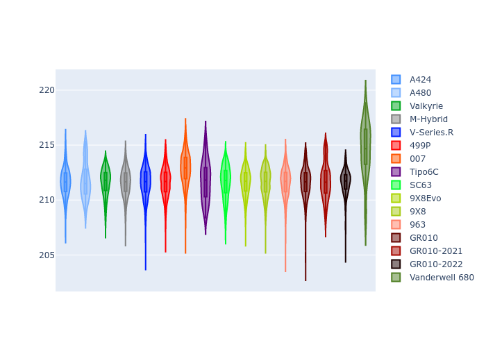
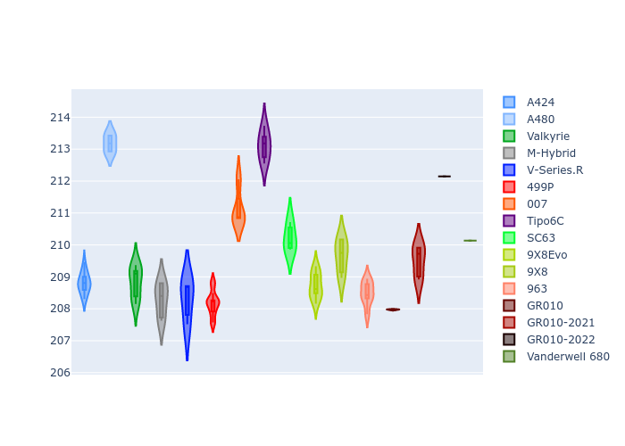
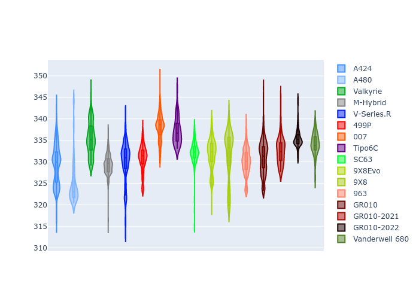
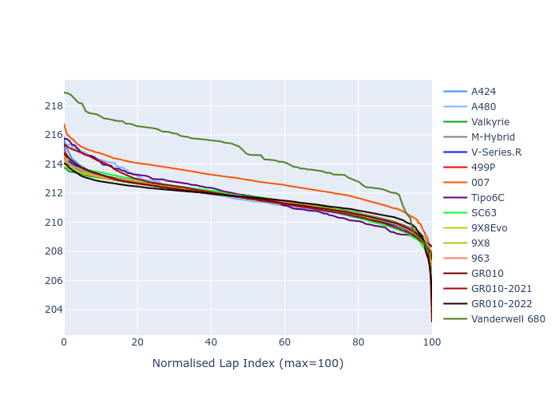

# Combined Plots

## Metadata

- BoP Accuracy: 96.48%
- Overall BoP Grade: A1
- Track: LEMANS
- Threshhold: 250.0kph
- Average Laptime: 3:31.85
- Average Quali Laptime: 3:27.22
- Average Topspeed: 335.10kph

## BoP Table
| Manufacturer     | Car            | Weight   | Power   | PINC   | E/Stint   | FDS    | RDP    | QDP    | TDP    |
|:-----------------|:---------------|:---------|:--------|:-------|:----------|:-------|:-------|:-------|:-------|
| Alpine           | A424           | 1064kg   | 507.0kw | +1.80% | 907MJ     | -      | 51.64% | 59.31% | 26.80% |
| Alpine           | A480           | 994kg    | 410.0kw | +0.10% | 751MJ     | -      | 54.81% | 80.56% | 55.69% |
| Aston Martin     | Valkyrie       | 1032kg   | 520.0kw | -      | 911MJ     | -      | 53.50% | 53.33% | 21.51% |
| BMW              | M-Hybrid       | 1061kg   | 509.0kw | +2.10% | 909MJ     | -      | 52.89% | 56.22% | 33.41% |
| Cadillac         | V-Series.R     | 1060kg   | 520.0kw | -      | 912MJ     | -      | 48.63% | 60.80% | 19.01% |
| Ferrari          | 499P           | 1079kg   | 487.0kw | +4.20% | 884MJ     | 190kph | 51.38% | 44.98% | 9.83%  |
| Glickenhaus      | 007            | 1030kg   | 520.0kw | -      | 913MJ     | -      | 46.15% | 49.30% | 41.45% |
| Isotta Fraschini | Tipo6C         | 1038kg   | 520.0kw | -      | 917MJ     | 190kph | 43.95% | 47.22% | 31.53% |
| Lamborghini      | SC63           | 1033kg   | 520.0kw | -      | 907MJ     | -      | 48.33% | 60.95% | 28.65% |
| Peugeot          | 9X8Evo         | 1053kg   | 508.0kw | -1.60% | 894MJ     | 190kph | 48.87% | 52.78% | 15.41% |
| Peugeot          | 9X8            | 1051kg   | 517.0kw | +0.50% | 911MJ     | 150kph | 54.54% | 58.39% | 9.69%  |
| Porsche          | 963            | 1047kg   | 507.0kw | -1.50% | 898MJ     | -      | 50.70% | 44.30% | 29.51% |
| Toyota           | GR010          | 1068kg   | 482.0kw | +4.60% | 890MJ     | 190kph | 51.09% | 52.71% | 11.46% |
| Toyota           | GR010-2021     | 1063kg   | 513.0kw | -4.60% | 951MJ     | 150kph | 53.89% | 50.91% | 25.87% |
| Toyota           | GR010-2022     | 1053kg   | 500.0kw | -4.00% | 884MJ     | 190kph | 53.24% | 64.49% | 9.72%  |
| Vanwall          | Vanderwell 680 | 1030kg   | 520.0kw | -      | 908MJ     | -      | 35.83% | 59.29% | 34.15% |

## Performance Table
| Manufacturer     | Car            | RP      | QP      | Vavg      |   RDLC | BOP-Grade   | Match   |
|:-----------------|:---------------|:--------|:--------|:----------|-------:|:------------|:--------|
| Alpine           | A424           | 3:31.59 | 3:26.33 | 334.23kph |   1.03 | ~A1         | 99.51%  |
| Alpine           | A480           | 3:31.58 | 3:29.04 | 320.95kph |   1.01 | ~A1         | 98.75%  |
| Aston Martin     | Valkyrie       | 3:31.61 | 3:25.37 | 338.94kph |   1.03 | ~A1         | 100.00% |
| BMW              | M-Hybrid       | 3:31.58 | 3:25.56 | 334.65kph |   1.03 | ~A1         | 100.00% |
| Cadillac         | V-Series.R     | 3:31.58 | 3:25.63 | 332.85kph |   1.03 | ~A1         | 99.89%  |
| Ferrari          | 499P           | 3:31.61 | 3:25.17 | 335.07kph |   1.03 | ~A1         | 99.96%  |
| Glickenhaus      | 007            | 3:32.82 | 3:29.77 | 339.30kph |   1.01 | ~A1         | 95.66%  |
| Isotta Fraschini | Tipo6C         | 3:31.58 | 3:30.73 | 339.45kph |   1    | ~A1         | 97.01%  |
| Lamborghini      | SC63           | 3:31.60 | 3:27.56 | 337.52kph |   1.02 | ~A1         | 100.00% |
| Peugeot          | 9X8Evo         | 3:31.60 | 3:26.12 | 334.78kph |   1.03 | ~A1         | 100.00% |
| Peugeot          | 9X8            | 3:31.58 | 3:27.29 | 334.67kph |   1.02 | ~A1         | 99.92%  |
| Porsche          | 963            | 3:31.58 | 3:25.95 | 335.70kph |   1.03 | ~A1         | 99.90%  |
| Toyota           | GR010          | 3:31.60 | 3:25.15 | 336.20kph |   1.03 | ~A1         | 99.65%  |
| Toyota           | GR010-2021     | 3:31.60 | 3:26.34 | 336.77kph |   1.03 | ~A1         | 99.74%  |
| Toyota           | GR010-2022     | 3:31.59 | 3:29.39 | 337.88kph |   1.01 | ~A1         | 99.70%  |
| Vanwall          | Vanderwell 680 | 3:34.46 | 3:30.20 | 332.63kph |   1.02 | +E2         | 53.92%  |

## Race Laptimes

## Quali Laptimes

## Topspeeds

## Laptimes Lineplot

