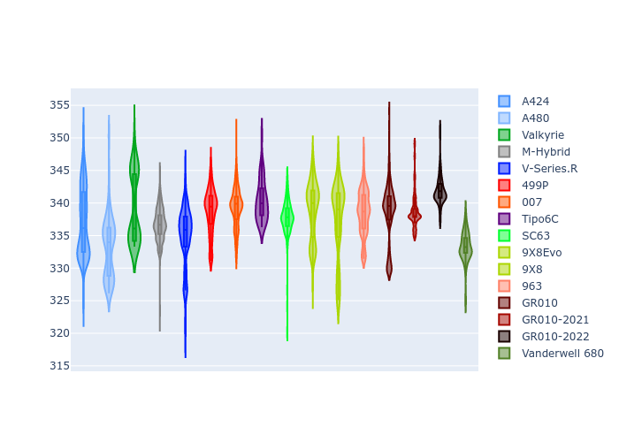
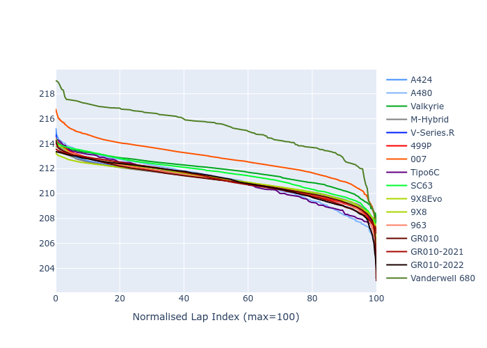

# Combined Plots

## Metadata

- BoP Accuracy: 96.19%
- Overall BoP Grade: A1
- Track: LEMANS
- Threshhold: 250.0kph

## BoP Table
| Manufacturer     | Car            | Weight   | Power   | PINC   | E/Stint   | FDS    | RDP    | QDP    | TDP    |
|:-----------------|:---------------|:---------|:--------|:-------|:----------|:-------|:-------|:-------|:-------|
| Alpine           | A424           | 1064kg   | 480.0kw | +0.50% | 881MJ     | -      | 52.35% | 61.85% | 27.84% |
| Alpine           | A480           | 952kg    | 410.0kw | +0.20% | 747MJ     | -      | 54.51% | 76.19% | 54.04% |
| Aston Martin     | Valkyrie       | 1034kg   | 490.0kw | -2.00% | 882MJ     | -      | 53.59% | 53.33% | 21.51% |
| BMW              | M-Hybrid       | 1065kg   | 480.0kw | +2.00% | 883MJ     | -      | 53.26% | 57.23% | 34.54% |
| Cadillac         | V-Series.R     | 1076kg   | 480.0kw | +7.90% | 890MJ     | -      | 47.80% | 56.73% | 19.63% |
| Ferrari          | 499P           | 1100kg   | 480.0kw | +0.60% | 873MJ     | 200kph | 53.02% | 42.32% | 9.88%  |
| Glickenhaus      | 007            | 1030kg   | 486.0kw | +4.00% | 889MJ     | -      | 46.49% | 46.07% | 47.78% |
| Isotta Fraschini | Tipo6C         | 1089kg   | 520.0kw | -2.00% | 919MJ     | 190kph | 43.95% | 47.22% | 31.53% |
| Lamborghini      | SC63           | 1071kg   | 517.0kw | -4.20% | 902MJ     | -      | 46.33% | 59.50% | 29.33% |
| Peugeot          | 9X8Evo         | 1068kg   | 480.0kw | -      | 873MJ     | 190kph | 48.47% | 51.26% | 16.02% |
| Peugeot          | 9X8            | 1092kg   | 487.0kw | +6.70% | 898MJ     | 150kph | 54.07% | 57.08% | 10.80% |
| Porsche          | 963            | 1064kg   | 480.0kw | +1.10% | 880MJ     | -      | 50.87% | 45.25% | 30.77% |
| Toyota           | GR010          | 1100kg   | 480.0kw | -      | 884MJ     | 200kph | 52.43% | 57.12% | 12.82% |
| Toyota           | GR010-2021     | 1100kg   | 480.0kw | +8.30% | 946MJ     | 200kph | 54.09% | 52.67% | 26.37% |
| Toyota           | GR010-2022     | 1100kg   | 480.0kw | +2.50% | 881MJ     | 200kph | 53.48% | 69.44% | 7.86%  |
| Vanwall          | Vanderwell 680 | 1030kg   | 520.0kw | -      | 908MJ     | -      | 53.41% | 56.28% | 29.85% |

## Performance Table
| Manufacturer     | Car            | RP      | QP      | Vavg      |   RDLC | BOP-Grade   | Match   |
|:-----------------|:---------------|:--------|:--------|:----------|-------:|:------------|:--------|
| Alpine           | A424           | 3:32.72 | 3:27.59 | 324.57kph |   1.02 | ~A1         | 98.73%  |
| Alpine           | A480           | 3:28.59 | 3:25.59 | 319.47kph |   1.01 | -C2         | 72.02%  |
| Aston Martin     | Valkyrie       | 3:32.70 | 3:26.36 | 327.52kph |   1.03 | ~A1         | 100.00% |
| BMW              | M-Hybrid       | 3:32.69 | 3:26.82 | 324.65kph |   1.03 | ~A1         | 98.47%  |
| Cadillac         | V-Series.R     | 3:32.71 | 3:26.91 | 324.14kph |   1.03 | ~A1         | 99.62%  |
| Ferrari          | 499P           | 3:31.58 | 3:24.81 | 323.69kph |   1.03 | ~A1         | 99.57%  |
| Glickenhaus      | 007            | 3:32.71 | 3:29.46 | 327.36kph |   1.02 | +A2         | 94.28%  |
| Isotta Fraschini | Tipo6C         | 3:32.70 | 3:31.67 | 327.08kph |   1    | ~A1         | 95.52%  |
| Lamborghini      | SC63           | 3:32.72 | 3:28.82 | 326.59kph |   1.02 | ~A1         | 99.28%  |
| Peugeot          | 9X8Evo         | 3:32.70 | 3:27.18 | 326.00kph |   1.03 | ~A1         | 98.41%  |
| Peugeot          | 9X8            | 3:32.70 | 3:27.27 | 317.18kph |   1.03 | ~A1         | 99.94%  |
| Porsche          | 963            | 3:32.71 | 3:26.97 | 324.69kph |   1.03 | ~A1         | 99.37%  |
| Toyota           | GR010          | 3:31.39 | 3:24.42 | 324.32kph |   1.03 | ~A1         | 99.63%  |
| Toyota           | GR010-2021     | 3:32.02 | 3:27.02 | 320.40kph |   1.02 | ~A1         | 100.00% |
| Toyota           | GR010-2022     | 3:31.18 | 3:27.79 | 323.85kph |   1.02 | ~A1         | 99.85%  |
| Vanwall          | Vanderwell 680 | 3:33.99 | 3:28.09 | 325.73kph |   1.03 | +B2         | 84.38%  |

## Race Laptimes

## Quali Laptimes

## Topspeeds

## Laptimes Lineplot

