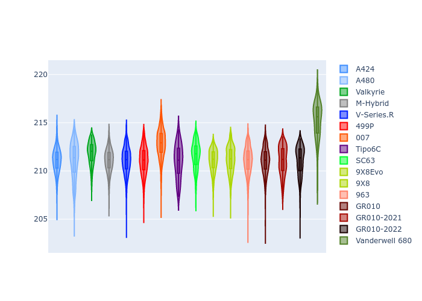

# Combined Plots

## Metadata

- BoP Accuracy: 99.44%
- Overall BoP Grade: A1
- Track: LEMANS
- Threshhold: 210.0kph

## BoP Table
| Manufacturer     | Car            | Weight   | Power   | PINC   | E/Stint   | FDS    |
|:-----------------|:---------------|:---------|:--------|:-------|:----------|:-------|
| Alpine           | A424           | 1050kg   | 480.0kw | -      | 879MJ     | -      |
| Alpine           | A480           | 1052kg   | 410.0kw | +0.20% | 747MJ     | -      |
| Aston Martin     | Valkyrie       | 1033kg   | 487.0kw | -1.40% | 880MJ     | -      |
| BMW              | M-Hybrid       | 1052kg   | 480.0kw | +2.00% | 881MJ     | -      |
| Cadillac         | V-Series.R     | 1057kg   | 481.0kw | +7.80% | 885MJ     | -      |
| Ferrari          | 499P           | 1079kg   | 480.0kw | +0.30% | 871MJ     | 190kph |
| Glickenhaus      | 007            | 1037kg   | 489.0kw | +3.20% | 889MJ     | -      |
| Isotta Fraschini | Tipo6C         | 1086kg   | 520.0kw | -2.40% | 920MJ     | 190kph |
| Lamborghini      | SC63           | 1080kg   | 517.0kw | -4.80% | 904MJ     | -      |
| Peugeot          | 9X8Evo         | 1049kg   | 480.0kw | -      | 871MJ     | 190kph |
| Peugeot          | 9X8            | 1063kg   | 493.0kw | +5.40% | 895MJ     | 150kph |
| Porsche          | 963            | 1052kg   | 480.0kw | +1.60% | 879MJ     | -      |
| Toyota           | GR010          | 1076kg   | 480.0kw | -      | 882MJ     | 190kph |
| Toyota           | GR010OLD       | 1100kg   | 480.0kw | +3.80% | 936MJ     | 150kph |
| Vanwall          | Vanderwell 680 | 1034kg   | 520.0kw | -      | 908MJ     | -      |

## Performance Table
| Manufacturer     | Car            | RP      | QP      | Vavg      |   RDLC | BOP-Grade   | Match   |
|:-----------------|:---------------|:--------|:--------|:----------|-------:|:------------|:--------|
| Alpine           | A424           | 3:34.35 | 3:29.43 | 325.96kph |   1.02 | ~A1         | 99.58%  |
| Alpine           | A480           | 3:34.32 | 3:31.62 | 317.56kph |   1.01 | ~A1         | 97.20%  |
| Aston Martin     | Valkyrie       | 3:34.36 | 3:27.94 | 327.50kph |   1.03 | ~A1         | 100.00% |
| BMW              | M-Hybrid       | 3:34.40 | 3:28.78 | 326.00kph |   1.03 | ~A1         | 100.00% |
| Cadillac         | V-Series.R     | 3:34.37 | 3:28.93 | 326.12kph |   1.03 | ~A1         | 99.96%  |
| Ferrari          | 499P           | 3:34.39 | 3:28.60 | 325.78kph |   1.03 | ~A1         | 99.98%  |
| Glickenhaus      | 007            | 3:34.38 | 3:31.07 | 326.44kph |   1.02 | ~A1         | 97.42%  |
| Isotta Fraschini | Tipo6C         | 3:34.37 | 3:33.12 | 327.26kph |   1.01 | ~A1         | 100.00% |
| Lamborghini      | SC63           | 3:34.38 | 3:30.55 | 325.47kph |   1.02 | ~A1         | 99.52%  |
| Peugeot          | 9X8Evo         | 3:34.41 | 3:28.83 | 328.13kph |   1.03 | ~A1         | 98.74%  |
| Peugeot          | 9X8            | 3:34.39 | 3:29.58 | 321.89kph |   1.02 | ~A1         | 99.96%  |
| Porsche          | 963            | 3:34.35 | 3:28.88 | 325.91kph |   1.03 | ~A1         | 99.89%  |
| Toyota           | GR010          | 3:34.36 | 3:28.36 | 326.46kph |   1.03 | ~A1         | 99.97%  |
| Toyota           | GR010OLD       | 3:34.28 | 3:30.93 | 320.45kph |   1.02 | ~A1         | 100.00% |
| Vanwall          | Vanderwell 680 | 3:34.37 | 3:28.36 | 325.27kph |   1.03 | ~A1         | 99.40%  |

## Race Laptimes

## Quali Laptimes

## Topspeeds

## Laptimes Lineplot

