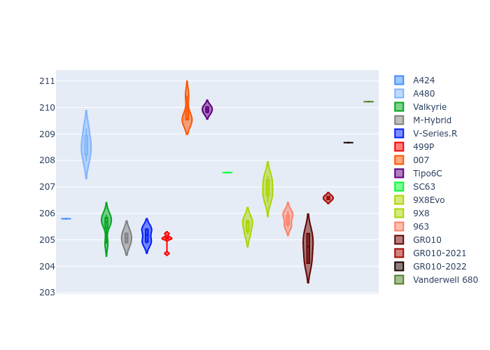

# Combined Plots

## Metadata

- BoP Accuracy: 95.14%
- Overall BoP Grade: A1
- Track: LEMANS
- Threshhold: 250.0kph
- Average Laptime: 3:31.52
- Average Quali Laptime: 3:26.93
- Average Topspeed: 337.80kph

## BoP Table
| Manufacturer     | Car            | Weight   | Power   | PINC   | E/Stint   | FDS    | RDP    | QDP    | TDP    |
|:-----------------|:---------------|:---------|:--------|:-------|:----------|:-------|:-------|:-------|:-------|
| Alpine           | A424           | 1039kg   | 498.0kw | +4.40% | 901MJ     | -      | 51.64% | 59.31% | 26.80% |
| Alpine           | A480           | 933kg    | 410.0kw | +5.00% | 752MJ     | -      | 53.05% | 74.07% | 48.97% |
| Aston Martin     | Valkyrie       | 1030kg   | 520.0kw | -      | 911MJ     | -      | 53.50% | 53.33% | 21.51% |
| BMW              | M-Hybrid       | 1040kg   | 504.0kw | +3.10% | 904MJ     | -      | 52.89% | 56.22% | 33.41% |
| Cadillac         | V-Series.R     | 1043kg   | 520.0kw | -      | 910MJ     | -      | 48.63% | 60.80% | 19.01% |
| Ferrari          | 499P           | 1059kg   | 497.0kw | +2.90% | 889MJ     | 190kph | 51.38% | 44.98% | 9.83%  |
| Glickenhaus      | 007            | 1030kg   | 520.0kw | -      | 913MJ     | -      | 46.15% | 49.30% | 41.45% |
| Isotta Fraschini | Tipo6C         | 1030kg   | 520.0kw | -      | 916MJ     | 140kph | 43.95% | 47.22% | 31.53% |
| Lamborghini      | SC63           | 1030kg   | 520.0kw | -      | 907MJ     | -      | 48.33% | 60.95% | 28.65% |
| Peugeot          | 9X8Evo         | 1030kg   | 520.0kw | -3.20% | 899MJ     | 190kph | 48.87% | 52.78% | 15.41% |
| Peugeot          | 9X8            | 1030kg   | 520.0kw | -      | 910MJ     | 140kph | 54.54% | 58.39% | 9.69%  |
| Porsche          | 963            | 1035kg   | 501.0kw | +1.90% | 898MJ     | -      | 50.70% | 44.30% | 29.51% |
| Toyota           | GR010          | 1060kg   | 499.0kw | +1.20% | 899MJ     | 190kph | 51.09% | 52.71% | 11.46% |
| Toyota           | GR010-2021     | 1055kg   | 510.0kw | -4.40% | 948MJ     | 150kph | 54.08% | 54.81% | 9.72%  |
| Toyota           | GR010-2022     | 1052kg   | 520.0kw | -5.20% | 899MJ     | 190kph | 53.45% | 68.83% | 9.58%  |
| Vanwall          | Vanderwell 680 | 1030kg   | 520.0kw | -      | 908MJ     | -      | 49.68% | 60.93% | 34.43% |

## Performance Table
| Manufacturer     | Car            | RP      | QP      | Vavg      |   RDLC | BOP-Grade   | Match   |
|:-----------------|:---------------|:--------|:--------|:----------|-------:|:------------|:--------|
| Alpine           | A424           | 3:31.08 | 3:25.80 | 337.09kph |   1.03 | ~A1         | 99.60%  |
| Alpine           | A480           | 3:31.06 | 3:28.57 | 333.21kph |   1.01 | ~A1         | 99.73%  |
| Aston Martin     | Valkyrie       | 3:31.85 | 3:25.57 | 339.17kph |   1.03 | ~A1         | 100.00% |
| BMW              | M-Hybrid       | 3:31.07 | 3:25.07 | 336.71kph |   1.03 | ~A1         | 100.00% |
| Cadillac         | V-Series.R     | 3:31.07 | 3:25.16 | 334.81kph |   1.03 | ~A1         | 99.86%  |
| Ferrari          | 499P           | 3:31.06 | 3:24.98 | 338.76kph |   1.03 | ~A1         | 99.94%  |
| Glickenhaus      | 007            | 3:32.82 | 3:29.76 | 339.30kph |   1.01 | +B1         | 88.98%  |
| Isotta Fraschini | Tipo6C         | 3:30.94 | 3:29.92 | 340.40kph |   1    | ~A1         | 100.00% |
| Lamborghini      | SC63           | 3:31.60 | 3:27.54 | 337.87kph |   1.02 | ~A1         | 100.00% |
| Peugeot          | 9X8Evo         | 3:31.06 | 3:25.54 | 338.95kph |   1.03 | ~A1         | 100.00% |
| Peugeot          | 9X8            | 3:31.18 | 3:26.94 | 337.41kph |   1.02 | ~A1         | 100.00% |
| Porsche          | 963            | 3:31.07 | 3:25.80 | 338.52kph |   1.03 | ~A1         | 99.84%  |
| Toyota           | GR010          | 3:31.05 | 3:24.70 | 338.54kph |   1.03 | ~A1         | 99.76%  |
| Toyota           | GR010-2021     | 3:31.08 | 3:26.58 | 338.75kph |   1.02 | ~A1         | 100.00% |
| Toyota           | GR010-2022     | 3:31.06 | 3:28.67 | 341.95kph |   1.01 | ~A1         | 99.49%  |
| Vanwall          | Vanderwell 680 | 3:35.20 | 3:30.22 | 333.32kph |   1.02 | +Ω1         | 35.07%  |

## Race Laptimes

## Quali Laptimes

## Topspeeds

## Laptimes Lineplot

