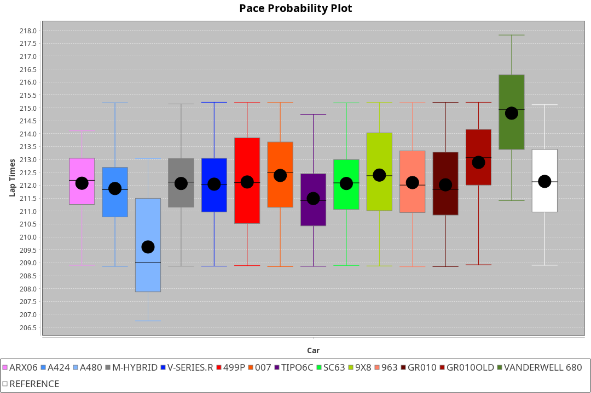
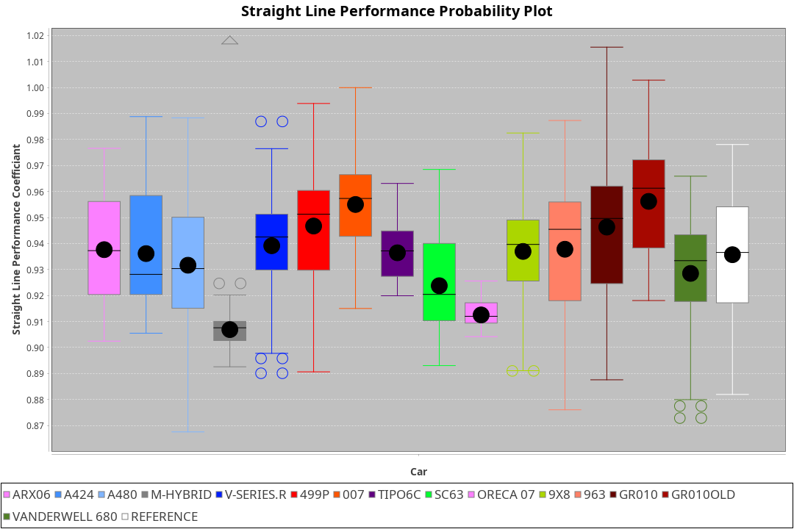
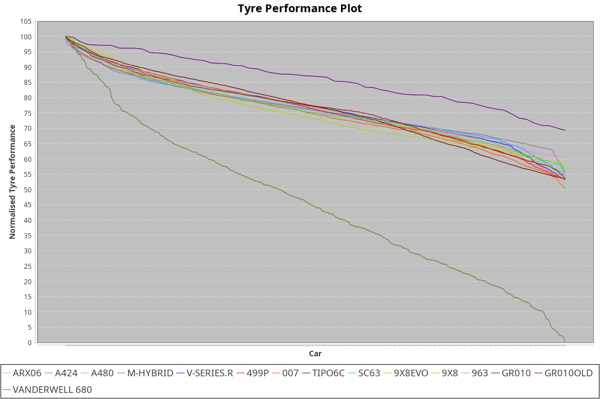

| Manufacturer     | Car            | Weight | Power   | PINC    | E/Stint | FDS     |
|:-|:-|:-|:-|:-|:-|:-|
| Acura            | ARX06          | 1066kg | 516.0kw | 0.70%   | 915MJ   |    -    |
| Alpine           | A424           | 1048kg | 520.0kw |    -    | 915MJ   |    -    |
| Alpine           | A480           | 949kg  | 429.0kw | 5.80%   | 768MJ   |    -    |
| BMW              | M-Hybrid       | 1041kg | 520.0kw | -3.40%  | 908MJ   |    -    |
| Cadillac         | V-Series.R     | 1057kg | 518.0kw | 0.30%   | 908MJ   |    -    |
| Ferrari          | 499P           | 1070kg | 498.0kw | 3.20%   | 894MJ   | 190kph  |
| Glickenhaus      | 007            | 1030kg | 520.0kw |    -    | 910MJ   |    -    |
| Isotta Fraschini | Tipo6C         | 1035kg | 520.0kw |    -    | 914MJ   | 190kph  |
| Lamborghini      | SC63           | 1030kg | 520.0kw |    -    | 910MJ   |    -    |
| Peugeot          | 9X8            | 1060kg | 496.0kw | 4.80%   | 891MJ   |    -    |
| Peugeot          | 9X8Evo         | 1042kg | 504.0kw | -2.10%  | 896MJ   | 190kph  |
| Porsche          | 963            | 1050kg | 520.0kw | -3.40%  | 902MJ   |    -    |
| Toyota           | GR010          | 1091kg | 504.0kw | 3.10%   | 902MJ   | 190kph  |
| Toyota           | GR010OLD       | 1100kg | 480.0kw | 0.30%   | 880MJ   |    -    |
| Vanwall          | Vanderwell 680 | 1030kg | 520.0kw |    -    | 903MJ   |    -    |

### BoP Accuracy: 83.74%; Overall BoP Grade: B2
| Manufacturer     | Car            | Type  | RP      | QP      | Weight | Power¹  | Threshhold | PINC    | Power²   | E/Stint | AVG Vmax  | FDS     | RDLC | L/Stint | BOP-Grade | Model Accuracy | Model Points | Match%  | SimDiff |
|:-|:-|:-|:-|:-|:-|:-|:-|:-|:-|:-|:-|:-|:-|:-|:-|:-|:-|:-|:-|
| Acura            | ARX06          | LMDH  | 3:31.80 | 3:22.95 | 1066kg | 516.0kw | 210.0kph   | 0.70%   | 519.60kw |  915MJ  | 323.41kph |    -    | 1.00 | 12      | +D1       | 100.00%        | 995          | 68.75%  | #       |
| Alpine           | A424           | LMDH  | 3:31.81 | 3:24.32 | 1048kg | 520.0kw | 0.0kph     |    -    | 520.00kw |  915MJ  | 337.38kph |    -    | 1.00 | 12      | ~A1       | 86.43%         | 618          | 95.46%  | #       |
| Alpine           | A480           | LMP1  | 3:31.79 | 3:25.55 |  949kg | 429.0kw | 210.0kph   | 5.80%   | 453.90kw |  768MJ  | 325.67kph |    -    | 0.98 | 11      | ~A1       | 68.63%         | 967          | 100.00% | ±0.76s  |
| BMW              | M-Hybrid       | LMDH  | 3:31.81 | 3:23.39 | 1041kg | 520.0kw | 210.0kph   | -3.40%  | 502.30kw |  908MJ  | 332.54kph |    -    | 1.01 | 12      | +B1       | 93.77%         | 1672         | 89.95%  | #       |
| Cadillac         | V-Series.R     | LMDH  | 3:31.82 | 3:24.29 | 1057kg | 518.0kw | 210.0kph   | 0.30%   | 519.60kw |  908MJ  | 329.73kph |    -    | 1.00 | 12      | ~A1       | 83.12%         | 1921         | 97.87%  | ±0.61s  |
| Ferrari          | 499P           | LMHHU | 3:31.80 | 3:23.96 | 1070kg | 498.0kw | 210.0kph   | 3.20%   | 513.90kw |  894MJ  | 332.17kph | 190kph  | 1.02 | 12      | ~A1       | 69.49%         | 1950         | 100.00% | ±0.93s  |
| Glickenhaus      | 007            | LMHNH | 3:32.37 | 3:26.41 | 1030kg | 520.0kw | 0.0kph     |    -    | 520.00kw |  910MJ  | 332.32kph |    -    | 0.96 | 12      | ~A1       | 89.50%         | 1518         | 100.00% | ±0.13s  |
| Isotta Fraschini | Tipo6C         | LMHHU | 3:31.82 | 3:27.35 | 1035kg | 520.0kw | 0.0kph     |    -    | 520.00kw |  914MJ  | 333.55kph | 190kph  | 1.07 | 12      | +C2       | 73.56%         | 64           | 73.16%  | #       |
| Lamborghini      | SC63           | LMDH  | 3:32.00 | 3:27.79 | 1030kg | 520.0kw | 0.0kph     |    -    | 520.00kw |  910MJ  | 335.28kph |    -    | 1.06 | 12      | +A2       | 95.82%         | 459          | 93.78%  | #       |
| Peugeot          | 9X8            | LMHHE | 3:31.81 | 3:24.47 | 1060kg | 496.0kw | 210.0kph   | 4.80%   | 519.80kw |  891MJ  | 325.64kph |    -    | 1.00 | 12      | -A2       | 88.75%         | 2383         | 94.34%  | ±1.45s  |
| Peugeot          | 9X8Evo         | LMHHU | 3:31.82 | 3:24.08 | 1042kg | 504.0kw | 210.0kph   | -2.10%  | 493.40kw |  896MJ  | 331.12kph | 190kph  | 1.01 | 12      | ~A1       | 66.97%         | 221          | 100.00% | #       |
| Porsche          | 963            | LMDH  | 3:31.82 | 3:23.86 | 1050kg | 520.0kw | 210.0kph   | -3.40%  | 502.30kw |  902MJ  | 331.48kph |    -    | 1.01 | 12      | ~A1       | 81.02%         | 5243         | 99.06%  | ±0.86s  |
| Toyota           | GR010          | LMHHU | 3:31.81 | 3:24.27 | 1091kg | 504.0kw | 210.0kph   | 3.10%   | 519.60kw |  902MJ  | 329.83kph | 190kph  | 1.00 | 12      | ~A1       | 73.70%         | 2701         | 100.00% | ±0.25s  |
| Toyota           | GR010OLD       | LMHHE | 3:31.76 | 3:23.45 | 1100kg | 480.0kw | 210.0kph   | 0.30%   | 481.40kw |  880MJ  | 317.59kph |    -    | 0.99 | 12      | -B1       | 99.03%         | 1536         | 87.96%  | ±0.91s  |
| Vanwall          | Vanderwell 680 | LMHNH | 3:38.69 | 3:29.11 | 1030kg | 520.0kw | 0.0kph     |    -    | 520.00kw |  903MJ  | 324.38kph |    -    | 1.01 | 12      | +Ω2       | 97.01%         | 649          | -44.24% | ±3.27s  |

## Power below Threshhold
| N/Nmax    | ARX06   | A424    | M-HYBRID | V-SERIES.R | 499P    | 007     | TIPO6C  | SC63    | 9X8     | 9X8EVO  | 963     | GR010   | GR010OLD | VANDERWELL 680 | ​     | RPM      | A480       |
|:-|:-|:-|:-|:-|:-|:-|:-|:-|:-|:-|:-|:-|:-|:-|:-|:-|:-|
|  0.550    |  254    |  256    |  256     |  255       |  245    |  256    |  256    |  256    |  244    |  248    |  256    |  248    |  236     |  256           |  ​    |   --     |  0.00      |
|  0.575    |  277    |  279    |  279     |  278       |  268    |  279    |  279    |  279    |  267    |  271    |  279    |  271    |  258     |  279           |  ​    |   --     |  0.00      |
|  0.600    |  298    |  300    |  300     |  299       |  288    |  300    |  300    |  300    |  287    |  291    |  300    |  291    |  277     |  300           |  ​    |   --     |  0.00      |
|  0.625    |  319    |  322    |  322     |  321       |  308    |  322    |  322    |  322    |  307    |  312    |  322    |  312    |  297     |  322           |  ​    |   --     |  0.00      |
|  0.650    |  340    |  343    |  343     |  342       |  329    |  343    |  343    |  343    |  327    |  333    |  343    |  333    |  317     |  343           |  ​    |   --     |  0.00      |
|  0.675    |  362    |  365    |  365     |  364       |  350    |  365    |  365    |  365    |  348    |  354    |  365    |  354    |  337     |  365           |  ​    |   --     |  0.00      |
|  0.700    |  384    |  387    |  387     |  386       |  371    |  387    |  387    |  387    |  369    |  375    |  387    |  375    |  358     |  387           |  ​    |   --     |  0.00      |
|  0.725    |  406    |  409    |  409     |  407       |  392    |  409    |  409    |  409    |  390    |  396    |  409    |  396    |  378     |  409           |  ​    |   --     |  0.00      |
|  0.750    |  427    |  430    |  430     |  428       |  411    |  430    |  430    |  430    |  410    |  416    |  430    |  416    |  397     |  430           |  ​    |   --     |  0.00      |
|  0.775    |  446    |  449    |  449     |  447       |  430    |  449    |  449    |  449    |  429    |  435    |  449    |  435    |  415     |  449           |  ​    |  5000    |  255.38    |
|  0.800    |  463    |  467    |  467     |  465       |  447    |  467    |  467    |  467    |  445    |  453    |  467    |  453    |  431     |  467           |  ​    |  5500    |  301.45    |
|  0.825    |  478    |  482    |  482     |  480       |  462    |  482    |  482    |  482    |  460    |  468    |  482    |  468    |  445     |  482           |  ​    |  6000    |  337.51    |
|  0.850    |  490    |  494    |  494     |  492       |  473    |  494    |  494    |  494    |  471    |  479    |  494    |  479    |  456     |  494           |  ​    |  6500    |  380.57    |
|  0.875    |  501    |  505    |  505     |  503       |  483    |  505    |  505    |  505    |  481    |  489    |  505    |  489    |  466     |  505           |  ​    |  7000    |  425.64    |
|  0.900    |  508    |  512    |  512     |  510       |  490    |  512    |  512    |  512    |  488    |  496    |  512    |  496    |  472     |  512           |  ​    |  7500    |  435.66    |
|  0.925    |  513    |  517    |  517     |  515       |  495    |  517    |  517    |  517    |  493    |  501    |  517    |  501    |  477     |  517           |  ​    |  8000    |  432.65    |
| **0.950** | **516** | **520** | **520**  | **518**    | **498** | **520** | **520** | **520** | **496** | **504** | **520** | **504** | **480**  | **520**        | **​** | **8500** | **435.66** |
|  0.975    |  514    |  518    |  518     |  516       |  496    |  518    |  518    |  518    |  494    |  502    |  518    |  502    |  478     |  518           |  ​    |  9000    |  217.33    |
|  1.000    |  510    |  514    |  514     |  512       |  493    |  514    |  514    |  514    |  491    |  499    |  514    |  499    |  475     |  514           |  ​    |   --     |  0.00      |
|  1.025    |  441    |  444    |  444     |  442       |  425    |  444    |  444    |  444    |  424    |  430    |  444    |  430    |  410     |  444           |  ​    |   --     |  0.00      |

## Power above Threshhold
| N/Nmax    | ARX06      | A424    | M-HYBRID   | V-SERIES.R | 499P       | 007     | TIPO6C  | SC63    | 9X8        | 9X8EVO     | 963        | GR010      | GR010OLD   | VANDERWELL 680 | ​     | RPM      | A480       |
|:-|:-|:-|:-|:-|:-|:-|:-|:-|:-|:-|:-|:-|:-|:-|:-|:-|:-|
|  0.550    |  256.30    |  256    |  247.16    |  256.27    |  253.46    |  256    |  256    |  256    |  256.40    |  243.21    |  247.16    |  256.31    |  237.22    |  256           |  ​    |   --     |  0.00      |
|  0.575    |  279.33    |  279    |  270.17    |  279.30    |  276.50    |  279    |  279    |  279    |  279.43    |  265.22    |  270.17    |  279.34    |  259.24    |  279           |  ​    |   --     |  0.00      |
|  0.600    |  299.35    |  300    |  290.18    |  299.32    |  296.54    |  300    |  300    |  300    |  299.47    |  285.24    |  290.18    |  299.36    |  278.25    |  300           |  ​    |   --     |  0.00      |
|  0.625    |  321.38    |  322    |  310.20    |  321.34    |  317.58    |  322    |  322    |  322    |  321.50    |  305.26    |  310.20    |  321.39    |  298.27    |  322           |  ​    |   --     |  0.00      |
|  0.650    |  342.40    |  343    |  331.21    |  342.37    |  338.62    |  343    |  343    |  343    |  342.53    |  325.27    |  331.21    |  342.41    |  318.29    |  343           |  ​    |   --     |  0.00      |
|  0.675    |  364.43    |  365    |  352.22    |  364.39    |  360.66    |  365    |  365    |  365    |  364.57    |  346.29    |  352.22    |  364.44    |  338.31    |  365           |  ​    |   --     |  0.00      |
|  0.700    |  386.46    |  387    |  374.24    |  386.41    |  382.70    |  387    |  387    |  387    |  386.60    |  367.31    |  374.24    |  386.46    |  359.33    |  387           |  ​    |   --     |  0.00      |
|  0.725    |  408.48    |  409    |  395.25    |  408.44    |  403.74    |  409    |  409    |  409    |  408.64    |  388.33    |  395.25    |  408.49    |  379.35    |  409           |  ​    |   --     |  0.00      |
|  0.750    |  429.51    |  430    |  415.26    |  429.46    |  424.77    |  430    |  430    |  430    |  429.67    |  407.34    |  415.26    |  429.52    |  398.36    |  430           |  ​    |   --     |  0.00      |
|  0.775    |  448.53    |  449    |  434.28    |  448.48    |  443.81    |  449    |  449    |  449    |  448.70    |  426.36    |  434.28    |  448.54    |  416.38    |  449           |  ​    |  5000    |  255.38    |
|  0.800    |  466.55    |  467    |  451.29    |  466.50    |  461.84    |  467    |  467    |  467    |  466.73    |  443.37    |  451.29    |  466.56    |  432.40    |  467           |  ​    |  5500    |  301.45    |
|  0.825    |  481.57    |  482    |  466.30    |  481.51    |  476.87    |  482    |  482    |  482    |  481.75    |  457.39    |  466.30    |  481.58    |  446.41    |  482           |  ​    |  6000    |  337.51    |
|  0.850    |  493.58    |  494    |  477.30    |  493.53    |  487.89    |  494    |  494    |  494    |  493.77    |  468.39    |  477.30    |  493.59    |  457.42    |  494           |  ​    |  6500    |  380.57    |
|  0.875    |  504.59    |  505    |  487.31    |  504.54    |  498.91    |  505    |  505    |  505    |  504.78    |  478.40    |  487.31    |  504.61    |  467.43    |  505           |  ​    |  7000    |  425.64    |
|  0.900    |  511.60    |  512    |  494.31    |  511.55    |  505.92    |  512    |  512    |  512    |  511.80    |  485.41    |  494.31    |  511.61    |  473.43    |  512           |  ​    |  7500    |  435.66    |
|  0.925    |  516.61    |  517    |  499.32    |  516.55    |  510.93    |  517    |  517    |  517    |  516.80    |  490.41    |  499.32    |  516.62    |  478.44    |  517           |  ​    |  8000    |  432.65    |
| **0.950** | **519.61** | **520** | **502.32** | **519.55** | **513.94** | **520** | **520** | **520** | **519.81** | **493.42** | **502.32** | **519.62** | **481.44** | **520**        | **​** | **8500** | **435.66** |
|  0.975    |  517.61    |  518    |  500.32    |  517.55    |  511.93    |  518    |  518    |  518    |  517.80    |  491.41    |  500.32    |  517.62    |  479.44    |  518           |  ​    |  9000    |  217.33    |
|  1.000    |  513.60    |  514    |  497.32    |  513.55    |  507.93    |  514    |  514    |  514    |  513.80    |  488.41    |  497.32    |  513.62    |  476.44    |  514           |  ​    |   --     |  0.00      |
|  1.025    |  443.52    |  444    |  429.27    |  443.47    |  438.80    |  444    |  444    |  444    |  443.69    |  421.36    |  429.27    |  443.53    |  411.38    |  444           |  ​    |   --     |  0.00      |
