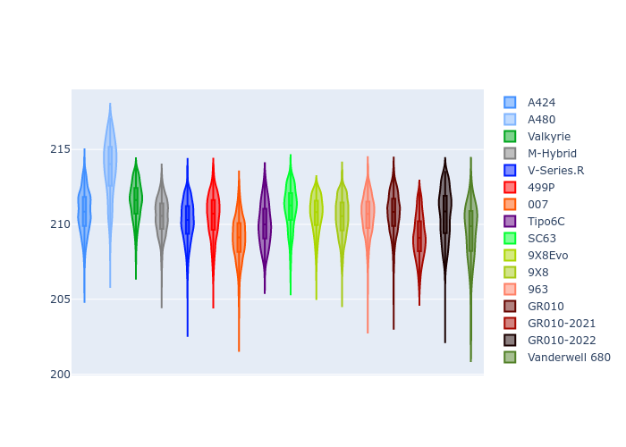
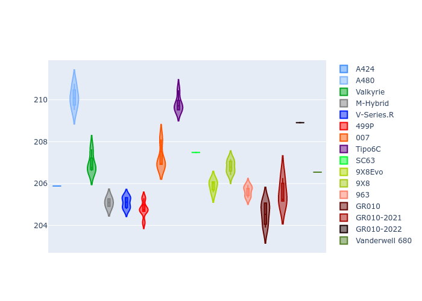
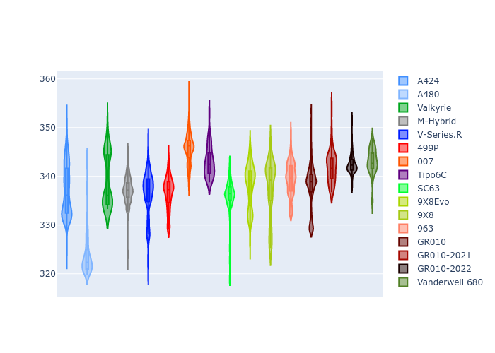
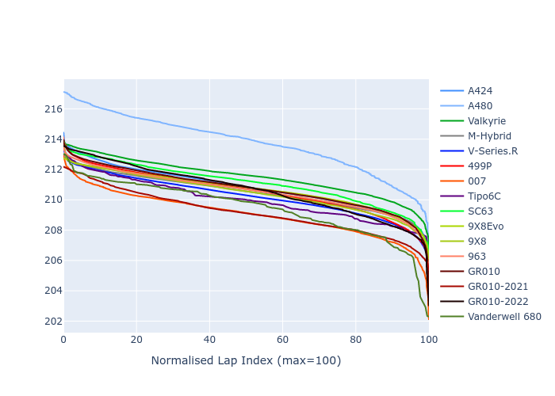

# Combined Plots

## Metadata

- BoP Accuracy: 96.23%
- Overall BoP Grade: A1
- Track: LEMANS
- Threshhold: 250.0kph
- Average Laptime: 3:30.58
- Average Quali Laptime: 3:26.72
- Laptime Std Dev: 1.03 seconds
- Filtered Average Topspeed: 339.80kph

## BoP Table
| Manufacturer     | Car            | Weight   | Power   | PINC   | E/Stint   | FDS    | RDP    | QDP    | TDP    |
|:-----------------|:---------------|:---------|:--------|:-------|:----------|:-------|:-------|:-------|:-------|
| Alpine           | A424           | 1046kg   | 511.0kw | +0.50% | 896MJ     | -      | 52.20% | 54.51% | 24.58% |
| Alpine           | A480           | 992kg    | 420.0kw | +0.10% | 760MJ     | -      | 53.05% | 74.07% | 48.97% |
| Aston Martin     | Valkyrie       | 1030kg   | 520.0kw | -      | 911MJ     | -      | 53.39% | 54.11% | 23.71% |
| BMW              | M-Hybrid       | 1040kg   | 513.0kw | -      | 918MJ     | -      | 53.47% | 52.95% | 33.73% |
| Cadillac         | V-Series.R     | 1037kg   | 519.0kw | -      | 908MJ     | -      | 49.22% | 60.31% | 18.04% |
| Ferrari          | 499P           | 1052kg   | 503.0kw | -0.60% | 890MJ     | 190kph | 51.56% | 44.72% | 9.86%  |
| Glickenhaus      | 007            | 1003kg   | 533.0kw | -      | 921MJ     | -      | 46.14% | 49.30% | 41.45% |
| Isotta Fraschini | Tipo6C         | 1015kg   | 523.0kw | -      | 917MJ     | 190kph | 43.95% | 47.22% | 31.53% |
| Lamborghini      | SC63           | 1030kg   | 520.0kw | -1.60% | 904MJ     | -      | 48.25% | 60.95% | 28.65% |
| Peugeot          | 9X8Evo         | 1042kg   | 518.0kw | -      | 901MJ     | 190kph | 50.17% | 49.36% | 17.73% |
| Peugeot          | 9X8            | 1036kg   | 524.0kw | -      | 914MJ     | 150kph | 54.54% | 58.39% | 9.69%  |
| Porsche          | 963            | 1046kg   | 511.0kw | +0.60% | 916MJ     | -      | 50.78% | 41.25% | 27.61% |
| Toyota           | GR010          | 1061kg   | 502.0kw | +1.50% | 904MJ     | 190kph | 51.68% | 51.25% | 14.48% |
| Toyota           | GR010-2021     | 1045kg   | 509.0kw | +0.10% | 954MJ     | 150kph | 54.04% | 54.81% | 9.72%  |
| Toyota           | GR010-2022     | 1050kg   | 503.0kw | +0.10% | 893MJ     | 190kph | 53.24% | 64.49% | 9.72%  |
| Vanwall          | Vanderwell 680 | 980kg    | 539.0kw | -      | 919MJ     | -      | 49.68% | 60.93% | 34.43% |

## Performance Table
| Manufacturer     | Car            | RP      | QP      | Vavg      |   RDLC | BOP-Grade   | Match   |
|:-----------------|:---------------|:--------|:--------|:----------|-------:|:------------|:--------|
| Alpine           | A424           | 3:30.82 | 3:26.05 | 337.04kph |   1.02 | ~A1         | 99.58%  |
| Alpine           | A480           | 3:33.70 | 3:33.10 | 325.90kph |   1    | +Ω1         | 45.24%  |
| Aston Martin     | Valkyrie       | 3:31.51 | 3:26.74 | 337.61kph |   1.02 | ~A1         | 99.85%  |
| BMW              | M-Hybrid       | 3:30.51 | 3:25.24 | 337.52kph |   1.03 | ~A1         | 100.00% |
| Cadillac         | V-Series.R     | 3:30.22 | 3:25.00 | 337.20kph |   1.03 | ~A1         | 99.95%  |
| Ferrari          | 499P           | 3:30.54 | 3:25.18 | 339.38kph |   1.03 | ~A1         | 99.66%  |
| Glickenhaus      | 007            | 3:29.04 | 3:26.58 | 346.83kph |   1.01 | ~A1         | 99.32%  |
| Isotta Fraschini | Tipo6C         | 3:30.01 | 3:29.43 | 344.10kph |   1    | ~A1         | 100.00% |
| Lamborghini      | SC63           | 3:31.09 | 3:27.66 | 337.66kph |   1.02 | ~A1         | 99.62%  |
| Peugeot          | 9X8Evo         | 3:30.67 | 3:25.81 | 340.61kph |   1.02 | ~A1         | 100.00% |
| Peugeot          | 9X8            | 3:30.46 | 3:26.55 | 338.78kph |   1.02 | ~A1         | 100.00% |
| Porsche          | 963            | 3:30.59 | 3:25.51 | 339.99kph |   1.02 | ~A1         | 99.91%  |
| Toyota           | GR010          | 3:30.74 | 3:25.15 | 340.72kph |   1.03 | ~A1         | 99.76%  |
| Toyota           | GR010-2021     | 3:29.19 | 3:25.16 | 344.76kph |   1.02 | ~A1         | 100.00% |
| Toyota           | GR010-2022     | 3:30.66 | 3:29.15 | 343.68kph |   1.01 | ~A1         | 99.63%  |
| Vanwall          | Vanderwell 680 | 3:29.47 | 3:25.28 | 344.99kph |   1.02 | ~A1         | 97.16%  |

## Race Laptimes

## Quali Laptimes

## Topspeeds

## Laptimes Lineplot

