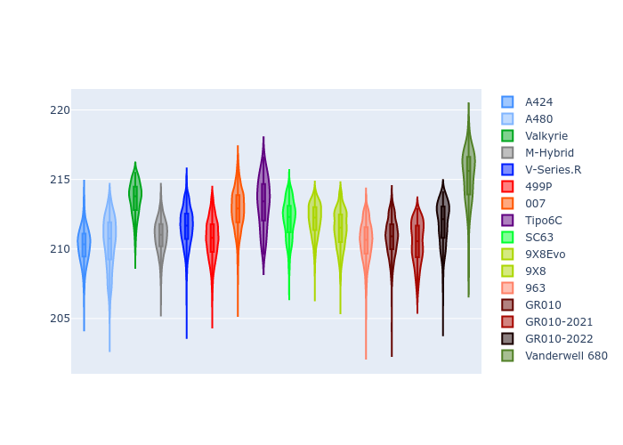

# Combined Plots

## Metadata

- BoP Accuracy: 93.58%
- Overall BoP Grade: A2
- Track: LEMANS
- Threshhold: 210.0kph

## BoP Table
| Manufacturer     | Car            | Weight   | Power   | PINC   | E/Stint   | FDS    |
|:-----------------|:---------------|:---------|:--------|:-------|:----------|:-------|
| Alpine           | A424           | 1047kg   | 520.0kw | -      | 914MJ     | -      |
| Alpine           | A480           | 1052kg   | 432.0kw | -      | 766MJ     | -      |
| Aston Martin     | Valkyrie       | 1042kg   | 504.0kw | +0.40% | 899MJ     | -      |
| BMW              | M-Hybrid       | 1041kg   | 512.0kw | -      | 906MJ     | -      |
| Cadillac         | V-Series.R     | 1034kg   | 510.0kw | -      | 901MJ     | -      |
| Ferrari          | 499P           | 1063kg   | 508.0kw | -      | 894MJ     | 190kph |
| Glickenhaus      | 007            | 1030kg   | 520.0kw | -      | 913MJ     | -      |
| Isotta Fraschini | Tipo6C         | 1059kg   | 520.0kw | -      | 919MJ     | 190kph |
| Lamborghini      | SC63           | 1042kg   | 519.0kw | -      | 907MJ     | -      |
| Peugeot          | 9X8Evo         | 1050kg   | 510.0kw | -      | 898MJ     | 190kph |
| Peugeot          | 9X8            | 1030kg   | 520.0kw | -      | 910MJ     | 150kph |
| Porsche          | 963            | 1047kg   | 516.0kw | -      | 909MJ     | -      |
| Toyota           | GR010          | 1080kg   | 512.0kw | -      | 911MJ     | 190kph |
| Toyota           | GR010OLD       | 1065kg   | 513.0kw | -      | 960MJ     | 150kph |
| Vanwall          | Vanderwell 680 | 1030kg   | 520.0kw | -      | 908MJ     | -      |

## Performance Table
| Manufacturer     | Car            | RP      | QP      | Vavg      |   RDLC | BOP-Grade   | Match   |
|:-----------------|:---------------|:--------|:--------|:----------|-------:|:------------|:--------|
| Alpine           | A424           | 3:28.33 | 3:23.72 | 335.90kph |   1.02 | ~A1         | 98.20%  |
| Alpine           | A480           | 3:30.65 | 3:28.08 | 323.49kph |   1.01 | -A2         | 93.96%  |
| Aston Martin     | Valkyrie       | 3:32.06 | 3:25.79 | 331.91kph |   1.03 | +A2         | 94.36%  |
| BMW              | M-Hybrid       | 3:29.28 | 3:23.95 | 333.52kph |   1.03 | ~A1         | 99.61%  |
| Cadillac         | V-Series.R     | 3:29.80 | 3:24.62 | 330.15kph |   1.03 | ~A1         | 99.96%  |
| Ferrari          | 499P           | 3:29.26 | 3:23.77 | 334.13kph |   1.03 | ~A1         | 99.49%  |
| Glickenhaus      | 007            | 3:30.05 | 3:26.90 | 332.27kph |   1.02 | ~A1         | 97.81%  |
| Isotta Fraschini | Tipo6C         | 3:32.17 | 3:30.96 | 332.03kph |   1.01 | +B1         | 86.57%  |
| Lamborghini      | SC63           | 3:30.75 | 3:27.06 | 333.77kph |   1.02 | ~A1         | 98.19%  |
| Peugeot          | 9X8Evo         | 3:30.04 | 3:24.72 | 335.30kph |   1.03 | ~A1         | 99.37%  |
| Peugeot          | 9X8            | 3:29.10 | 3:24.56 | 328.05kph |   1.02 | ~A1         | 99.74%  |
| Porsche          | 963            | 3:29.00 | 3:23.83 | 333.96kph |   1.03 | ~A1         | 99.72%  |
| Toyota           | GR010          | 3:29.88 | 3:24.16 | 333.73kph |   1.03 | ~A1         | 99.97%  |
| Toyota           | GR010OLD       | 3:27.89 | 3:24.78 | 329.37kph |   1.02 | ~A1         | 96.14%  |
| Vanwall          | Vanderwell 680 | 3:34.07 | 3:28.09 | 325.73kph |   1.03 | +Ω1         | 40.62%  |

## Race Laptimes

## Quali Laptimes

## Topspeeds

## Laptimes Lineplot

