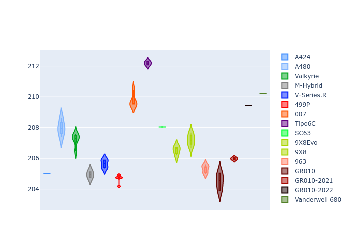
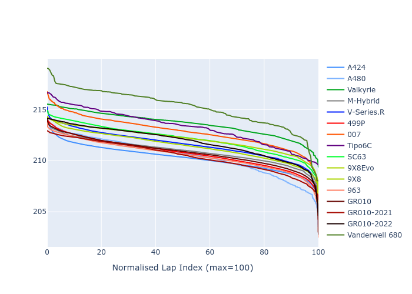

# Combined Plots

## Metadata

- BoP Accuracy: 90.65%
- Overall BoP Grade: A2
- Track: LEMANS
- Threshhold: 210.0kph

## BoP Table
| Manufacturer     | Car            | Weight   | Power   | PINC   | E/Stint   | FDS    | RDP    | QDP    | TDP    |
|:-----------------|:---------------|:---------|:--------|:-------|:----------|:-------|:-------|:-------|:-------|
| Alpine           | A424           | 1047kg   | 520.0kw | -      | 914MJ     | -      | 52.35% | 61.85% | 27.84% |
| Alpine           | A480           | 952kg    | 432.0kw | -      | 766MJ     | -      | 54.51% | 76.19% | 54.04% |
| Aston Martin     | Valkyrie       | 1042kg   | 504.0kw | +0.40% | 899MJ     | -      | 53.59% | 53.33% | 21.51% |
| BMW              | M-Hybrid       | 1041kg   | 512.0kw | -      | 906MJ     | -      | 53.26% | 57.23% | 34.54% |
| Cadillac         | V-Series.R     | 1034kg   | 510.0kw | -      | 901MJ     | -      | 47.80% | 56.73% | 19.63% |
| Ferrari          | 499P           | 1063kg   | 508.0kw | -      | 894MJ     | 190kph | 53.02% | 42.32% | 9.88%  |
| Glickenhaus      | 007            | 1030kg   | 520.0kw | -      | 913MJ     | -      | 46.49% | 46.07% | 47.78% |
| Isotta Fraschini | Tipo6C         | 1059kg   | 520.0kw | -      | 919MJ     | 190kph | 43.95% | 47.22% | 31.53% |
| Lamborghini      | SC63           | 1042kg   | 519.0kw | -      | 907MJ     | -      | 46.33% | 59.50% | 29.33% |
| Peugeot          | 9X8Evo         | 1050kg   | 510.0kw | -      | 898MJ     | 190kph | 48.47% | 51.26% | 16.02% |
| Peugeot          | 9X8            | 1030kg   | 520.0kw | -      | 910MJ     | 150kph | 54.07% | 57.08% | 10.80% |
| Porsche          | 963            | 1047kg   | 516.0kw | -      | 909MJ     | -      | 50.87% | 45.25% | 30.77% |
| Toyota           | GR010          | 1080kg   | 512.0kw | -      | 911MJ     | 190kph | 52.43% | 57.12% | 12.82% |
| Toyota           | GR010-2021     | 1065kg   | 513.0kw | -      | 960MJ     | 150kph | 54.09% | 52.67% | 26.37% |
| Toyota           | GR010-2022     | 1080kg   | 512.0kw | -      | 904MJ     | 190kph | 53.48% | 69.44% | 7.86%  |
| Vanwall          | Vanderwell 680 | 1030kg   | 520.0kw | -      | 908MJ     | -      | 53.41% | 56.28% | 29.85% |

## Performance Table
| Manufacturer     | Car            | RP      | QP      | Vavg      |   RDLC | BOP-Grade   | Match   |
|:-----------------|:---------------|:--------|:--------|:----------|-------:|:------------|:--------|
| Alpine           | A424           | 3:28.07 | 3:23.20 | 335.67kph |   1.02 | ~A1         | 99.72%  |
| Alpine           | A480           | 3:26.13 | 3:23.21 | 325.42kph |   1.01 | -B2         | 80.75%  |
| Aston Martin     | Valkyrie       | 3:31.10 | 3:24.86 | 331.91kph |   1.03 | +A2         | 92.95%  |
| BMW              | M-Hybrid       | 3:28.82 | 3:23.19 | 333.46kph |   1.03 | ~A1         | 100.00% |
| Cadillac         | V-Series.R     | 3:29.36 | 3:23.76 | 329.89kph |   1.03 | ~A1         | 99.66%  |
| Ferrari          | 499P           | 3:27.29 | 3:20.82 | 334.05kph |   1.03 | ~A1         | 96.53%  |
| Glickenhaus      | 007            | 3:30.05 | 3:26.91 | 332.27kph |   1.02 | +A2         | 90.15%  |
| Isotta Fraschini | Tipo6C         | 3:31.17 | 3:30.17 | 332.03kph |   1    | +B2         | 80.60%  |
| Lamborghini      | SC63           | 3:30.60 | 3:26.79 | 333.77kph |   1.02 | +A2         | 92.76%  |
| Peugeot          | 9X8Evo         | 3:28.95 | 3:23.65 | 335.30kph |   1.03 | ~A1         | 99.79%  |
| Peugeot          | 9X8            | 3:28.12 | 3:22.95 | 326.48kph |   1.03 | ~A1         | 99.21%  |
| Porsche          | 963            | 3:28.56 | 3:23.06 | 334.36kph |   1.03 | ~A1         | 99.78%  |
| Toyota           | GR010          | 3:27.24 | 3:20.57 | 334.21kph |   1.03 | ~A1         | 96.96%  |
| Toyota           | GR010-2021     | 3:27.68 | 3:22.91 | 325.59kph |   1.02 | ~A1         | 98.82%  |
| Toyota           | GR010-2022     | 3:27.45 | 3:24.20 | 331.71kph |   1.02 | ~A1         | 99.71%  |
| Vanwall          | Vanderwell 680 | 3:33.99 | 3:28.09 | 325.73kph |   1.03 | +Ω1         | 23.07%  |

## Race Laptimes

## Quali Laptimes

## Topspeeds

## Laptimes Lineplot

