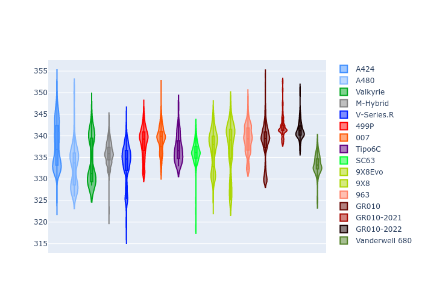

# Combined Plots

## Metadata

- BoP Accuracy: 93.45%
- Overall BoP Grade: A2
- Track: LEMANS
- Threshhold: 210.0kph
- Average Laptime: 3:31.76
- Average Quali Laptime: 3:27.16
- Average Topspeed: 337.14kph

## BoP Table
| Manufacturer     | Car            | Weight   | Power   | PINC   | E/Stint   | FDS    | RDP    | QDP    | TDP    |
|:-----------------|:---------------|:---------|:--------|:-------|:----------|:-------|:-------|:-------|:-------|
| Alpine           | A424           | 1047kg   | 520.0kw | -      | 914MJ     | -      | 51.64% | 59.31% | 26.80% |
| Alpine           | A480           | 952kg    | 432.0kw | -      | 766MJ     | -      | 53.05% | 74.07% | 48.97% |
| Aston Martin     | Valkyrie       | 1042kg   | 504.0kw | +0.40% | 899MJ     | -      | 53.50% | 53.33% | 21.51% |
| BMW              | M-Hybrid       | 1041kg   | 512.0kw | -      | 906MJ     | -      | 52.89% | 56.22% | 33.41% |
| Cadillac         | V-Series.R     | 1034kg   | 510.0kw | -      | 901MJ     | -      | 48.63% | 60.80% | 19.01% |
| Ferrari          | 499P           | 1063kg   | 508.0kw | -      | 894MJ     | 190kph | 51.38% | 44.98% | 9.83%  |
| Glickenhaus      | 007            | 1030kg   | 520.0kw | -      | 913MJ     | -      | 46.15% | 49.30% | 41.45% |
| Isotta Fraschini | Tipo6C         | 1059kg   | 520.0kw | -      | 919MJ     | 190kph | 43.95% | 47.22% | 31.53% |
| Lamborghini      | SC63           | 1042kg   | 519.0kw | -      | 907MJ     | -      | 48.33% | 60.95% | 28.65% |
| Peugeot          | 9X8Evo         | 1050kg   | 510.0kw | -      | 898MJ     | 190kph | 48.87% | 52.78% | 15.41% |
| Peugeot          | 9X8            | 1030kg   | 520.0kw | -      | 910MJ     | 150kph | 54.54% | 58.39% | 9.69%  |
| Porsche          | 963            | 1047kg   | 516.0kw | -      | 909MJ     | -      | 50.70% | 44.30% | 29.51% |
| Toyota           | GR010          | 1080kg   | 512.0kw | -      | 911MJ     | 190kph | 51.09% | 52.71% | 11.46% |
| Toyota           | GR010-2021     | 1065kg   | 513.0kw | -      | 960MJ     | 150kph | 54.08% | 54.81% | 9.72%  |
| Toyota           | GR010-2022     | 1080kg   | 512.0kw | -      | 904MJ     | 190kph | 53.45% | 68.83% | 9.58%  |
| Vanwall          | Vanderwell 680 | 1030kg   | 520.0kw | -      | 908MJ     | -      | 49.68% | 60.93% | 34.43% |

## Performance Table
| Manufacturer     | Car            | RP      | QP      | Vavg      |   RDLC | BOP-Grade   | Match   |
|:-----------------|:---------------|:--------|:--------|:----------|-------:|:------------|:--------|
| Alpine           | A424           | 3:30.24 | 3:25.00 | 337.77kph |   1.03 | ~A1         | 99.94%  |
| Alpine           | A480           | 3:30.44 | 3:27.97 | 332.98kph |   1.01 | ~A1         | 99.33%  |
| Aston Martin     | Valkyrie       | 3:33.60 | 3:27.21 | 334.29kph |   1.03 | +B1         | 85.87%  |
| BMW              | M-Hybrid       | 3:30.94 | 3:24.94 | 335.93kph |   1.03 | ~A1         | 100.00% |
| Cadillac         | V-Series.R     | 3:31.59 | 3:25.65 | 333.51kph |   1.03 | ~A1         | 99.75%  |
| Ferrari          | 499P           | 3:30.73 | 3:24.67 | 338.55kph |   1.03 | ~A1         | 99.91%  |
| Glickenhaus      | 007            | 3:32.82 | 3:29.76 | 339.30kph |   1.01 | +A2         | 92.19%  |
| Isotta Fraschini | Tipo6C         | 3:33.24 | 3:32.18 | 336.99kph |   1    | +B2         | 80.60%  |
| Lamborghini      | SC63           | 3:32.13 | 3:28.04 | 336.22kph |   1.02 | ~A1         | 99.81%  |
| Peugeot          | 9X8Evo         | 3:32.10 | 3:26.51 | 336.96kph |   1.03 | ~A1         | 100.00% |
| Peugeot          | 9X8            | 3:31.44 | 3:27.20 | 337.41kph |   1.02 | ~A1         | 100.00% |
| Porsche          | 963            | 3:30.55 | 3:25.31 | 339.13kph |   1.03 | ~A1         | 99.55%  |
| Toyota           | GR010          | 3:30.84 | 3:24.50 | 338.39kph |   1.03 | ~A1         | 99.71%  |
| Toyota           | GR010-2021     | 3:30.45 | 3:25.98 | 342.12kph |   1.02 | ~A1         | 100.00% |
| Toyota           | GR010-2022     | 3:31.84 | 3:29.43 | 341.31kph |   1.01 | ~A1         | 99.66%  |
| Vanwall          | Vanderwell 680 | 3:35.20 | 3:30.22 | 333.32kph |   1.02 | +Ω1         | 38.86%  |

## Race Laptimes

## Quali Laptimes

## Topspeeds

## Laptimes Lineplot

