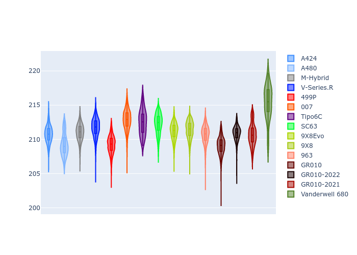
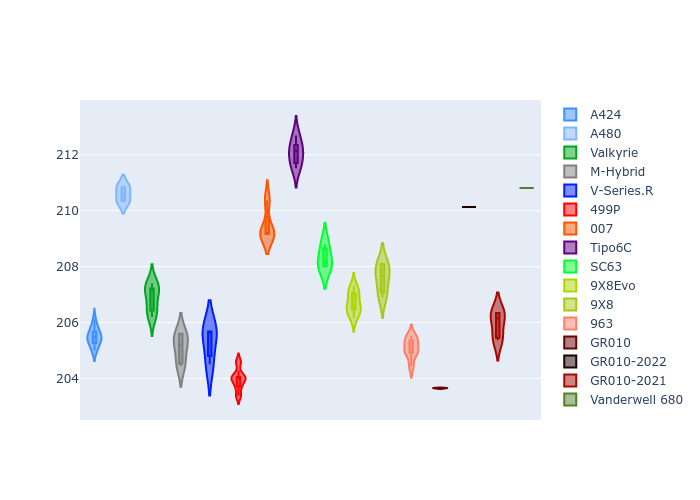
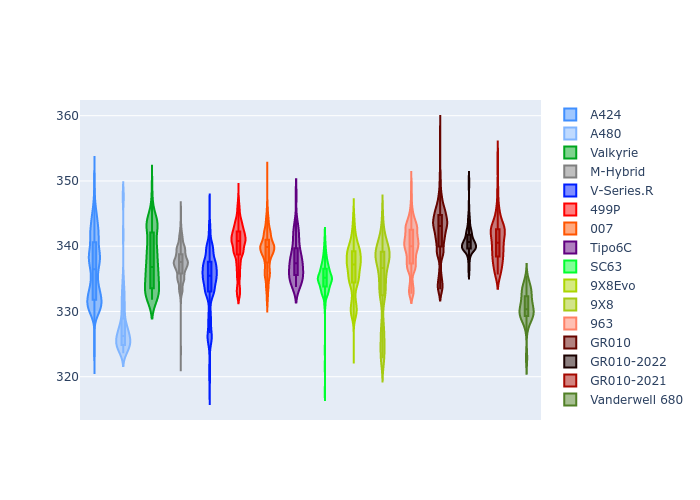
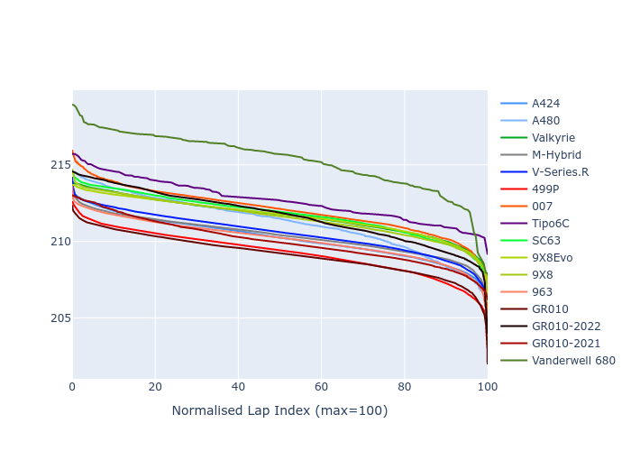

# Combined Plots

## Metadata

- BoP Accuracy: 94.29%
- Overall BoP Grade: A2
- Track: LEMANS
- Threshhold: 250.0kph
- Average Laptime: 3:31.22
- Average Quali Laptime: 3:26.74
- Average Topspeed: 336.59kph

## BoP Table
| Manufacturer     | Car            | Weight   | Power   | PINC   | E/Stint   | FDS    | RDP    | QDP    | TDP    |
|:-----------------|:---------------|:---------|:--------|:-------|:----------|:-------|:-------|:-------|:-------|
| Alpine           | A424           | 1038kg   | 507.0kw | +0.90% | 903MJ     | -      | 51.64% | 59.31% | 26.80% |
| Alpine           | A480           | 952kg    | 417.0kw | -      | 753MJ     | -      | 54.81% | 80.56% | 55.69% |
| BMW              | M-Hybrid       | 1039kg   | 508.0kw | +0.90% | 904MJ     | -      | 52.89% | 56.22% | 33.41% |
| Cadillac         | V-Series.R     | 1036kg   | 509.0kw | -      | 900MJ     | -      | 48.63% | 60.80% | 19.01% |
| Ferrari          | 499P           | 1043kg   | 508.0kw | -1.70% | 889MJ     | 190kph | 51.38% | 44.98% | 9.83%  |
| Glickenhaus      | 007            | 1030kg   | 520.0kw | -      | 913MJ     | -      | 46.15% | 49.30% | 41.45% |
| Isotta Fraschini | Tipo6C         | 1048kg   | 515.0kw | +0.90% | 915MJ     | 190kph | 43.95% | 47.22% | 31.53% |
| Lamborghini      | SC63           | 1039kg   | 519.0kw | -1.60% | 904MJ     | -      | 48.33% | 60.95% | 28.65% |
| Peugeot          | 9X8Evo         | 1047kg   | 508.0kw | -0.70% | 895MJ     | 190kph | 48.87% | 52.78% | 15.41% |
| Peugeot          | 9X8            | 1042kg   | 516.0kw | -      | 908MJ     | 150kph | 54.54% | 58.39% | 9.69%  |
| Porsche          | 963            | 1042kg   | 511.0kw | -      | 904MJ     | -      | 50.70% | 44.30% | 29.51% |
| Toyota           | GR010          | 1053kg   | 508.0kw | +0.90% | 906MJ     | 190kph | 51.09% | 52.71% | 11.46% |
| Toyota           | GR010-2022     | 1070kg   | 506.0kw | -      | 898MJ     | 190kph | 53.24% | 64.49% | 9.72%  |
| Toyota           | GR010-2021     | 1066kg   | 515.0kw | -      | 962MJ     | 150kph | 53.89% | 50.91% | 25.87% |
| Vanwall          | Vanderwell 680 | 1030kg   | 512.0kw | -      | 901MJ     | -      | 35.83% | 59.29% | 34.15% |

## Performance Table
| Manufacturer     | Car            | RP      | QP      | Vavg      |   RDLC | BOP-Grade   | Match   |
|:-----------------|:---------------|:--------|:--------|:----------|-------:|:------------|:--------|
| Alpine           | A424           | 3:30.72 | 3:25.51 | 336.49kph |   1.03 | ~A1         | 99.94%  |
| Alpine           | A480           | 3:29.07 | 3:26.60 | 327.93kph |   1.01 | ~A1         | 100.00% |
| BMW              | M-Hybrid       | 3:31.03 | 3:25.05 | 335.96kph |   1.03 | ~A1         | 100.00% |
| Cadillac         | V-Series.R     | 3:31.71 | 3:25.76 | 333.04kph |   1.03 | ~A1         | 99.58%  |
| Ferrari          | 499P           | 3:29.24 | 3:22.96 | 339.43kph |   1.03 | ~A1         | 99.33%  |
| Glickenhaus      | 007            | 3:32.82 | 3:29.77 | 339.30kph |   1.01 | +A2         | 90.20%  |
| Isotta Fraschini | Tipo6C         | 3:32.32 | 3:31.45 | 337.85kph |   1    | +B1         | 89.55%  |
| Lamborghini      | SC63           | 3:32.27 | 3:28.20 | 335.22kph |   1.02 | ~A1         | 99.04%  |
| Peugeot          | 9X8Evo         | 3:31.18 | 3:25.72 | 336.23kph |   1.03 | ~A1         | 100.00% |
| Peugeot          | 9X8            | 3:31.41 | 3:27.12 | 335.06kph |   1.02 | ~A1         | 99.98%  |
| Porsche          | 963            | 3:30.68 | 3:25.11 | 338.52kph |   1.03 | ~A1         | 99.84%  |
| Toyota           | GR010          | 3:29.07 | 3:22.78 | 341.30kph |   1.03 | ~A1         | 98.97%  |
| Toyota           | GR010-2022     | 3:30.84 | 3:28.65 | 340.83kph |   1.01 | ~A1         | 99.70%  |
| Toyota           | GR010-2021     | 3:30.59 | 3:25.39 | 340.87kph |   1.03 | ~A1         | 100.00% |
| Vanwall          | Vanderwell 680 | 3:35.28 | 3:30.98 | 330.77kph |   1.02 | +Ω1         | 38.24%  |

## Race Laptimes

## Quali Laptimes

## Topspeeds

## Laptimes Lineplot

