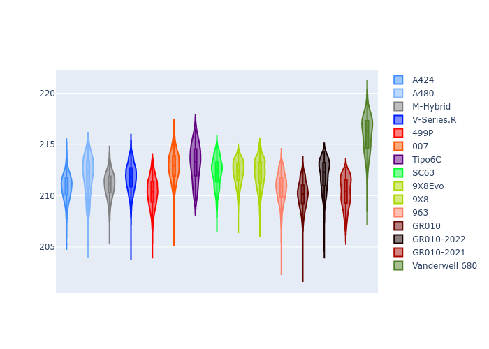
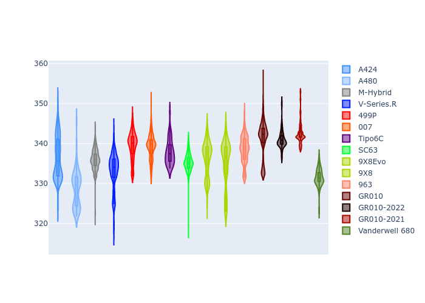

# Combined Plots

## Metadata

- BoP Accuracy: 93.81%
- Overall BoP Grade: A2
- Track: LEMANS
- Threshhold: 250.0kph
- Average Laptime: 3:31.85
- Average Quali Laptime: 3:27.36
- Average Topspeed: 336.81kph

## BoP Table
| Manufacturer     | Car            | Weight   | Power   | PINC   | E/Stint   | FDS    | RDP    | QDP    | TDP    |
|:-----------------|:---------------|:---------|:--------|:-------|:----------|:-------|:-------|:-------|:-------|
| Alpine           | A424           | 1038kg   | 507.0kw | +0.90% | 903MJ     | -      | 51.64% | 59.31% | 26.80% |
| Alpine           | A480           | 952kg    | 417.0kw | -      | 753MJ     | -      | 53.05% | 74.07% | 48.97% |
| BMW              | M-Hybrid       | 1039kg   | 508.0kw | +0.90% | 904MJ     | -      | 52.89% | 56.22% | 33.41% |
| Cadillac         | V-Series.R     | 1036kg   | 509.0kw | -      | 900MJ     | -      | 48.63% | 60.80% | 19.01% |
| Ferrari          | 499P           | 1043kg   | 508.0kw | -1.70% | 889MJ     | 190kph | 51.38% | 44.98% | 9.83%  |
| Glickenhaus      | 007            | 1030kg   | 520.0kw | -      | 913MJ     | -      | 46.15% | 49.30% | 41.45% |
| Isotta Fraschini | Tipo6C         | 1048kg   | 515.0kw | +0.90% | 915MJ     | 190kph | 43.95% | 47.22% | 31.53% |
| Lamborghini      | SC63           | 1039kg   | 519.0kw | -1.60% | 904MJ     | -      | 48.33% | 60.95% | 28.65% |
| Peugeot          | 9X8Evo         | 1047kg   | 508.0kw | -0.70% | 895MJ     | 190kph | 48.87% | 52.78% | 15.41% |
| Peugeot          | 9X8            | 1042kg   | 516.0kw | -      | 908MJ     | 150kph | 54.54% | 58.39% | 9.69%  |
| Porsche          | 963            | 1042kg   | 511.0kw | -      | 904MJ     | -      | 50.70% | 44.30% | 29.51% |
| Toyota           | GR010          | 1053kg   | 508.0kw | +0.90% | 906MJ     | 190kph | 51.09% | 52.71% | 11.46% |
| Toyota           | GR010-2022     | 1070kg   | 506.0kw | -      | 898MJ     | 190kph | 53.45% | 68.83% | 9.58%  |
| Toyota           | GR010-2021     | 1066kg   | 515.0kw | -      | 962MJ     | 150kph | 54.08% | 54.81% | 9.72%  |
| Vanwall          | Vanderwell 680 | 1030kg   | 512.0kw | -      | 901MJ     | -      | 49.68% | 60.93% | 34.43% |

## Performance Table
| Manufacturer     | Car            | RP      | QP      | Vavg      |   RDLC | BOP-Grade   | Match   |
|:-----------------|:---------------|:--------|:--------|:----------|-------:|:------------|:--------|
| Alpine           | A424           | 3:30.84 | 3:25.57 | 336.49kph |   1.03 | ~A1         | 99.97%  |
| Alpine           | A480           | 3:31.89 | 3:29.37 | 328.74kph |   1.01 | ~A1         | 98.27%  |
| BMW              | M-Hybrid       | 3:31.06 | 3:25.05 | 335.96kph |   1.03 | ~A1         | 100.00% |
| Cadillac         | V-Series.R     | 3:31.75 | 3:25.80 | 333.04kph |   1.03 | ~A1         | 99.75%  |
| Ferrari          | 499P           | 3:30.33 | 3:24.29 | 339.43kph |   1.03 | ~A1         | 99.75%  |
| Glickenhaus      | 007            | 3:32.82 | 3:29.76 | 339.30kph |   1.01 | +A2         | 94.06%  |
| Isotta Fraschini | Tipo6C         | 3:33.13 | 3:32.07 | 337.85kph |   1    | +B2         | 84.33%  |
| Lamborghini      | SC63           | 3:32.29 | 3:28.20 | 335.22kph |   1.02 | ~A1         | 99.81%  |
| Peugeot          | 9X8Evo         | 3:32.27 | 3:26.68 | 336.23kph |   1.03 | ~A1         | 100.00% |
| Peugeot          | 9X8            | 3:32.22 | 3:27.94 | 335.06kph |   1.02 | ~A1         | 99.96%  |
| Porsche          | 963            | 3:30.78 | 3:25.53 | 338.52kph |   1.03 | ~A1         | 99.70%  |
| Toyota           | GR010          | 3:30.10 | 3:23.80 | 341.30kph |   1.03 | ~A1         | 99.62%  |
| Toyota           | GR010-2022     | 3:32.00 | 3:29.58 | 341.00kph |   1.01 | ~A1         | 99.66%  |
| Toyota           | GR010-2021     | 3:30.32 | 3:25.85 | 342.49kph |   1.02 | ~A1         | 100.00% |
| Vanwall          | Vanderwell 680 | 3:35.89 | 3:30.87 | 331.45kph |   1.02 | +Ω1         | 32.23%  |

## Race Laptimes

## Quali Laptimes

## Topspeeds

## Laptimes Lineplot

