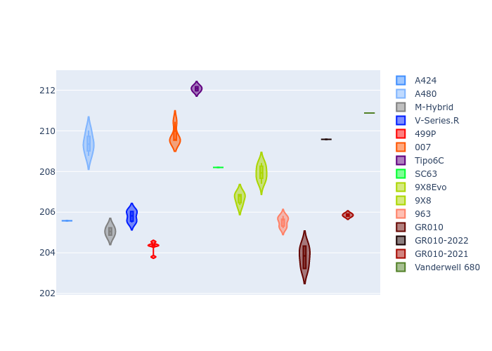

# Combined Plots

## Metadata

- BoP Accuracy: 90.74%
- Overall BoP Grade: A2
- Track: LEMANS
- Threshhold: 250.0kph

## BoP Table
| Manufacturer     | Car            | Weight   | Power   | PINC   | E/Stint   | FDS    | RDP    | QDP    | TDP    |
|:-----------------|:---------------|:---------|:--------|:-------|:----------|:-------|:-------|:-------|:-------|
| Alpine           | A424           | 1038kg   | 507.0kw | +0.90% | 903MJ     | -      | 52.35% | 61.85% | 27.84% |
| Alpine           | A480           | 952kg    | 417.0kw | -      | 753MJ     | -      | 54.51% | 76.19% | 54.04% |
| BMW              | M-Hybrid       | 1039kg   | 508.0kw | +0.90% | 904MJ     | -      | 53.26% | 57.23% | 34.54% |
| Cadillac         | V-Series.R     | 1036kg   | 509.0kw | -      | 900MJ     | -      | 47.80% | 56.73% | 19.63% |
| Ferrari          | 499P           | 1043kg   | 508.0kw | -1.70% | 889MJ     | 190kph | 53.02% | 42.32% | 9.88%  |
| Glickenhaus      | 007            | 1030kg   | 520.0kw | -      | 913MJ     | -      | 46.49% | 46.07% | 47.78% |
| Isotta Fraschini | Tipo6C         | 1048kg   | 515.0kw | +0.90% | 915MJ     | 190kph | 43.95% | 47.22% | 31.53% |
| Lamborghini      | SC63           | 1039kg   | 519.0kw | -1.60% | 904MJ     | -      | 46.33% | 59.50% | 29.33% |
| Peugeot          | 9X8Evo         | 1047kg   | 508.0kw | -0.70% | 895MJ     | 190kph | 48.47% | 51.26% | 16.02% |
| Peugeot          | 9X8            | 1042kg   | 516.0kw | -      | 908MJ     | 150kph | 54.07% | 57.08% | 10.80% |
| Porsche          | 963            | 1042kg   | 511.0kw | -      | 904MJ     | -      | 50.87% | 45.25% | 30.77% |
| Toyota           | GR010          | 1053kg   | 508.0kw | +0.90% | 906MJ     | 190kph | 52.43% | 57.12% | 12.82% |
| Toyota           | GR010-2022     | 1070kg   | 506.0kw | -      | 898MJ     | 190kph | 53.48% | 69.44% | 7.86%  |
| Toyota           | GR010-2021     | 1066kg   | 515.0kw | -      | 962MJ     | 150kph | 54.09% | 52.67% | 26.37% |
| Vanwall          | Vanderwell 680 | 1030kg   | 512.0kw | -      | 901MJ     | -      | 53.41% | 56.28% | 29.85% |

## Performance Table
| Manufacturer     | Car            | RP      | QP      | Vavg      |   RDLC | BOP-Grade   | Match   |
|:-----------------|:---------------|:--------|:--------|:----------|-------:|:------------|:--------|
| Alpine           | A424           | 3:28.85 | 3:23.93 | 334.38kph |   1.02 | ~A1         | 99.82%  |
| Alpine           | A480           | 3:27.82 | 3:24.84 | 321.28kph |   1.01 | ~A1         | 97.22%  |
| BMW              | M-Hybrid       | 3:28.98 | 3:23.34 | 333.48kph |   1.03 | ~A1         | 100.00% |
| Cadillac         | V-Series.R     | 3:29.55 | 3:23.93 | 329.43kph |   1.03 | ~A1         | 99.66%  |
| Ferrari          | 499P           | 3:26.86 | 3:20.42 | 334.95kph |   1.03 | -A2         | 93.26%  |
| Glickenhaus      | 007            | 3:30.05 | 3:26.91 | 332.27kph |   1.02 | +A2         | 91.10%  |
| Isotta Fraschini | Tipo6C         | 3:31.09 | 3:30.10 | 332.85kph |   1    | +B2         | 84.33%  |
| Lamborghini      | SC63           | 3:30.78 | 3:26.97 | 332.81kph |   1.02 | +A2         | 93.12%  |
| Peugeot          | 9X8Evo         | 3:29.15 | 3:23.84 | 334.59kph |   1.03 | ~A1         | 99.79%  |
| Peugeot          | 9X8            | 3:28.99 | 3:23.77 | 324.21kph |   1.03 | ~A1         | 99.91%  |
| Porsche          | 963            | 3:28.85 | 3:23.34 | 333.76kph |   1.03 | ~A1         | 99.81%  |
| Toyota           | GR010          | 3:26.48 | 3:19.86 | 337.07kph |   1.03 | -A2         | 90.36%  |
| Toyota           | GR010-2022     | 3:27.67 | 3:24.42 | 331.41kph |   1.02 | ~A1         | 99.71%  |
| Toyota           | GR010-2021     | 3:27.52 | 3:22.76 | 325.94kph |   1.02 | ~A1         | 98.09%  |
| Vanwall          | Vanderwell 680 | 3:34.82 | 3:28.87 | 323.90kph |   1.03 | +Ω1         | 14.88%  |

## Race Laptimes

## Quali Laptimes

## Topspeeds

## Laptimes Lineplot

