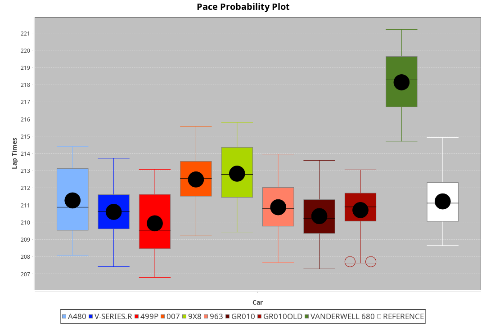
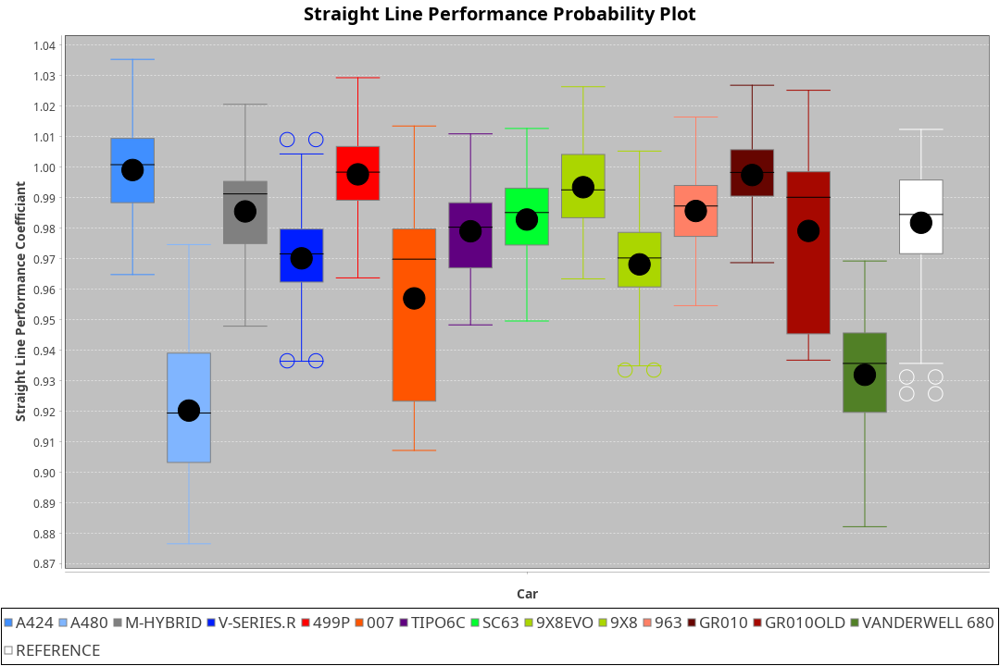
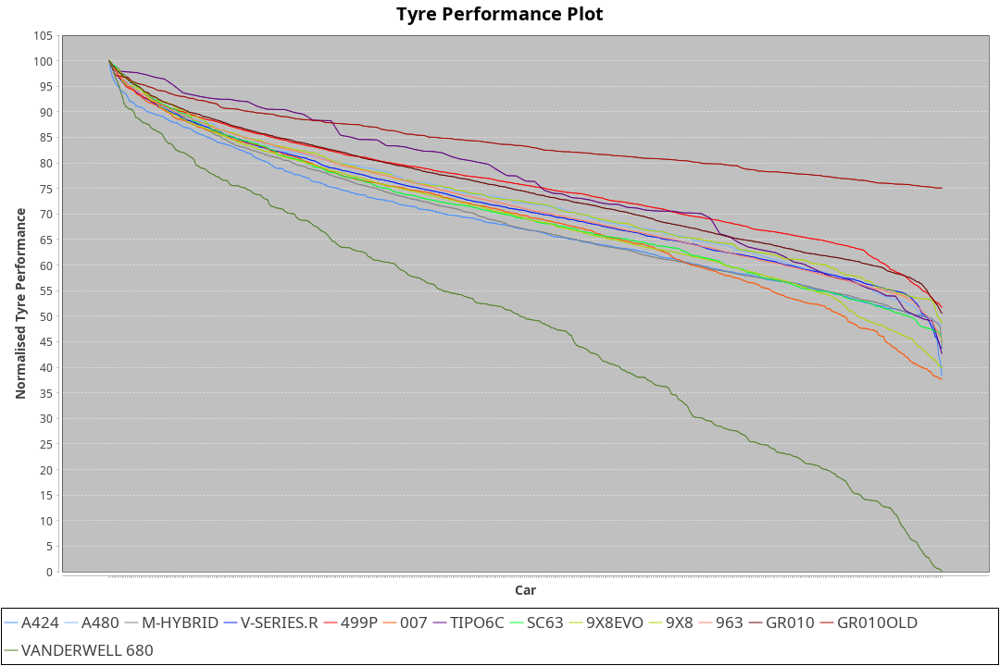

| Manufacturer     | Car            | Weight | Power   | PINC    | E/Stint | FDS     |
|:-|:-|:-|:-|:-|:-|:-|
| Alpine           | A424           | 1038kg | 507.0kw | 0.90%   | 903MJ   |    -    |
| Alpine           | A480           | 952kg  | 417.0kw |    -    | 753MJ   |    -    |
| BMW              | M-Hybrid       | 1039kg | 508.0kw | 0.90%   | 904MJ   |    -    |
| Cadillac         | V-Series.R     | 1036kg | 509.0kw |    -    | 900MJ   |    -    |
| Ferrari          | 499P           | 1043kg | 508.0kw | -1.70%  | 889MJ   | 190kph  |
| Glickenhaus      | 007            | 1030kg | 520.0kw |    -    | 913MJ   |    -    |
| Isotta Fraschini | Tipo6C         | 1048kg | 515.0kw | 0.90%   | 915MJ   | 190kph  |
| Lamborghini      | SC63           | 1039kg | 519.0kw | -1.60%  | 904MJ   |    -    |
| Peugeot          | 9X8Evo         | 1047kg | 508.0kw | -0.70%  | 895MJ   | 190kph  |
| Peugeot          | 9X8            | 1042kg | 516.0kw |    -    | 908MJ   | 150kph  |
| Porsche          | 963            | 1042kg | 511.0kw |    -    | 904MJ   |    -    |
| Toyota           | GR010          | 1053kg | 508.0kw | 0.90%   | 906MJ   | 190kph  |
| Toyota           | GR010OLD       | 1066kg | 515.0kw |    -    | 962MJ   | 150kph  |
| Vanwall          | Vanderwell 680 | 1030kg | 512.0kw |    -    | 901MJ   |    -    |

### BoP Accuracy: 65.60%; Overall BoP Grade: D1
| Manufacturer     | Car            | Type  | RP      | QP      | Weight | Power¹  | Threshhold | PINC    | Power²   | E/Stint | AVG Vmax  | FDS     | RDLC | L/Stint | BOP-Grade | Model Accuracy | Model Points | Match%  | SimDiff |
|:-|:-|:-|:-|:-|:-|:-|:-|:-|:-|:-|:-|:-|:-|:-|:-|:-|:-|:-|:-|
| Alpine           | A424           | LMDH  | 3:28.81 | 3:23.58 | 1038kg | 507.0kw | 250.0kph   | 0.90%   | 511.60kw |  903MJ  | 328.96kph |    -    | 1.02 | 12      | -D1       | 97.47%         | 1810         | 69.40%  | #       |
| Alpine           | A480           | LMP1  | 3:32.17 | 3:29.11 |  952kg | 417.0kw | 0.0kph     |    -    | 417.00kw |  753MJ  | 315.58kph |    -    | 0.98 | 11      | +E2       | 92.36%         | 1643         | 50.81%  | -0.21   |
| BMW              | M-Hybrid       | LMDH  | 3:29.71 | 3:23.95 | 1039kg | 508.0kw | 250.0kph   | 0.90%   | 512.60kw |  904MJ  | 324.48kph |    -    | 1.03 | 12      | -A2       | 100.00%        | 3339         | 90.88%  | #       |
| Cadillac         | V-Series.R     | LMDH  | 3:29.90 | 3:23.92 | 1036kg | 509.0kw | 250.0kph   |    -    | 509.00kw |  900MJ  | 325.00kph |    -    | 1.03 | 12      | ~A1       | 99.00%         | 6039         | 96.50%  | #       |
| Ferrari          | 499P           | LMHHU | 3:28.60 | 3:22.83 | 1043kg | 508.0kw | 250.0kph   | -1.70%  | 499.40kw |  889MJ  | 323.41kph | 190kph  | 1.06 | 12      | -D2       | 99.56%         | 7418         | 63.17%  | #       |
| Glickenhaus      | 007            | LMHNH | 3:30.03 | 3:26.45 | 1030kg | 520.0kw | 0.0kph     |    -    | 520.00kw |  913MJ  | 329.03kph |    -    | 0.97 | 12      | ~A1       | 93.90%         | 2170         | 100.00% | +1.42   |
| Isotta Fraschini | Tipo6C         | LMHHU | 3:31.86 | 3:30.07 | 1048kg | 515.0kw | 250.0kph   | 0.90%   | 519.60kw |  915MJ  | 319.95kph | 190kph  | 1.08 | 12      | +Ω1       | 97.73%         | 129          | 33.85%  | +1.51   |
| Lamborghini      | SC63           | LMDH  | 3:30.62 | 3:27.06 | 1039kg | 519.0kw | 250.0kph   | -1.60%  | 510.70kw |  904MJ  | 318.67kph |    -    | 1.07 | 12      | +B1       | 100.00%        | 784          | 89.29%  | +1.23   |
| Peugeot          | 9X8Evo         | LMHHU | 3:30.14 | 3:24.68 | 1047kg | 508.0kw | 250.0kph   | -0.70%  | 504.40kw |  895MJ  | 333.52kph | 190kph  | 1.00 | 12      | ~A1       | 100.00%        | 1889         | 98.83%  | #       |
| Peugeot          | 9X8            | LMHHE | 3:30.74 | 3:26.21 | 1042kg | 516.0kw | 0.0kph     |    -    | 516.00kw |  908MJ  | 318.41kph | 150kph  | 1.04 | 12      | ~A1       | 99.16%         | 4816         | 100.00% | -0.43   |
| Porsche          | 963            | LMDH  | 3:29.31 | 3:23.21 | 1042kg | 511.0kw | 250.0kph   |    -    | 511.00kw |  904MJ  | 322.26kph |    -    | 1.03 | 12      | -C1       | 100.00%        | 14574        | 77.16%  | #       |
| Toyota           | GR010          | LMHHU | 3:28.27 | 3:22.45 | 1053kg | 508.0kw | 250.0kph   | 0.90%   | 512.60kw |  906MJ  | 322.05kph | 190kph  | 1.06 | 12      | -E1       | 97.78%         | 5323         | 55.47%  | #       |
| Toyota           | GR010OLD       | LMHHE | 3:26.27 | 3:22.38 | 1066kg | 515.0kw | 0.0kph     |    -    | 515.00kw |  962MJ  | 329.94kph | 150kph  | 1.02 | 12      | -Ω1       | 94.52%         | 690          | 4.42%   | +3.68   |
| Vanwall          | Vanderwell 680 | LMHNH | 3:34.99 | 3:28.61 | 1030kg | 512.0kw | 0.0kph     |    -    | 512.00kw |  901MJ  | 321.99kph |    -    | 1.02 | 12      | +Ω2       | 95.37%         | 639          | -11.32% | +0.16   |

## Power below Threshhold
| N/Nmax    | A424    | M-HYBRID | V-SERIES.R | 499P    | 007     | TIPO6C  | SC63    | 9X8EVO  | 9X8     | 963     | GR010   | GR010OLD | VANDERWELL 680 | ​     | RPM      | A480    |
|:-|:-|:-|:-|:-|:-|:-|:-|:-|:-|:-|:-|:-|:-|:-|:-|:-|
|  0.550    |  250    |  250     |  251       |  250    |  256    |  254    |  256    |  250    |  254    |  252    |  250    |  254     |  252           |  ​    |   --     |   -     |
|  0.575    |  273    |  273     |  274       |  273    |  279    |  277    |  279    |  273    |  277    |  275    |  273    |  277     |  275           |  ​    |   --     |   -     |
|  0.600    |  293    |  293     |  294       |  293    |  300    |  297    |  299    |  293    |  298    |  295    |  293    |  297     |  296           |  ​    |   --     |   -     |
|  0.625    |  314    |  314     |  315       |  314    |  322    |  319    |  321    |  314    |  319    |  316    |  314    |  319     |  317           |  ​    |   --     |   -     |
|  0.650    |  335    |  335     |  336       |  335    |  343    |  340    |  342    |  335    |  340    |  337    |  335    |  340     |  338           |  ​    |   --     |   -     |
|  0.675    |  356    |  357     |  357       |  357    |  365    |  362    |  364    |  357    |  362    |  359    |  357    |  362     |  359           |  ​    |   --     |   -     |
|  0.700    |  377    |  378     |  379       |  378    |  387    |  383    |  386    |  378    |  384    |  380    |  378    |  383     |  381           |  ​    |   --     |   -     |
|  0.725    |  399    |  399     |  400       |  399    |  409    |  405    |  408    |  399    |  406    |  402    |  399    |  405     |  403           |  ​    |   --     |   -     |
|  0.750    |  419    |  420     |  421       |  420    |  430    |  426    |  429    |  420    |  427    |  422    |  420    |  426     |  423           |  ​    |   --     |   -     |
|  0.775    |  438    |  439     |  440       |  439    |  449    |  445    |  448    |  439    |  446    |  441    |  439    |  445     |  442           |  ​    |  5000    |  245    |
|  0.800    |  455    |  456     |  457       |  456    |  467    |  463    |  466    |  456    |  463    |  459    |  456    |  463     |  460           |  ​    |  5500    |  289    |
|  0.825    |  470    |  471     |  472       |  471    |  482    |  478    |  481    |  471    |  478    |  474    |  471    |  478     |  475           |  ​    |  6000    |  323    |
|  0.850    |  482    |  483     |  484       |  483    |  494    |  489    |  493    |  483    |  490    |  485    |  483    |  489     |  486           |  ​    |  6500    |  365    |
|  0.875    |  492    |  493     |  494       |  493    |  505    |  500    |  504    |  493    |  501    |  496    |  493    |  500     |  497           |  ​    |  7000    |  408    |
|  0.900    |  499    |  500     |  501       |  500    |  512    |  507    |  511    |  500    |  508    |  503    |  500    |  507     |  504           |  ​    |  7500    |  418    |
|  0.925    |  504    |  505     |  506       |  505    |  517    |  512    |  516    |  505    |  513    |  508    |  505    |  512     |  509           |  ​    |  8000    |  414    |
| **0.950** | **507** | **508**  | **509**    | **508** | **520** | **515** | **519** | **508** | **516** | **511** | **508** | **515**  | **512**        | **​** | **8500** | **417** |
|  0.975    |  505    |  506     |  507       |  506    |  518    |  513    |  517    |  506    |  514    |  509    |  506    |  513     |  510           |  ​    |  9000    |  209    |
|  1.000    |  502    |  503     |  504       |  503    |  514    |  509    |  513    |  503    |  510    |  505    |  503    |  509     |  506           |  ​    |   --     |   -     |
|  1.025    |  433    |  434     |  435       |  434    |  444    |  440    |  443    |  434    |  441    |  436    |  434    |  440     |  437           |  ​    |   --     |   -     |

## Power above Threshhold
| N/Nmax    | A424       | M-HYBRID   | V-SERIES.R | 499P       | 007     | TIPO6C     | SC63       | 9X8EVO     | 9X8     | 963     | GR010      | GR010OLD | VANDERWELL 680 | ​     | RPM      | A480    |
|:-|:-|:-|:-|:-|:-|:-|:-|:-|:-|:-|:-|:-|:-|:-|:-|:-|
|  0.550    |  252.28    |  252.28    |  251       |  246.18    |  256    |  256.31    |  251.34    |  248.22    |  254    |  252    |  252.28    |  254     |  252           |  ​    |   --     |   -     |
|  0.575    |  275.30    |  275.31    |  274       |  268.20    |  279    |  279.34    |  274.37    |  271.24    |  277    |  275    |  275.31    |  277     |  275           |  ​    |   --     |   -     |
|  0.600    |  295.33    |  296.33    |  294       |  288.21    |  300    |  299.37    |  295.40    |  291.26    |  298    |  295    |  296.33    |  297     |  296           |  ​    |   --     |   -     |
|  0.625    |  316.35    |  317.35    |  315       |  308.22    |  322    |  321.39    |  316.43    |  312.27    |  319    |  316    |  317.35    |  319     |  317           |  ​    |   --     |   -     |
|  0.650    |  337.37    |  338.38    |  336       |  329.24    |  343    |  342.42    |  337.46    |  333.29    |  340    |  337    |  338.38    |  340     |  338           |  ​    |   --     |   -     |
|  0.675    |  359.40    |  359.40    |  357       |  350.26    |  365    |  364.45    |  358.49    |  354.31    |  362    |  359    |  359.40    |  362     |  359           |  ​    |   --     |   -     |
|  0.700    |  380.42    |  381.43    |  379       |  371.27    |  387    |  386.47    |  380.52    |  375.33    |  384    |  380    |  381.43    |  383     |  381           |  ​    |   --     |   -     |
|  0.725    |  402.44    |  403.45    |  400       |  392.29    |  409    |  408.50    |  401.55    |  396.35    |  406    |  402    |  403.45    |  405     |  403           |  ​    |   --     |   -     |
|  0.750    |  422.46    |  423.47    |  421       |  412.30    |  430    |  429.52    |  422.58    |  416.37    |  427    |  422    |  423.47    |  426     |  423           |  ​    |   --     |   -     |
|  0.775    |  441.49    |  442.49    |  440       |  431.31    |  449    |  448.55    |  441.60    |  435.38    |  446    |  441    |  442.49    |  445     |  442           |  ​    |  5000    |  245    |
|  0.800    |  459.51    |  460.51    |  457       |  448.33    |  467    |  466.57    |  458.63    |  453.40    |  463    |  459    |  460.51    |  463     |  460           |  ​    |  5500    |  289    |
|  0.825    |  474.52    |  475.53    |  472       |  463.34    |  482    |  481.59    |  473.65    |  468.41    |  478    |  474    |  475.53    |  478     |  475           |  ​    |  6000    |  323    |
|  0.850    |  485.53    |  486.54    |  484       |  474.35    |  494    |  493.60    |  485.66    |  479.42    |  490    |  485    |  486.54    |  489     |  486           |  ​    |  6500    |  365    |
|  0.875    |  496.55    |  497.56    |  494       |  484.35    |  505    |  504.62    |  495.68    |  489.43    |  501    |  496    |  497.56    |  500     |  497           |  ​    |  7000    |  408    |
|  0.900    |  503.55    |  504.56    |  501       |  491.36    |  512    |  511.63    |  502.69    |  496.44    |  508    |  503    |  504.56    |  507     |  504           |  ​    |  7500    |  418    |
|  0.925    |  508.56    |  509.57    |  506       |  496.36    |  517    |  516.63    |  507.69    |  501.44    |  513    |  508    |  509.57    |  512     |  509           |  ​    |  8000    |  414    |
| **0.950** | **511.56** | **512.57** | **509**    | **499.36** | **520** | **519.64** | **510.70** | **504.44** | **516** | **511** | **512.57** | **515**  | **512**        | **​** | **8500** | **417** |
|  0.975    |  509.56    |  510.57    |  507       |  497.36    |  518    |  517.63    |  508.69    |  502.44    |  514    |  509    |  510.57    |  513     |  510           |  ​    |  9000    |  209    |
|  1.000    |  505.56    |  506.57    |  504       |  494.36    |  514    |  513.63    |  505.69    |  499.44    |  510    |  505    |  506.57    |  509     |  506           |  ​    |   --     |   -     |
|  1.025    |  436.48    |  437.49    |  435       |  426.31    |  444    |  443.54    |  436.60    |  430.38    |  441    |  436    |  437.49    |  440     |  437           |  ​    |   --     |   -     |
