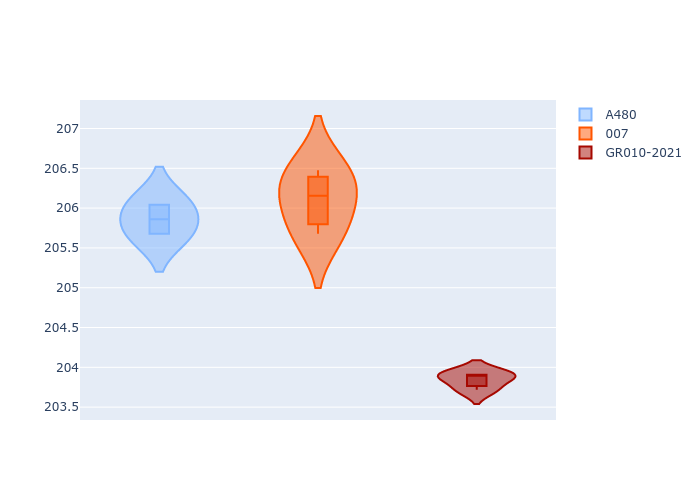
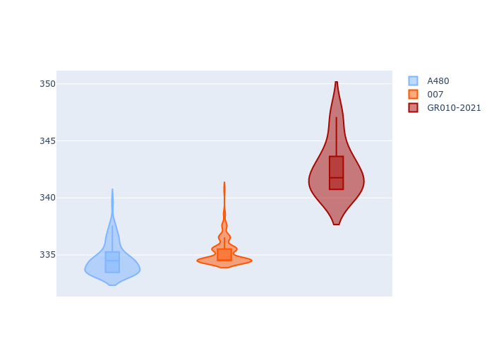

# Combined Plots

## Metadata

- BoP Accuracy: 87.64%
- Overall BoP Grade: B1
- Track: LEMANS
- Threshhold: 0.0kph

## BoP Table
| Manufacturer   | Car        | Weight   | Power   | PINC   | E/Stint   | FDS    | RDP    | QDP    | TDP    |
|:---------------|:-----------|:---------|:--------|:-------|:----------|:-------|:-------|:-------|:-------|
| Alpine         | A480       | 952kg    | 450.0kw | -      | 844MJ     | -      | 47.96% | 28.57% | 21.48% |
| Glickenhaus    | 007        | 1030kg   | 520.0kw | -      | 965MJ     | -      | 45.28% | 37.50% | 14.42% |
| Toyota         | GR010-2021 | 1066kg   | 515.0kw | -      | 962MJ     | 150kph | 51.22% | 60.00% | 0.85%  |

## Performance Table
| Manufacturer   | Car        | RP      | QP      | Vavg      |   RDLC | BOP-Grade   | Match   |
|:---------------|:-----------|:--------|:--------|:----------|-------:|:------------|:--------|
| Alpine         | A480       | 3:29.07 | 3:23.28 | 319.34kph |   1.03 | ~A1         | 97.73%  |
| Glickenhaus    | 007        | 3:30.17 | 3:23.62 | 320.02kph |   1.03 | +D1         | 66.77%  |
| Toyota         | GR010-2021 | 3:28.03 | 3:21.47 | 326.96kph |   1.03 | ~A1         | 98.42%  |

## Race Laptimes

## Quali Laptimes

## Topspeeds

## Laptimes Lineplot

