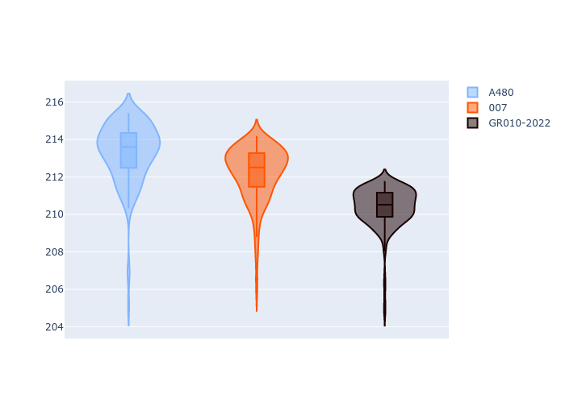
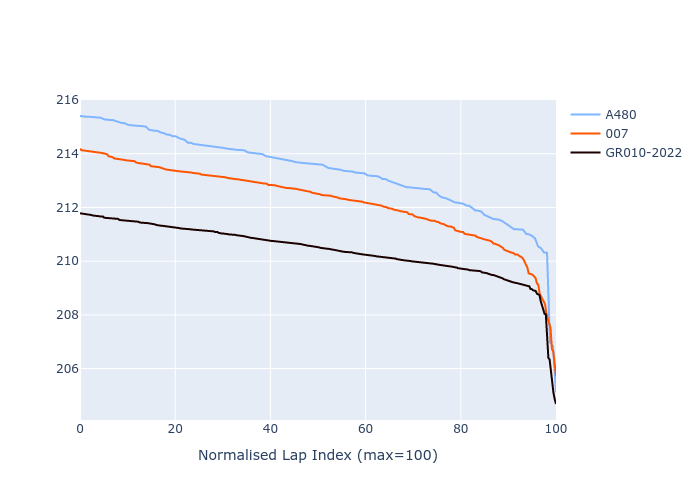

# Combined Plots

## Metadata

- BoP Accuracy: 82.10%
- Overall BoP Grade: B2
- Track: LEMANS
- Threshhold: 0.0kph

## BoP Table
| Manufacturer   | Car        | Weight   | Power   | PINC   | E/Stint   | FDS    | RDP    | QDP    | TDP    |
|:---------------|:-----------|:---------|:--------|:-------|:----------|:-------|:-------|:-------|:-------|
| Alpine         | A480       | 952kg    | 417.0kw | -      | 753MJ     | -      | 43.36% | 33.33% | 17.74% |
| Glickenhaus    | 007        | 1030kg   | 520.0kw | -      | 910MJ     | -      | 45.93% | 20.00% | 27.89% |
| Toyota         | GR010-2022 | 1070kg   | 506.0kw | -      | 898MJ     | 190kph | 48.39% | 66.67% | 12.11% |

## Performance Table
| Manufacturer   | Car        | RP      | QP      | Vavg      |   RDLC | BOP-Grade   | Match   |
|:---------------|:-----------|:--------|:--------|:----------|-------:|:------------|:--------|
| Alpine         | A480       | 3:33.90 | 3:34.11 | 320.96kph |   1    | -E1         | 56.25%  |
| Glickenhaus    | 007        | 3:32.80 | 3:31.60 | 330.57kph |   1.01 | +A2         | 90.86%  |
| Toyota         | GR010-2022 | 3:30.98 | 3:31.54 | 332.24kph |   1    | ~A1         | 99.20%  |

## Race Laptimes

## Quali Laptimes

## Topspeeds

## Laptimes Lineplot

