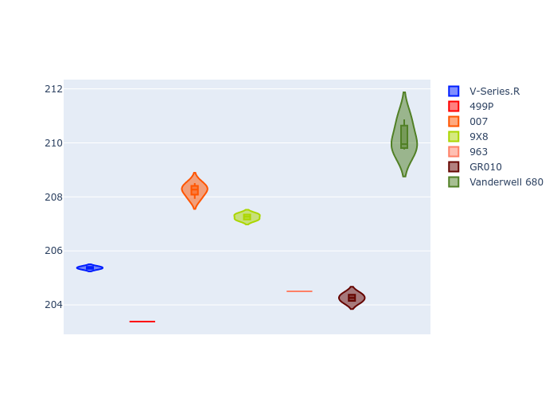

# Combined Plots

## Metadata

- BoP Accuracy: 81.78%
- Overall BoP Grade: B2
- Track: LEMANS
- Threshhold: 0.0kph
- Average Laptime: 3:32.12
- Average Quali Laptime: 3:26.26
- Average Topspeed: 338.47kph

## BoP Table
| Manufacturer   | Car            | Weight   | Power   | PINC   | E/Stint   | FDS    | RDP    | QDP    | TDP    |
|:---------------|:---------------|:---------|:--------|:-------|:----------|:-------|:-------|:-------|:-------|
| Cadillac       | V-Series.R     | 1046kg   | 513.0kw | -      | 905MJ     | -      | 37.71% | 28.57% | 13.28% |
| Ferrari        | 499P           | 1064kg   | 509.0kw | -      | 901MJ     | 190kph | 38.44% | 16.67% | 5.59%  |
| Glickenhaus    | 007            | 1030kg   | 520.0kw | -      | 913MJ     | -      | 36.23% | 57.14% | 16.80% |
| Peugeot        | 9X8            | 1042kg   | 516.0kw | -      | 908MJ     | 150kph | 37.23% | 50.00% | 14.95% |
| Porsche        | 963            | 1048kg   | 516.0kw | -      | 910MJ     | -      | 35.21% | 25.00% | 3.20%  |
| Toyota         | GR010          | 1080kg   | 512.0kw | -      | 908MJ     | 190kph | 37.75% | 40.00% | 2.44%  |
| Vanwall        | Vanderwell 680 | 1030kg   | 512.0kw | -      | 901MJ     | -      | 25.45% | 75.00% | 20.21% |

## Performance Table
| Manufacturer   | Car            | RP      | QP      | Vavg      |   RDLC | BOP-Grade   | Match   |
|:---------------|:---------------|:--------|:--------|:----------|-------:|:------------|:--------|
| Cadillac       | V-Series.R     | 3:31.41 | 3:25.34 | 338.10kph |   1.03 | ~A1         | 97.89%  |
| Ferrari        | 499P           | 3:30.27 | 3:23.34 | 342.44kph |   1.03 | -B2         | 82.38%  |
| Glickenhaus    | 007            | 3:32.83 | 3:28.41 | 338.76kph |   1.02 | +B2         | 83.88%  |
| Peugeot        | 9X8            | 3:31.68 | 3:27.42 | 335.60kph |   1.02 | ~A1         | 99.58%  |
| Porsche        | 963            | 3:31.07 | 3:24.56 | 340.50kph |   1.03 | -A2         | 94.48%  |
| Toyota         | GR010          | 3:31.09 | 3:24.35 | 341.39kph |   1.03 | ~A1         | 95.24%  |
| Vanwall        | Vanderwell 680 | 3:36.52 | 3:30.39 | 332.49kph |   1.03 | +Ω1         | 19.05%  |

## Race Laptimes

## Quali Laptimes

## Topspeeds

## Laptimes Lineplot

