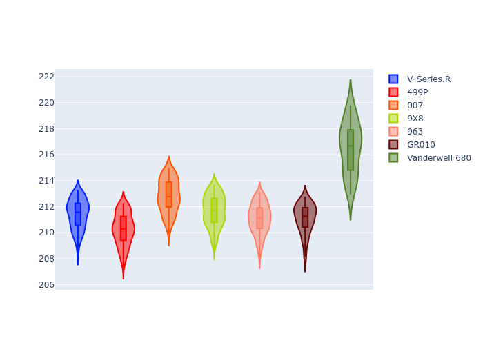
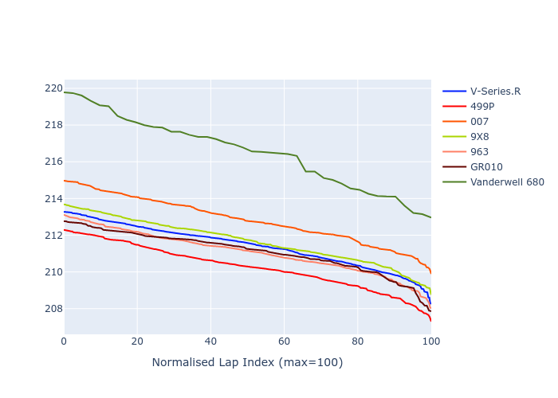

# Combined Plots

## Metadata

- BoP Accuracy: 81.84%
- Overall BoP Grade: B2
- Track: LEMANS
- Threshhold: 0.0kph

## BoP Table
| Manufacturer   | Car            | Weight   | Power   | PINC   | E/Stint   | FDS    |
|:---------------|:---------------|:---------|:--------|:-------|:----------|:-------|
| Cadillac       | V-Series.R     | 1046kg   | 513.0kw | -      | 905MJ     | -      |
| Ferrari        | 499P           | 1064kg   | 509.0kw | -      | 901MJ     | 190kph |
| Glickenhaus    | 007            | 1030kg   | 520.0kw | -      | 913MJ     | -      |
| Peugeot        | 9X8            | 1042kg   | 516.0kw | -      | 908MJ     | 150kph |
| Porsche        | 963            | 1048kg   | 516.0kw | -      | 910MJ     | -      |
| Toyota         | GR010          | 1080kg   | 512.0kw | -      | 908MJ     | 190kph |
| Vanwall        | Vanderwell 680 | 1030kg   | 512.0kw | -      | 901MJ     | -      |

## Performance Table
| Manufacturer   | Car            | RP      | QP      | Vavg      |   RDLC | BOP-Grade   | Match   |
|:---------------|:---------------|:--------|:--------|:----------|-------:|:------------|:--------|
| Cadillac       | V-Series.R     | 3:28.84 | 3:22.75 | 338.37kph |   1.03 | ~A1         | 97.91%  |
| Ferrari        | 499P           | 3:27.69 | 3:20.77 | 342.71kph |   1.03 | -B2         | 82.38%  |
| Glickenhaus    | 007            | 3:30.21 | 3:25.78 | 339.02kph |   1.02 | +B2         | 84.23%  |
| Peugeot        | 9X8            | 3:29.08 | 3:24.80 | 335.87kph |   1.02 | ~A1         | 99.58%  |
| Porsche        | 963            | 3:28.49 | 3:21.98 | 340.77kph |   1.03 | -A2         | 94.48%  |
| Toyota         | GR010          | 3:28.50 | 3:21.77 | 341.66kph |   1.03 | ~A1         | 95.24%  |
| Vanwall        | Vanderwell 680 | 3:33.87 | 3:27.73 | 332.75kph |   1.03 | +Ω1         | 19.05%  |

## Race Laptimes

## Quali Laptimes

## Topspeeds

## Laptimes Lineplot

