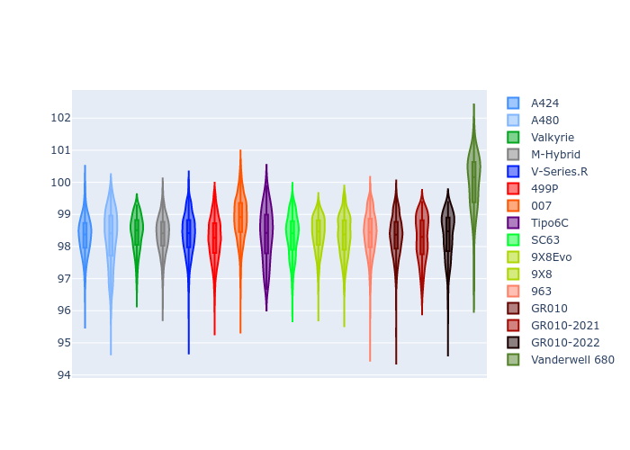
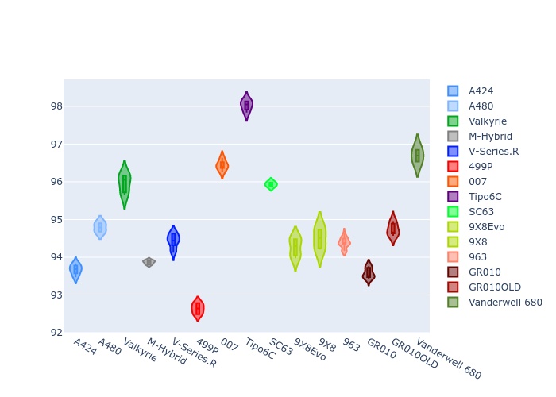
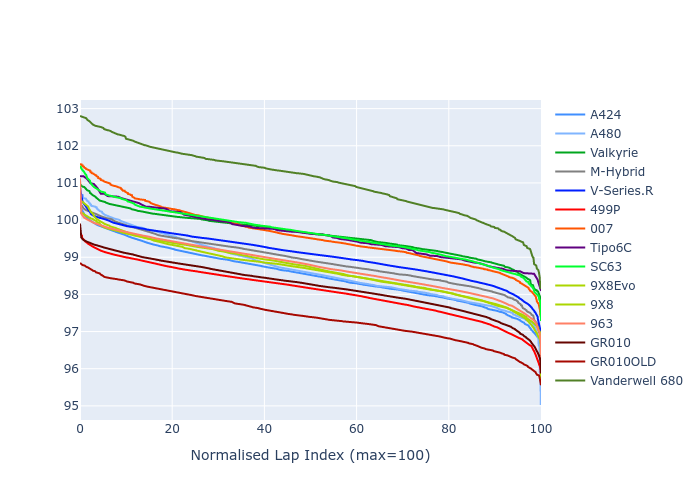

# Combined Plots

## Metadata

- BoP Accuracy: 92.92%
- Overall BoP Grade: A2
- Track: MONZA
- Threshhold: 210.0kph

## BoP Table
| Manufacturer     | Car            | Weight   | Power   | PINC   | E/Stint   | FDS    |
|:-----------------|:---------------|:---------|:--------|:-------|:----------|:-------|
| Alpine           | A424           | 1067kg   | 520.0kw | -1.00% | 913MJ     | -      |
| Alpine           | A480           | 1052kg   | 432.0kw | +1.00% | 800MJ     | -      |
| Aston Martin     | Valkyrie       | 1042kg   | 505.0kw | +0.40% | 900MJ     | -      |
| BMW              | M-Hybrid       | 1061kg   | 512.0kw | -1.00% | 906MJ     | -      |
| Cadillac         | V-Series.R     | 1054kg   | 510.0kw | +1.00% | 905MJ     | -      |
| Ferrari          | 499P           | 1083kg   | 508.0kw | -1.00% | 903MJ     | 190kph |
| Glickenhaus      | 007            | 1050kg   | 520.0kw | -      | 918MJ     | -      |
| Isotta Fraschini | Tipo6C         | 1078kg   | 520.0kw | -      | 919MJ     | 190kph |
| Lamborghini      | SC63           | 1056kg   | 519.0kw | -1.00% | 908MJ     | -      |
| Peugeot          | 9X8Evo         | 1070kg   | 510.0kw | -1.00% | 899MJ     | 190kph |
| Peugeot          | 9X8            | 1050kg   | 520.0kw | -      | 914MJ     | 150kph |
| Porsche          | 963            | 1067kg   | 516.0kw | -1.00% | 908MJ     | -      |
| Toyota           | GR010          | 1100kg   | 512.0kw | -1.00% | 913MJ     | 190kph |
| Toyota           | GR010OLD       | 1085kg   | 513.0kw | +1.00% | 964MJ     | 150kph |
| Vanwall          | Vanderwell 680 | 1030kg   | 520.0kw | -      | 913MJ     | -      |

## Performance Table
| Manufacturer     | Car            | RP      | QP      | Vavg      |   RDLC | BOP-Grade   | Match   |
|:-----------------|:---------------|:--------|:--------|:----------|-------:|:------------|:--------|
| Alpine           | A424           | 1:38.51 | 1:35.54 | 311.96kph |   1.03 | ~A1         | 99.81%  |
| Alpine           | A480           | 1:38.60 | 1:36.62 | 303.97kph |   1.02 | ~A1         | 99.66%  |
| Aston Martin     | Valkyrie       | 1:39.61 | 1:35.89 | 311.35kph |   1.04 | ~A1         | 97.49%  |
| BMW              | M-Hybrid       | 1:38.92 | 1:35.61 | 309.74kph |   1.03 | ~A1         | 100.00% |
| Cadillac         | V-Series.R     | 1:39.05 | 1:35.82 | 308.08kph |   1.03 | ~A1         | 99.79%  |
| Ferrari          | 499P           | 1:38.10 | 1:34.77 | 310.35kph |   1.04 | ~A1         | 97.99%  |
| Glickenhaus      | 007            | 1:39.51 | 1:37.21 | 309.30kph |   1.02 | +B1         | 89.59%  |
| Isotta Fraschini | Tipo6C         | 1:39.60 | 1:38.23 | 309.24kph |   1.01 | ~A1         | 95.52%  |
| Lamborghini      | SC63           | 1:39.61 | 1:37.06 | 310.61kph |   1.03 | +A2         | 94.45%  |
| Peugeot          | 9X8Evo         | 1:38.67 | 1:35.40 | 311.41kph |   1.03 | ~A1         | 100.00% |
| Peugeot          | 9X8            | 1:38.65 | 1:35.72 | 305.38kph |   1.03 | ~A1         | 99.93%  |
| Porsche          | 963            | 1:38.77 | 1:35.53 | 310.16kph |   1.03 | ~A1         | 99.87%  |
| Toyota           | GR010          | 1:38.23 | 1:34.80 | 310.02kph |   1.04 | ~A1         | 98.61%  |
| Toyota           | GR010OLD       | 1:37.41 | 1:35.19 | 307.41kph |   1.02 | -B1         | 86.80%  |
| Vanwall          | Vanderwell 680 | 1:41.01 | 1:37.38 | 305.33kph |   1.04 | +Ω1         | 34.23%  |

## Race Laptimes

## Quali Laptimes

## Topspeeds

## Laptimes Lineplot

