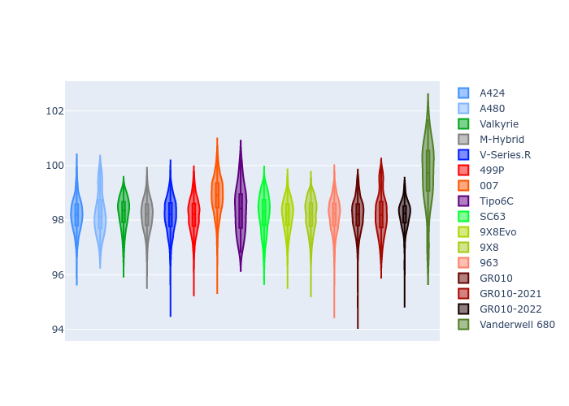
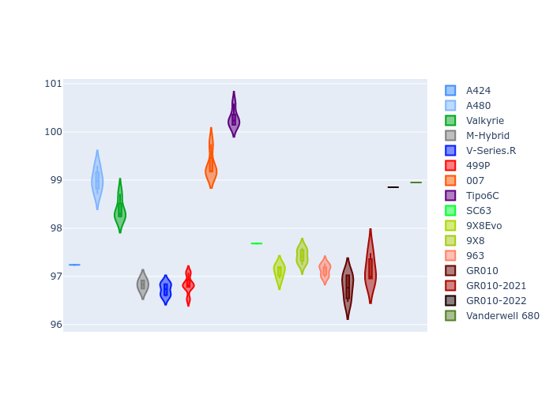
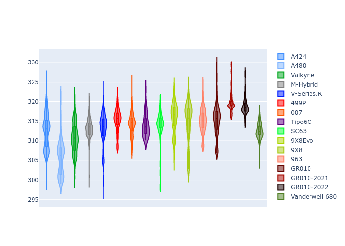
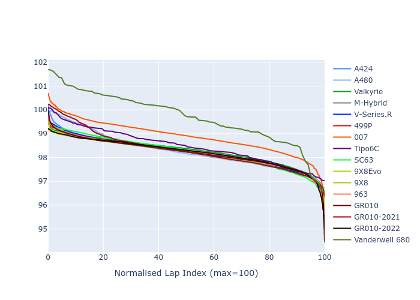

# Combined Plots

## Metadata

- BoP Accuracy: 95.31%
- Overall BoP Grade: A1
- Track: MONZA
- Threshhold: 250.0kph
- Average Laptime: 1:39.12
- Average Quali Laptime: 1:38.07
- Laptime Std Dev: 0.50 seconds
- Filtered Average Topspeed: 313.99kph

## BoP Table
| Manufacturer     | Car            | Weight   | Power   | PINC   | E/Stint   | FDS    | RDP    | QDP    | TDP    |
|:-----------------|:---------------|:---------|:--------|:-------|:----------|:-------|:-------|:-------|:-------|
| Alpine           | A424           | 1066kg   | 511.0kw | +0.10% | 899MJ     | -      | 52.20% | 54.51% | 24.58% |
| Alpine           | A480           | 988kg    | 422.0kw | +0.10% | 793MJ     | -      | 53.05% | 74.07% | 48.97% |
| Aston Martin     | Valkyrie       | 1034kg   | 501.0kw | -      | 895MJ     | -      | 53.39% | 54.11% | 23.71% |
| BMW              | M-Hybrid       | 1060kg   | 513.0kw | +0.10% | 909MJ     | -      | 53.47% | 52.95% | 33.73% |
| Cadillac         | V-Series.R     | 1057kg   | 519.0kw | -      | 911MJ     | -      | 49.22% | 60.31% | 18.04% |
| Ferrari          | 499P           | 1072kg   | 503.0kw | -0.10% | 898MJ     | 190kph | 51.56% | 44.72% | 9.86%  |
| Glickenhaus      | 007            | 1033kg   | 504.0kw | -      | 902MJ     | -      | 46.14% | 49.30% | 41.45% |
| Isotta Fraschini | Tipo6C         | 1030kg   | 497.0kw | -      | 893MJ     | 190kph | 43.95% | 47.22% | 31.53% |
| Lamborghini      | SC63           | 1050kg   | 520.0kw | +0.10% | 910MJ     | -      | 48.25% | 60.95% | 28.65% |
| Peugeot          | 9X8Evo         | 1062kg   | 518.0kw | -0.10% | 904MJ     | 190kph | 50.17% | 49.36% | 17.73% |
| Peugeot          | 9X8            | 1056kg   | 524.0kw | -      | 919MJ     | 150kph | 54.54% | 58.39% | 9.69%  |
| Porsche          | 963            | 1066kg   | 511.0kw | +0.10% | 905MJ     | -      | 50.78% | 41.25% | 27.61% |
| Toyota           | GR010          | 1081kg   | 502.0kw | +0.10% | 904MJ     | 190kph | 51.68% | 51.25% | 14.48% |
| Toyota           | GR010-2021     | 1065kg   | 509.0kw | -0.10% | 956MJ     | 150kph | 54.04% | 54.81% | 9.72%  |
| Toyota           | GR010-2022     | 1070kg   | 503.0kw | -0.10% | 896MJ     | 190kph | 53.24% | 64.49% | 9.72%  |
| Vanwall          | Vanderwell 680 | 1030kg   | 520.0kw | -      | 913MJ     | -      | 49.68% | 60.93% | 34.43% |

## Performance Table
| Manufacturer     | Car            | RP      | QP      | Vavg      |   RDLC | BOP-Grade   | Match   |
|:-----------------|:---------------|:--------|:--------|:----------|-------:|:------------|:--------|
| Alpine           | A424           | 1:39.01 | 1:37.53 | 312.41kph |   1.02 | ~A1         | 99.96%  |
| Alpine           | A480           | 1:39.73 | 1:40.25 | 305.44kph |   0.99 | +B2         | 83.30%  |
| Aston Martin     | Valkyrie       | 1:39.73 | 1:38.23 | 310.74kph |   1.02 | ~A1         | 95.52%  |
| BMW              | M-Hybrid       | 1:38.81 | 1:37.09 | 313.23kph |   1.02 | ~A1         | 99.98%  |
| Cadillac         | V-Series.R     | 1:38.64 | 1:36.95 | 312.84kph |   1.02 | ~A1         | 99.93%  |
| Ferrari          | 499P           | 1:38.87 | 1:37.10 | 315.29kph |   1.02 | ~A1         | 99.99%  |
| Glickenhaus      | 007            | 1:39.73 | 1:39.30 | 314.14kph |   1    | +B1         | 89.51%  |
| Isotta Fraschini | Tipo6C         | 1:39.73 | 1:40.24 | 313.90kph |   0.99 | +A2         | 90.30%  |
| Lamborghini      | SC63           | 1:38.81 | 1:37.98 | 314.60kph |   1.01 | ~A1         | 100.00% |
| Peugeot          | 9X8Evo         | 1:38.87 | 1:37.35 | 315.94kph |   1.02 | ~A1         | 100.00% |
| Peugeot          | 9X8            | 1:38.71 | 1:37.64 | 314.31kph |   1.01 | ~A1         | 99.92%  |
| Porsche          | 963            | 1:38.91 | 1:37.29 | 315.06kph |   1.02 | ~A1         | 99.95%  |
| Toyota           | GR010          | 1:39.11 | 1:37.23 | 315.06kph |   1.02 | ~A1         | 99.78%  |
| Toyota           | GR010-2021     | 1:38.24 | 1:37.10 | 319.71kph |   1.01 | ~A1         | 100.00% |
| Toyota           | GR010-2022     | 1:38.99 | 1:39.06 | 318.72kph |   1    | ~A1         | 99.48%  |
| Vanwall          | Vanderwell 680 | 1:40.06 | 1:38.78 | 312.45kph |   1.01 | +D1         | 67.30%  |

## Race Laptimes

## Quali Laptimes

## Topspeeds

## Laptimes Lineplot

