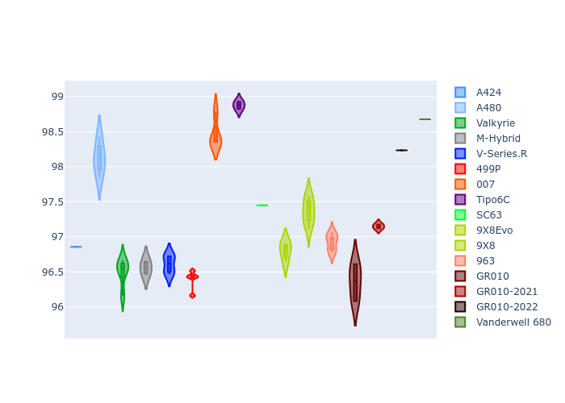
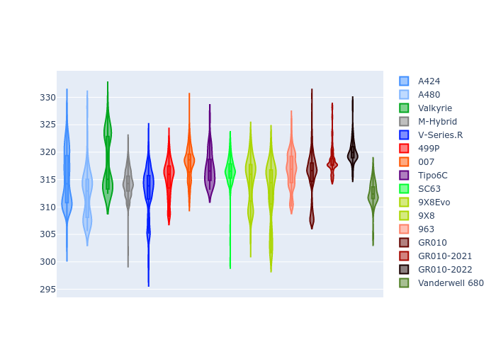
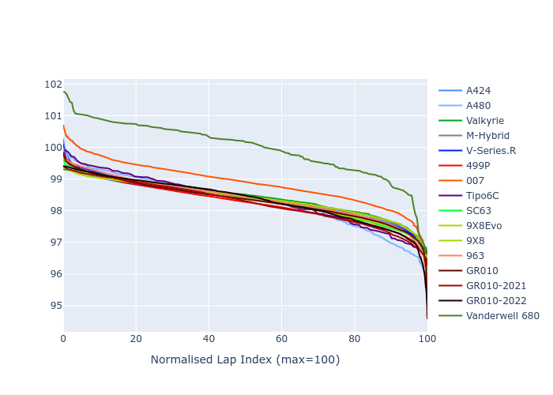

# Combined Plots

## Metadata

- BoP Accuracy: 92.15%
- Overall BoP Grade: A2
- Track: MONZA
- Threshhold: 250.0kph

## BoP Table
| Manufacturer     | Car            | Weight   | Power   | PINC   | E/Stint   | FDS    | RDP    | QDP    | TDP    |
|:-----------------|:---------------|:---------|:--------|:-------|:----------|:-------|:-------|:-------|:-------|
| Alpine           | A424           | 1067kg   | 520.0kw | -0.10% | 915MJ     | -      | 52.35% | 61.85% | 27.84% |
| Alpine           | A480           | 952kg    | 432.0kw | +0.10% | 799MJ     | -      | 54.51% | 76.19% | 54.04% |
| Aston Martin     | Valkyrie       | 1050kg   | 504.0kw | +0.10% | 899MJ     | -      | 53.59% | 53.33% | 21.51% |
| BMW              | M-Hybrid       | 1061kg   | 512.0kw | -0.10% | 908MJ     | -      | 53.26% | 57.23% | 34.54% |
| Cadillac         | V-Series.R     | 1054kg   | 510.0kw | +0.10% | 903MJ     | -      | 47.80% | 56.73% | 19.63% |
| Ferrari          | 499P           | 1083kg   | 508.0kw | -0.10% | 904MJ     | 190kph | 53.02% | 42.32% | 9.88%  |
| Glickenhaus      | 007            | 1050kg   | 520.0kw | -      | 918MJ     | -      | 46.49% | 46.07% | 47.78% |
| Isotta Fraschini | Tipo6C         | 1059kg   | 520.0kw | -      | 917MJ     | 190kph | 43.95% | 47.22% | 31.53% |
| Lamborghini      | SC63           | 1062kg   | 519.0kw | -0.10% | 910MJ     | -      | 46.33% | 59.50% | 29.33% |
| Peugeot          | 9X8Evo         | 1070kg   | 510.0kw | -0.10% | 901MJ     | 190kph | 48.47% | 51.26% | 16.02% |
| Peugeot          | 9X8            | 1050kg   | 520.0kw | -      | 914MJ     | 150kph | 54.07% | 57.08% | 10.80% |
| Porsche          | 963            | 1067kg   | 516.0kw | -0.10% | 910MJ     | -      | 50.87% | 45.25% | 30.77% |
| Toyota           | GR010          | 1100kg   | 512.0kw | -0.10% | 914MJ     | 190kph | 52.43% | 57.12% | 12.82% |
| Toyota           | GR010-2021     | 1085kg   | 513.0kw | +0.10% | 962MJ     | 150kph | 54.09% | 52.67% | 26.37% |
| Toyota           | GR010-2022     | 1100kg   | 512.0kw | +0.10% | 907MJ     | 190kph | 53.48% | 69.44% | 7.86%  |
| Vanwall          | Vanderwell 680 | 1030kg   | 520.0kw | -      | 913MJ     | -      | 53.41% | 56.28% | 29.85% |

## Performance Table
| Manufacturer     | Car            | RP      | QP      | Vavg      |   RDLC | BOP-Grade   | Match   |
|:-----------------|:---------------|:--------|:--------|:----------|-------:|:------------|:--------|
| Alpine           | A424           | 1:38.70 | 1:35.59 | 312.42kph |   1.03 | ~A1         | 99.65%  |
| Alpine           | A480           | 1:37.47 | 1:35.30 | 305.12kph |   1.02 | -C2         | 72.02%  |
| Aston Martin     | Valkyrie       | 1:39.94 | 1:36.19 | 310.05kph |   1.04 | ~A1         | 97.49%  |
| BMW              | M-Hybrid       | 1:39.07 | 1:35.59 | 310.36kph |   1.04 | ~A1         | 100.00% |
| Cadillac         | V-Series.R     | 1:39.29 | 1:35.82 | 307.18kph |   1.04 | ~A1         | 99.74%  |
| Ferrari          | 499P           | 1:38.62 | 1:34.73 | 310.94kph |   1.04 | ~A1         | 98.53%  |
| Glickenhaus      | 007            | 1:39.60 | 1:37.30 | 309.30kph |   1.02 | +A2         | 90.71%  |
| Isotta Fraschini | Tipo6C         | 1:39.95 | 1:38.67 | 311.24kph |   1.01 | +B1         | 85.07%  |
| Lamborghini      | SC63           | 1:39.88 | 1:37.26 | 310.64kph |   1.03 | +A2         | 93.49%  |
| Peugeot          | 9X8Evo         | 1:39.39 | 1:36.05 | 312.08kph |   1.03 | ~A1         | 98.41%  |
| Peugeot          | 9X8            | 1:38.82 | 1:35.56 | 303.92kph |   1.03 | ~A1         | 99.38%  |
| Porsche          | 963            | 1:38.95 | 1:35.54 | 311.20kph |   1.04 | ~A1         | 99.78%  |
| Toyota           | GR010          | 1:38.64 | 1:34.65 | 311.13kph |   1.04 | ~A1         | 99.25%  |
| Toyota           | GR010-2021     | 1:38.73 | 1:35.65 | 303.23kph |   1.03 | ~A1         | 99.78%  |
| Toyota           | GR010-2022     | 1:38.70 | 1:36.35 | 308.96kph |   1.02 | ~A1         | 99.85%  |
| Vanwall          | Vanderwell 680 | 1:40.97 | 1:37.38 | 305.33kph |   1.04 | +Ω1         | 41.22%  |

## Race Laptimes

## Quali Laptimes

## Topspeeds

## Laptimes Lineplot

