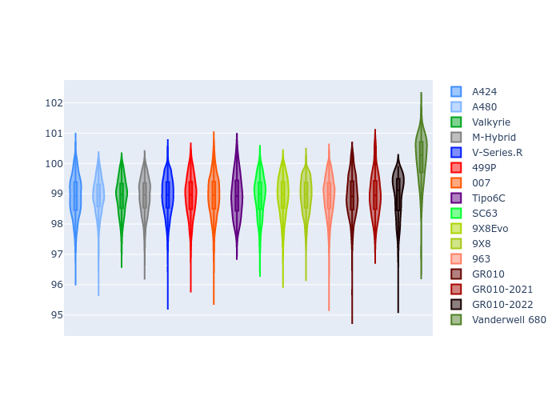
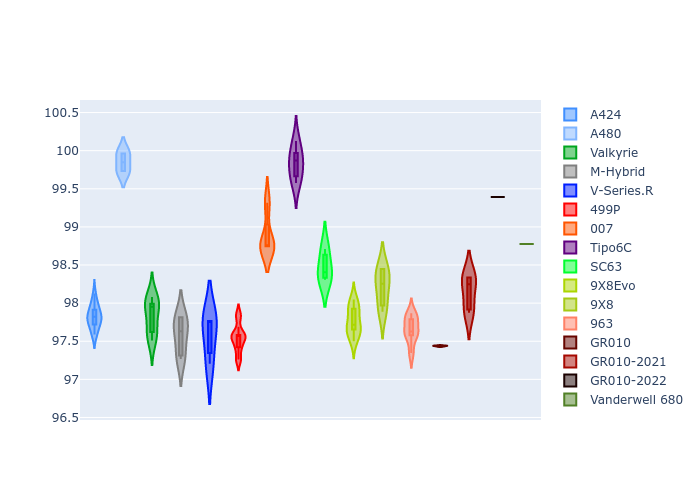
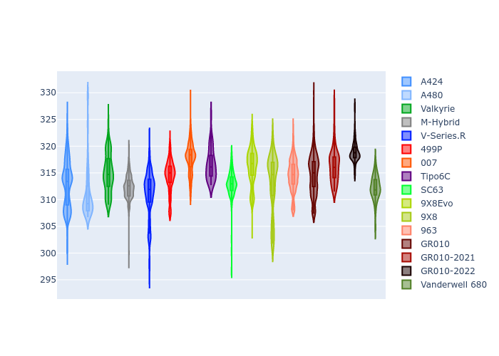
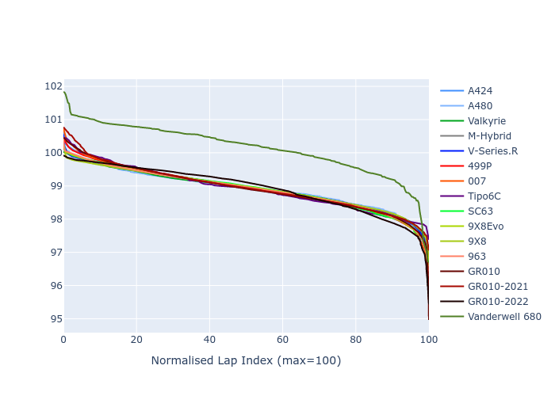

# Combined Plots

## Metadata

- BoP Accuracy: 97.19%
- Overall BoP Grade: A1
- Track: MONZA
- Threshhold: 0.0kph
- Average Laptime: 1:38.99
- Average Quali Laptime: 1:37.89
- Laptime Std Dev: 0.30 seconds
- Filtered Average Topspeed: 314.40kph

## BoP Table
| Manufacturer     | Car            | Weight   | Power   | PINC   | E/Stint   | FDS    | RDP    | QDP    | TDP    |
|:-----------------|:---------------|:---------|:--------|:-------|:----------|:-------|:-------|:-------|:-------|
| Alpine           | A424           | 1039kg   | 499.0kw | -      | 885MJ     | -      | 51.45% | 55.09% | 24.89% |
| Alpine           | A480           | 932kg    | 418.0kw | -      | 784MJ     | -      | 54.77% | 76.19% | 54.04% |
| Aston Martin     | Valkyrie       | 1050kg   | 520.0kw | -      | 913MJ     | -      | 53.07% | 48.70% | 24.00% |
| BMW              | M-Hybrid       | 1041kg   | 500.0kw | -      | 895MJ     | -      | 52.63% | 52.34% | 34.06% |
| Cadillac         | V-Series.R     | 1047kg   | 507.0kw | -      | 900MJ     | -      | 48.80% | 57.26% | 18.10% |
| Ferrari          | 499P           | 1065kg   | 496.0kw | -      | 892MJ     | 190kph | 51.39% | 44.34% | 9.89%  |
| Glickenhaus      | 007            | 1032kg   | 520.0kw | -      | 916MJ     | -      | 46.14% | 49.30% | 41.45% |
| Isotta Fraschini | Tipo6C         | 1053kg   | 520.0kw | -      | 916MJ     | 200kph | 43.95% | 47.22% | 31.53% |
| Lamborghini      | SC63           | 1064kg   | 520.0kw | -      | 911MJ     | -      | 48.32% | 60.95% | 28.65% |
| Peugeot          | 9X8Evo         | 1032kg   | 502.0kw | -      | 887MJ     | 190kph | 49.16% | 50.25% | 18.00% |
| Peugeot          | 9X8            | 1034kg   | 508.0kw | -      | 902MJ     | 150kph | 54.54% | 58.39% | 9.69%  |
| Porsche          | 963            | 1036kg   | 496.0kw | -      | 889MJ     | -      | 50.61% | 41.90% | 27.68% |
| Toyota           | GR010          | 1063kg   | 495.0kw | -      | 895MJ     | 190kph | 51.33% | 51.71% | 14.89% |
| Toyota           | GR010-2021     | 1060kg   | 497.0kw | -      | 944MJ     | 150kph | 54.02% | 52.67% | 26.37% |
| Toyota           | GR010-2022     | 1058kg   | 498.0kw | -      | 890MJ     | 190kph | 53.24% | 64.49% | 9.72%  |
| Vanwall          | Vanderwell 680 | 1030kg   | 520.0kw | -      | 913MJ     | -      | 50.86% | 59.83% | 31.84% |

## Performance Table
| Manufacturer     | Car            | RP      | QP      | Vavg      |   RDLC | BOP-Grade   | Match   |
|:-----------------|:---------------|:--------|:--------|:----------|-------:|:------------|:--------|
| Alpine           | A424           | 1:38.91 | 1:37.45 | 312.90kph |   1.01 | ~A1         | 99.90%  |
| Alpine           | A480           | 1:38.91 | 1:38.22 | 311.18kph |   1.01 | ~A1         | 99.80%  |
| Aston Martin     | Valkyrie       | 1:38.92 | 1:37.63 | 314.87kph |   1.01 | ~A1         | 100.00% |
| BMW              | M-Hybrid       | 1:38.93 | 1:37.23 | 312.35kph |   1.02 | ~A1         | 100.00% |
| Cadillac         | V-Series.R     | 1:38.92 | 1:37.20 | 311.08kph |   1.02 | ~A1         | 99.92%  |
| Ferrari          | 499P           | 1:38.92 | 1:37.10 | 314.46kph |   1.02 | ~A1         | 99.96%  |
| Glickenhaus      | 007            | 1:38.91 | 1:38.54 | 317.83kph |   1    | ~A1         | 99.08%  |
| Isotta Fraschini | Tipo6C         | 1:38.91 | 1:39.49 | 316.54kph |   0.99 | ~A1         | 100.00% |
| Lamborghini      | SC63           | 1:38.91 | 1:38.02 | 313.01kph |   1.01 | ~A1         | 100.00% |
| Peugeot          | 9X8Evo         | 1:38.92 | 1:37.45 | 316.21kph |   1.02 | ~A1         | 100.00% |
| Peugeot          | 9X8            | 1:38.92 | 1:37.91 | 313.18kph |   1.01 | ~A1         | 100.00% |
| Porsche          | 963            | 1:38.91 | 1:37.46 | 314.57kph |   1.01 | ~A1         | 99.93%  |
| Toyota           | GR010          | 1:38.92 | 1:36.91 | 314.65kph |   1.02 | ~A1         | 99.80%  |
| Toyota           | GR010-2021     | 1:38.92 | 1:37.72 | 316.33kph |   1.01 | ~A1         | 97.28%  |
| Toyota           | GR010-2022     | 1:38.92 | 1:38.93 | 318.95kph |   1    | ~A1         | 99.55%  |
| Vanwall          | Vanderwell 680 | 1:40.14 | 1:38.95 | 312.25kph |   1.01 | +E1         | 59.75%  |

## Race Laptimes

## Quali Laptimes

## Topspeeds

## Laptimes Lineplot

