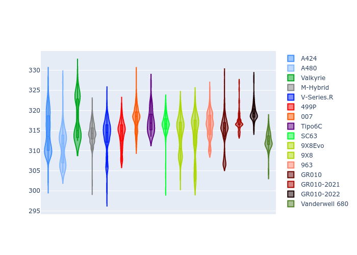

# Combined Plots

## Metadata

- BoP Accuracy: 97.86%
- Overall BoP Grade: A1
- Track: MONZA
- Threshhold: 0.0kph

## BoP Table
| Manufacturer     | Car            | Weight   | Power   | PINC   | E/Stint   | FDS    |
|:-----------------|:---------------|:---------|:--------|:-------|:----------|:-------|
| Alpine           | A424           | 1045kg   | 486.0kw | -      | 882MJ     | -      |
| Alpine           | A480           | 1040kg   | 410.0kw | -      | 777MJ     | -      |
| Aston Martin     | Valkyrie       | 1030kg   | 498.0kw | -      | 891MJ     | -      |
| BMW              | M-Hybrid       | 1044kg   | 488.0kw | -      | 885MJ     | -      |
| Cadillac         | V-Series.R     | 1053kg   | 497.0kw | -      | 891MJ     | -      |
| Ferrari          | 499P           | 1100kg   | 480.0kw | -      | 881MJ     | 190kph |
| Glickenhaus      | 007            | 1033kg   | 507.0kw | -      | 905MJ     | -      |
| Isotta Fraschini | Tipo6C         | 1090kg   | 520.0kw | -      | 920MJ     | 190kph |
| Lamborghini      | SC63           | 1069kg   | 518.0kw | -      | 910MJ     | -      |
| Peugeot          | 9X8Evo         | 1049kg   | 480.0kw | -      | 872MJ     | 190kph |
| Peugeot          | 9X8            | 1050kg   | 498.0kw | -      | 895MJ     | 150kph |
| Porsche          | 963            | 1044kg   | 487.0kw | -      | 881MJ     | -      |
| Toyota           | GR010          | 1100kg   | 480.0kw | -      | 886MJ     | 190kph |
| Toyota           | GR010OLD       | 1100kg   | 480.0kw | -      | 932MJ     | 190kph |
| Vanwall          | Vanderwell 680 | 1030kg   | 520.0kw | -      | 913MJ     | -      |

## Performance Table
| Manufacturer     | Car            | RP      | QP      | Vavg      |   RDLC | BOP-Grade   | Match   |
|:-----------------|:---------------|:--------|:--------|:----------|-------:|:------------|:--------|
| Alpine           | A424           | 1:39.81 | 1:36.76 | 307.46kph |   1.03 | ~A1         | 99.88%  |
| Alpine           | A480           | 1:39.80 | 1:37.77 | 298.92kph |   1.02 | ~A1         | 97.43%  |
| Aston Martin     | Valkyrie       | 1:39.80 | 1:36.07 | 310.78kph |   1.04 | ~A1         | 100.00% |
| BMW              | M-Hybrid       | 1:39.80 | 1:36.43 | 306.92kph |   1.03 | ~A1         | 99.96%  |
| Cadillac         | V-Series.R     | 1:39.81 | 1:36.52 | 304.58kph |   1.03 | ~A1         | 100.00% |
| Ferrari          | 499P           | 1:39.76 | 1:36.32 | 303.06kph |   1.04 | ~A1         | 99.94%  |
| Glickenhaus      | 007            | 1:39.81 | 1:37.49 | 308.29kph |   1.02 | ~A1         | 98.32%  |
| Isotta Fraschini | Tipo6C         | 1:39.81 | 1:38.43 | 308.00kph |   1.01 | ~A1         | 100.00% |
| Lamborghini      | SC63           | 1:39.80 | 1:37.25 | 309.77kph |   1.03 | ~A1         | 99.88%  |
| Peugeot          | 9X8Evo         | 1:39.80 | 1:36.45 | 307.58kph |   1.03 | ~A1         | 99.75%  |
| Peugeot          | 9X8            | 1:39.81 | 1:36.81 | 300.63kph |   1.03 | ~A1         | 99.96%  |
| Porsche          | 963            | 1:39.80 | 1:36.50 | 306.87kph |   1.03 | ~A1         | 99.90%  |
| Toyota           | GR010          | 1:39.80 | 1:36.27 | 303.58kph |   1.04 | ~A1         | 99.97%  |
| Toyota           | GR010OLD       | 1:39.81 | 1:37.48 | 297.89kph |   1.02 | ~A1         | 100.00% |
| Vanwall          | Vanderwell 680 | 1:41.01 | 1:37.38 | 305.33kph |   1.04 | +C2         | 72.92%  |

## Race Laptimes

## Quali Laptimes

## Topspeeds

## Laptimes Lineplot

