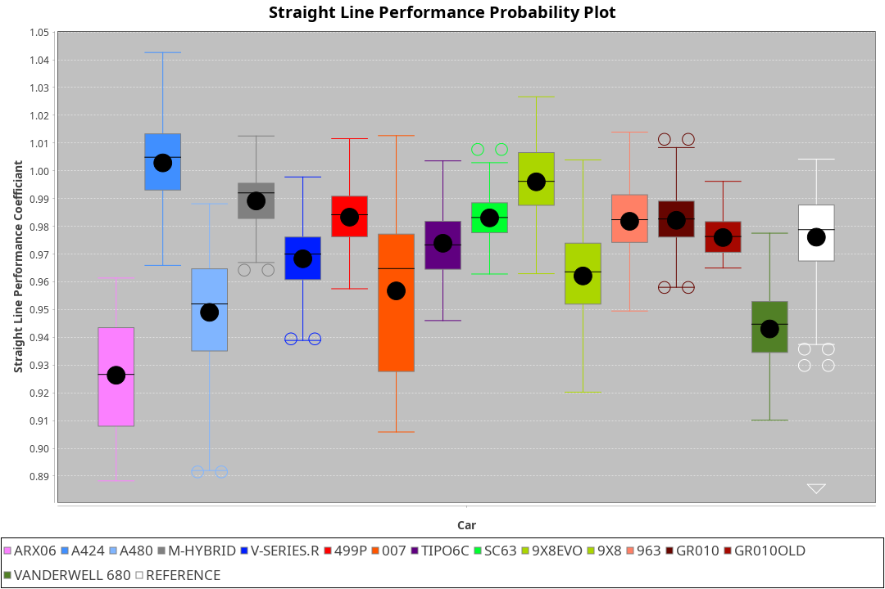
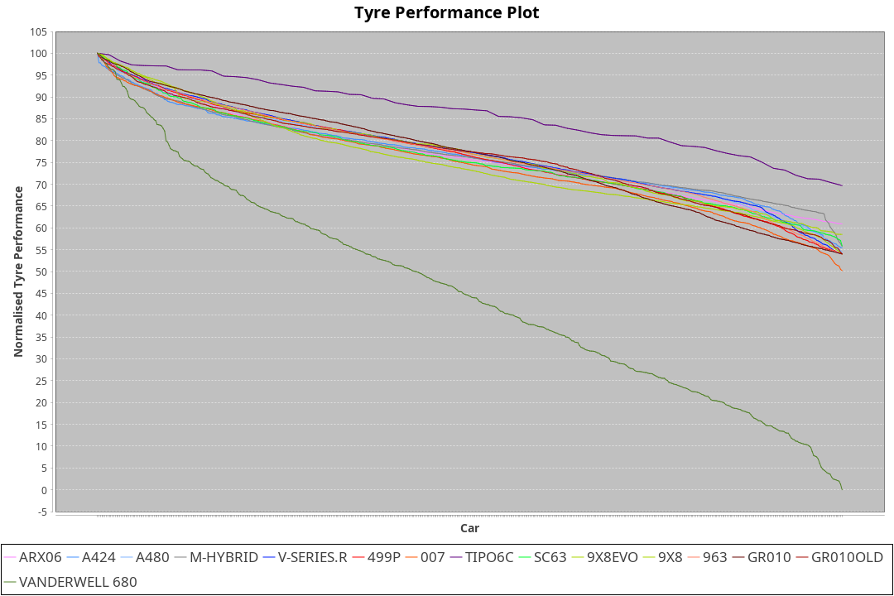

| Manufacturer     | Car            | Weight | Power   | PINC    | E/Stint | FDS     |
|:-|:-|:-|:-|:-|:-|:-|
| Toyota           | GR010          | 1100kg | 480.0kw |    -    | 886MJ   | 200kph  |
| Peugeot          | 9X8Evo         | 1085kg | 480.0kw |    -    | 875MJ   | 190kph  |
| Cadillac         | V-Series.R     | 1045kg | 493.0kw |    -    | 887MJ   |    -    |
| Porsche          | 963            | 1048kg | 490.0kw |    -    | 885MJ   |    -    |
| Ferrari          | 499P           | 1100kg | 480.0kw |    -    | 881MJ   | 200kph  |
| Alpine           | A424           | 1050kg | 489.0kw |    -    | 886MJ   |    -    |
| BMW              | M-Hybrid       | 1049kg | 492.0kw |    -    | 888MJ   |    -    |
| Aston Martin     | Valkyrie       | 1030kg | 493.0kw |    -    | 887MJ   |    -    |
| Lamborghini      | SC63           | 1074kg | 520.0kw |    -    | 912MJ   |    -    |
| Isotta Fraschini | Tipo6C         | 1084kg | 507.0kw |    -    | 908MJ   | 190kph  |
| Glickenhaus      | 007            | 1030kg | 503.0kw |    -    | 901MJ   |    -    |
| Vanwall          | Vanderwell 680 | 1030kg | 520.0kw |    -    | 913MJ   |    -    |
| Acura            | ARX06          | 1044kg | 486.0kw |    -    | 885MJ   |    -    |
| Toyota           | GR010OLD       | 1100kg | 480.0kw |    -    | 932MJ   | 200kph  |
| Alpine           | A480           | 950kg  | 410.0kw |    -    | 778MJ   |    -    |
| Peugeot          | 9X8            | 1043kg | 486.0kw |    -    | 883MJ   | 150kph  |

### BoP Accuracy: 90.10%; Overall BoP Grade: A2
| Manufacturer     | Car            | Type  | RP      | QP      | Weight | Power¹  | Threshhold | PINC    | Power²   | E/Stint | AVG Vmax  | FDS     | RDLC | L/Stint | BOP-Grade | Model Accuracy | Model Points | Match%  | SimDiff |
|:-|:-|:-|:-|:-|:-|:-|:-|:-|:-|:-|:-|:-|:-|:-|:-|:-|:-|:-|:-|
| Acura            | ARX06          | LMDH  | 1:39.95 | 1:36.23 | 1044kg | 486.0kw | 0.0kph     |    -    | 486.00kw |  885MJ  | 295.84kph |    -    | 1.02 | 29      | +B2       | 100.00%        | 996          | 83.73%  | #       |
| Alpine           | A424           | LMDH  | 1:39.96 | 1:36.48 | 1050kg | 489.0kw | 0.0kph     |    -    | 489.00kw |  886MJ  | 291.98kph |    -    | 1.02 | 29      | ~A1       | 96.10%         | 2390         | 97.30%  | #       |
| Alpine           | A480           | LMP1  | 1:39.97 | 1:37.55 |  950kg | 410.0kw | 0.0kph     |    -    | 410.00kw |  778MJ  | 291.63kph |    -    | 0.98 | 27      | ~A1       | 95.62%         | 1701         | 100.00% | +0.27   |
| Aston Martin     | Valkyrie       | LMHNH | 1:39.95 | 1:36.01 | 1030kg | 493.0kw | 0.0kph     |    -    | 493.00kw |  887MJ  | 294.24kph |    -    | 1.05 | 29      | +C2       | 100.00%        | 466          | 74.30%  | #       |
| BMW              | M-Hybrid       | LMDH  | 1:39.97 | 1:36.24 | 1049kg | 492.0kw | 0.0kph     |    -    | 492.00kw |  888MJ  | 294.37kph |    -    | 1.02 | 29      | ~A1       | 100.00%        | 3339         | 100.00% | #       |
| Cadillac         | V-Series.R     | LMDH  | 1:39.97 | 1:36.37 | 1045kg | 493.0kw | 0.0kph     |    -    | 493.00kw |  887MJ  | 296.69kph |    -    | 1.02 | 29      | ~A1       | 99.56%         | 5841         | 99.09%  | #       |
| Ferrari          | 499P           | LMHHU | 1:39.60 | 1:35.85 | 1100kg | 480.0kw | 0.0kph     |    -    | 480.00kw |  881MJ  | 289.20kph | 200kph  | 1.01 | 29      | -B2       | 99.57%         | 7417         | 83.14%  | #       |
| Glickenhaus      | 007            | LMHNH | 1:39.96 | 1:37.30 | 1030kg | 503.0kw | 0.0kph     |    -    | 503.00kw |  901MJ  | 302.44kph |    -    | 0.97 | 29      | ~A1       | 93.90%         | 2170         | 99.06%  | +0.16   |
| Isotta Fraschini | Tipo6C         | LMHHU | 1:39.96 | 1:38.13 | 1084kg | 507.0kw | 0.0kph     |    -    | 507.00kw |  908MJ  | 295.89kph | 190kph  | 1.03 | 29      | +B2       | 100.00%        | 132          | 82.07%  | #       |
| Lamborghini      | SC63           | LMDH  | 1:39.96 | 1:37.31 | 1074kg | 520.0kw | 0.0kph     |    -    | 520.00kw |  912MJ  | 294.24kph |    -    | 1.03 | 29      | ~A1       | 100.00%        | 784          | 98.41%  | #       |
| Peugeot          | 9X8Evo         | LMHHU | 1:39.96 | 1:36.41 | 1085kg | 480.0kw | 0.0kph     |    -    | 480.00kw |  875MJ  | 297.25kph | 190kph  | 0.97 | 29      | +B1       | 100.00%        | 1891         | 88.50%  | #       |
| Peugeot          | 9X8            | LMHHE | 1:39.95 | 1:36.66 | 1043kg | 486.0kw | 0.0kph     |    -    | 486.00kw |  883MJ  | 290.68kph | 150kph  | 1.03 | 29      | ~A1       | 99.96%         | 4579         | 100.00% | -0.07   |
| Porsche          | 963            | LMDH  | 1:39.96 | 1:36.10 | 1048kg | 490.0kw | 0.0kph     |    -    | 490.00kw |  885MJ  | 294.17kph |    -    | 1.02 | 29      | ~A1       | 98.39%         | 16118        | 100.00% | #       |
| Toyota           | GR010          | LMHHU | 1:39.54 | 1:35.90 | 1100kg | 480.0kw | 0.0kph     |    -    | 480.00kw |  886MJ  | 288.23kph | 200kph  | 1.01 | 29      | -B2       | 99.90%         | 5196         | 80.05%  | #       |
| Toyota           | GR010OLD       | LMHHE | 1:39.72 | 1:37.19 | 1100kg | 480.0kw | 0.0kph     |    -    | 480.00kw |  932MJ  | 295.31kph | 200kph  | 1.00 | 29      | +A2       | 97.31%         | 905          | 90.27%  | +1.04   |
| Vanwall          | Vanderwell 680 | LMHNH | 1:40.81 | 1:37.06 | 1030kg | 520.0kw | 0.0kph     |    -    | 520.00kw |  913MJ  | 300.75kph |    -    | 1.01 | 29      | +D1       | 98.91%         | 543          | 65.61%  | +0.13   |

## Power below Threshhold
| N/Nmax    | ARX06   | A424    | VALKYRIE | M-HYBRID | V-SERIES.R | 499P    | 007     | TIPO6C  | SC63    | 9X8EVO  | 9X8     | 963     | GR010   | GR010OLD | VANDERWELL 680 | ​     | RPM      | A480       |
|:-|:-|:-|:-|:-|:-|:-|:-|:-|:-|:-|:-|:-|:-|:-|:-|:-|:-|:-|
|  0.550    |  239    |  241    |  243     |  242     |  243       |  236    |  248    |  250    |  256    |  236    |  239    |  241    |  236    |  236     |  256           |  ​    |   --     |   -        |
|  0.575    |  261    |  263    |  265     |  265     |  265       |  258    |  271    |  273    |  279    |  258    |  261    |  264    |  258    |  258     |  279           |  ​    |   --     |   -        |
|  0.600    |  281    |  282    |  285     |  284     |  285       |  277    |  291    |  293    |  300    |  277    |  281    |  283    |  277    |  277     |  300           |  ​    |   --     |   -        |
|  0.625    |  301    |  302    |  305     |  304     |  305       |  297    |  311    |  314    |  322    |  297    |  301    |  303    |  297    |  297     |  322           |  ​    |   --     |   -        |
|  0.650    |  321    |  323    |  325     |  325     |  325       |  317    |  332    |  335    |  343    |  317    |  321    |  324    |  317    |  317     |  343           |  ​    |   --     |   -        |
|  0.675    |  341    |  343    |  346     |  345     |  346       |  337    |  353    |  356    |  365    |  337    |  341    |  344    |  337    |  337     |  365           |  ​    |   --     |   -        |
|  0.700    |  362    |  364    |  367     |  366     |  367       |  358    |  374    |  377    |  387    |  358    |  362    |  365    |  358    |  358     |  387           |  ​    |   --     |   -        |
|  0.725    |  383    |  385    |  388     |  387     |  388       |  378    |  395    |  399    |  409    |  378    |  383    |  386    |  378    |  378     |  409           |  ​    |   --     |   -        |
|  0.750    |  402    |  404    |  407     |  407     |  407       |  397    |  416    |  419    |  430    |  397    |  402    |  405    |  397    |  397     |  430           |  ​    |   --     |   -        |
|  0.775    |  420    |  423    |  426     |  425     |  426       |  415    |  435    |  438    |  449    |  415    |  420    |  424    |  415    |  415     |  449           |  ​    |  5000    |  -3213569  |
|  0.800    |  436    |  439    |  443     |  442     |  443       |  431    |  452    |  455    |  467    |  431    |  436    |  440    |  431    |  431     |  467           |  ​    |  5500    |  -3499979  |
|  0.825    |  451    |  454    |  457     |  456     |  457       |  445    |  467    |  470    |  482    |  445    |  451    |  455    |  445    |  445     |  482           |  ​    |  5999    |  -3800400  |
|  0.850    |  462    |  465    |  468     |  467     |  468       |  456    |  478    |  482    |  494    |  456    |  462    |  466    |  456    |  456     |  494           |  ​    |  6499    |  -4114832  |
|  0.875    |  472    |  475    |  478     |  477     |  478       |  466    |  488    |  492    |  505    |  466    |  472    |  476    |  466    |  466     |  505           |  ​    |  7000    |  -4443276  |
|  0.900    |  478    |  481    |  485     |  484     |  485       |  472    |  495    |  499    |  512    |  472    |  478    |  482    |  472    |  472     |  512           |  ​    |  7500    |  -4785730  |
|  0.925    |  483    |  486    |  490     |  489     |  490       |  477    |  500    |  504    |  517    |  477    |  483    |  487    |  477    |  477     |  517           |  ​    |  8000    |  407       |
| **0.950** | **486** | **489** | **493**  | **492**  | **493**    | **480** | **503** | **507** | **520** | **480** | **486** | **490** | **480** | **480**  | **520**        | **​** | **8499** | **410**    |
|  0.975    |  484    |  487    |  491     |  490     |  491       |  478    |  501    |  505    |  518    |  478    |  484    |  488    |  478    |  478     |  518           |  ​    |  9000    |  205       |
|  1.000    |  481    |  484    |  488     |  487     |  488       |  475    |  498    |  502    |  514    |  475    |  481    |  485    |  475    |  475     |  514           |  ​    |   --     |   -        |
|  1.025    |  415    |  418    |  421     |  420     |  421       |  410    |  430    |  433    |  444    |  410    |  415    |  419    |  410    |  410     |  444           |  ​    |   --     |   -        |

## Power above Threshhold
| N/Nmax    | ARX06   | A424    | VALKYRIE | M-HYBRID | V-SERIES.R | 499P    | 007     | TIPO6C  | SC63    | 9X8EVO  | 9X8     | 963     | GR010   | GR010OLD | VANDERWELL 680 | ​     | RPM      | A480       |
|:-|:-|:-|:-|:-|:-|:-|:-|:-|:-|:-|:-|:-|:-|:-|:-|:-|:-|:-|
|  0.550    |  239    |  241    |  243     |  242     |  243       |  236    |  248    |  250    |  256    |  236    |  239    |  241    |  236    |  236     |  256           |  ​    |   --     |   -        |
|  0.575    |  261    |  263    |  265     |  265     |  265       |  258    |  271    |  273    |  279    |  258    |  261    |  264    |  258    |  258     |  279           |  ​    |   --     |   -        |
|  0.600    |  281    |  282    |  285     |  284     |  285       |  277    |  291    |  293    |  300    |  277    |  281    |  283    |  277    |  277     |  300           |  ​    |   --     |   -        |
|  0.625    |  301    |  302    |  305     |  304     |  305       |  297    |  311    |  314    |  322    |  297    |  301    |  303    |  297    |  297     |  322           |  ​    |   --     |   -        |
|  0.650    |  321    |  323    |  325     |  325     |  325       |  317    |  332    |  335    |  343    |  317    |  321    |  324    |  317    |  317     |  343           |  ​    |   --     |   -        |
|  0.675    |  341    |  343    |  346     |  345     |  346       |  337    |  353    |  356    |  365    |  337    |  341    |  344    |  337    |  337     |  365           |  ​    |   --     |   -        |
|  0.700    |  362    |  364    |  367     |  366     |  367       |  358    |  374    |  377    |  387    |  358    |  362    |  365    |  358    |  358     |  387           |  ​    |   --     |   -        |
|  0.725    |  383    |  385    |  388     |  387     |  388       |  378    |  395    |  399    |  409    |  378    |  383    |  386    |  378    |  378     |  409           |  ​    |   --     |   -        |
|  0.750    |  402    |  404    |  407     |  407     |  407       |  397    |  416    |  419    |  430    |  397    |  402    |  405    |  397    |  397     |  430           |  ​    |   --     |   -        |
|  0.775    |  420    |  423    |  426     |  425     |  426       |  415    |  435    |  438    |  449    |  415    |  420    |  424    |  415    |  415     |  449           |  ​    |  5000    |  -3213569  |
|  0.800    |  436    |  439    |  443     |  442     |  443       |  431    |  452    |  455    |  467    |  431    |  436    |  440    |  431    |  431     |  467           |  ​    |  5500    |  -3499979  |
|  0.825    |  451    |  454    |  457     |  456     |  457       |  445    |  467    |  470    |  482    |  445    |  451    |  455    |  445    |  445     |  482           |  ​    |  5999    |  -3800400  |
|  0.850    |  462    |  465    |  468     |  467     |  468       |  456    |  478    |  482    |  494    |  456    |  462    |  466    |  456    |  456     |  494           |  ​    |  6499    |  -4114832  |
|  0.875    |  472    |  475    |  478     |  477     |  478       |  466    |  488    |  492    |  505    |  466    |  472    |  476    |  466    |  466     |  505           |  ​    |  7000    |  -4443276  |
|  0.900    |  478    |  481    |  485     |  484     |  485       |  472    |  495    |  499    |  512    |  472    |  478    |  482    |  472    |  472     |  512           |  ​    |  7500    |  -4785730  |
|  0.925    |  483    |  486    |  490     |  489     |  490       |  477    |  500    |  504    |  517    |  477    |  483    |  487    |  477    |  477     |  517           |  ​    |  8000    |  407       |
| **0.950** | **486** | **489** | **493**  | **492**  | **493**    | **480** | **503** | **507** | **520** | **480** | **486** | **490** | **480** | **480**  | **520**        | **​** | **8499** | **410**    |
|  0.975    |  484    |  487    |  491     |  490     |  491       |  478    |  501    |  505    |  518    |  478    |  484    |  488    |  478    |  478     |  518           |  ​    |  9000    |  205       |
|  1.000    |  481    |  484    |  488     |  487     |  488       |  475    |  498    |  502    |  514    |  475    |  481    |  485    |  475    |  475     |  514           |  ​    |   --     |   -        |
|  1.025    |  415    |  418    |  421     |  420     |  421       |  410    |  430    |  433    |  444    |  410    |  415    |  419    |  410    |  410     |  444           |  ​    |   --     |   -        |
