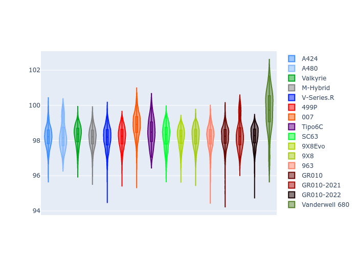
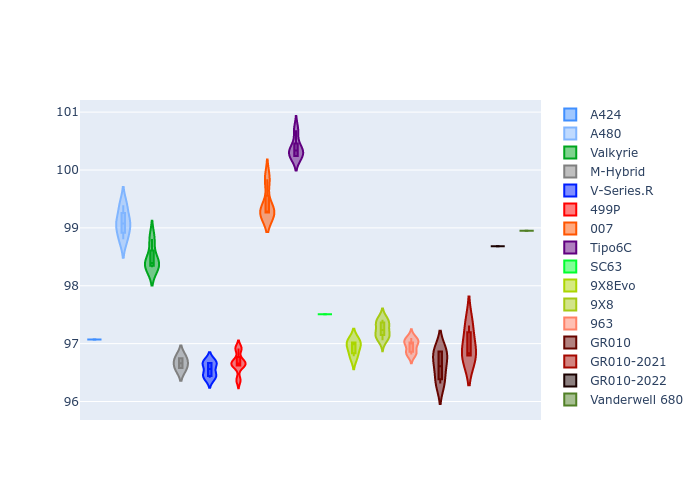
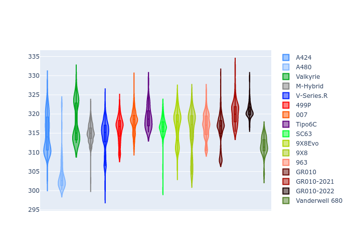
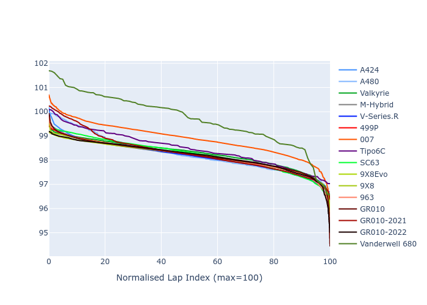

# Combined Plots

## Metadata

- BoP Accuracy: 96.07%
- Overall BoP Grade: A1
- Track: MONZA
- Threshhold: 250.0kph
- Average Laptime: 1:38.22
- Average Quali Laptime: 1:37.09
- Average Topspeed: 315.92kph

## BoP Table
| Manufacturer     | Car            | Weight   | Power   | PINC   | E/Stint   | FDS    | RDP    | QDP    | TDP    |
|:-----------------|:---------------|:---------|:--------|:-------|:----------|:-------|:-------|:-------|:-------|
| Alpine           | A424           | 1058kg   | 515.0kw | +0.70% | 911MJ     | -      | 51.64% | 59.31% | 26.80% |
| Alpine           | A480           | 990kg    | 421.0kw | +0.10% | 793MJ     | -      | 54.81% | 80.56% | 55.69% |
| Aston Martin     | Valkyrie       | 1030kg   | 520.0kw | -      | 911MJ     | -      | 53.50% | 53.33% | 21.51% |
| BMW              | M-Hybrid       | 1050kg   | 517.0kw | -      | 911MJ     | -      | 52.89% | 56.22% | 33.41% |
| Cadillac         | V-Series.R     | 1040kg   | 520.0kw | -      | 910MJ     | -      | 48.63% | 60.80% | 19.01% |
| Ferrari          | 499P           | 1065kg   | 503.0kw | +0.10% | 898MJ     | 190kph | 51.38% | 44.98% | 9.83%  |
| Glickenhaus      | 007            | 1030kg   | 520.0kw | -      | 916MJ     | -      | 46.15% | 49.30% | 41.45% |
| Isotta Fraschini | Tipo6C         | 1030kg   | 520.0kw | -      | 914MJ     | 190kph | 43.95% | 47.22% | 31.53% |
| Lamborghini      | SC63           | 1030kg   | 520.0kw | -      | 908MJ     | -      | 48.33% | 60.95% | 28.65% |
| Peugeot          | 9X8Evo         | 1051kg   | 516.0kw | -0.10% | 904MJ     | 190kph | 48.87% | 52.78% | 15.41% |
| Peugeot          | 9X8            | 1043kg   | 524.0kw | -      | 917MJ     | 150kph | 54.54% | 58.39% | 9.69%  |
| Porsche          | 963            | 1051kg   | 514.0kw | -0.10% | 906MJ     | -      | 50.70% | 44.30% | 29.51% |
| Toyota           | GR010          | 1069kg   | 501.0kw | +0.10% | 902MJ     | 190kph | 51.09% | 52.71% | 11.46% |
| Toyota           | GR010-2021     | 1046kg   | 509.0kw | -0.10% | 954MJ     | 150kph | 53.89% | 50.91% | 25.87% |
| Toyota           | GR010-2022     | 1050kg   | 503.0kw | -0.10% | 894MJ     | 190kph | 53.24% | 64.49% | 9.72%  |
| Vanwall          | Vanderwell 680 | 1030kg   | 520.0kw | -      | 913MJ     | -      | 35.83% | 59.29% | 34.15% |

## Performance Table
| Manufacturer     | Car            | RP      | QP      | Vavg      |   RDLC | BOP-Grade   | Match   |
|:-----------------|:---------------|:--------|:--------|:----------|-------:|:------------|:--------|
| Alpine           | A424           | 1:38.00 | 1:36.57 | 314.90kph |   1.01 | ~A1         | 99.85%  |
| Alpine           | A480           | 1:38.02 | 1:37.85 | 304.20kph |   1    | ~A1         | 100.00% |
| Aston Martin     | Valkyrie       | 1:38.27 | 1:36.36 | 317.94kph |   1.02 | ~A1         | 100.00% |
| BMW              | M-Hybrid       | 1:37.98 | 1:36.20 | 315.02kph |   1.02 | ~A1         | 99.97%  |
| Cadillac         | V-Series.R     | 1:37.94 | 1:36.19 | 314.17kph |   1.02 | ~A1         | 99.88%  |
| Ferrari          | 499P           | 1:38.01 | 1:36.03 | 316.08kph |   1.02 | ~A1         | 99.93%  |
| Glickenhaus      | 007            | 1:38.87 | 1:38.47 | 318.05kph |   1    | -A2         | 91.95%  |
| Isotta Fraschini | Tipo6C         | 1:38.32 | 1:38.94 | 319.09kph |   0.99 | ~A1         | 95.52%  |
| Lamborghini      | SC63           | 1:38.24 | 1:37.37 | 316.72kph |   1.01 | ~A1         | 100.00% |
| Peugeot          | 9X8Evo         | 1:38.01 | 1:36.48 | 317.01kph |   1.02 | ~A1         | 99.93%  |
| Peugeot          | 9X8            | 1:38.02 | 1:37.04 | 315.72kph |   1.01 | ~A1         | 99.92%  |
| Porsche          | 963            | 1:38.01 | 1:36.41 | 316.92kph |   1.02 | ~A1         | 99.83%  |
| Toyota           | GR010          | 1:38.19 | 1:36.18 | 315.97kph |   1.02 | ~A1         | 99.66%  |
| Toyota           | GR010-2021     | 1:38.01 | 1:36.58 | 320.28kph |   1.01 | ~A1         | 100.00% |
| Toyota           | GR010-2022     | 1:38.06 | 1:38.05 | 320.90kph |   1    | ~A1         | 99.63%  |
| Vanwall          | Vanderwell 680 | 1:39.63 | 1:38.67 | 311.81kph |   1.01 | +E2         | 50.98%  |

## Race Laptimes

## Quali Laptimes

## Topspeeds

## Laptimes Lineplot

