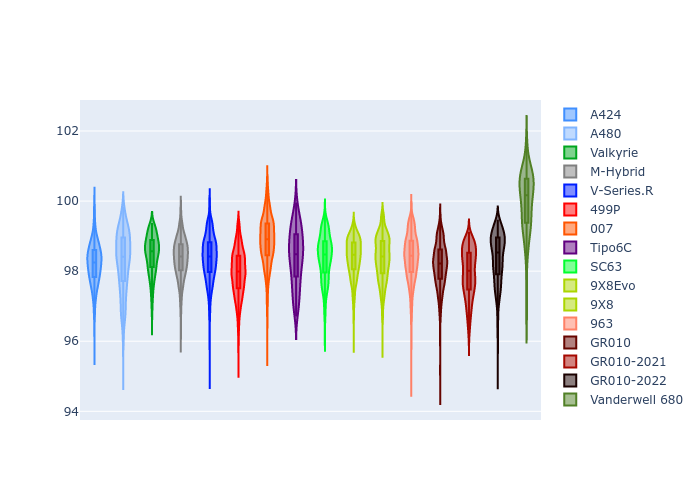

# Combined Plots

## Metadata

- BoP Accuracy: 92.43%
- Overall BoP Grade: A2
- Track: MONZA
- Threshhold: 210.0kph

## BoP Table
| Manufacturer     | Car            | Weight   | Power   | PINC   | E/Stint   | FDS    |
|:-----------------|:---------------|:---------|:--------|:-------|:----------|:-------|
| Alpine           | A424           | 1057kg   | 520.0kw | -1.00% | 912MJ     | -      |
| Alpine           | A480           | 1052kg   | 432.0kw | +1.00% | 800MJ     | -      |
| Aston Martin     | Valkyrie       | 1042kg   | 505.0kw | +0.40% | 900MJ     | -      |
| BMW              | M-Hybrid       | 1051kg   | 512.0kw | -1.00% | 905MJ     | -      |
| Cadillac         | V-Series.R     | 1044kg   | 510.0kw | +1.00% | 903MJ     | -      |
| Ferrari          | 499P           | 1073kg   | 508.0kw | -1.00% | 902MJ     | 190kph |
| Glickenhaus      | 007            | 1040kg   | 520.0kw | -      | 917MJ     | -      |
| Isotta Fraschini | Tipo6C         | 1069kg   | 520.0kw | -      | 918MJ     | 190kph |
| Lamborghini      | SC63           | 1052kg   | 519.0kw | -1.00% | 908MJ     | -      |
| Peugeot          | 9X8Evo         | 1060kg   | 510.0kw | -1.00% | 898MJ     | 190kph |
| Peugeot          | 9X8            | 1040kg   | 520.0kw | -      | 913MJ     | 150kph |
| Porsche          | 963            | 1057kg   | 516.0kw | -1.00% | 907MJ     | -      |
| Toyota           | GR010          | 1090kg   | 512.0kw | -1.00% | 912MJ     | 190kph |
| Toyota           | GR010OLD       | 1075kg   | 513.0kw | +1.00% | 963MJ     | 150kph |
| Vanwall          | Vanderwell 680 | 1030kg   | 520.0kw | -      | 913MJ     | -      |

## Performance Table
| Manufacturer     | Car            | RP      | QP      | Vavg      |   RDLC | BOP-Grade   | Match   |
|:-----------------|:---------------|:--------|:--------|:----------|-------:|:------------|:--------|
| Alpine           | A424           | 1:38.33 | 1:35.37 | 313.03kph |   1.03 | ~A1         | 99.81%  |
| Alpine           | A480           | 1:38.60 | 1:36.62 | 303.97kph |   1.02 | ~A1         | 98.55%  |
| Aston Martin     | Valkyrie       | 1:39.61 | 1:35.89 | 311.35kph |   1.04 | ~A1         | 96.08%  |
| BMW              | M-Hybrid       | 1:38.74 | 1:35.44 | 310.80kph |   1.03 | ~A1         | 99.96%  |
| Cadillac         | V-Series.R     | 1:38.87 | 1:35.65 | 309.14kph |   1.03 | ~A1         | 99.92%  |
| Ferrari          | 499P           | 1:37.93 | 1:34.61 | 311.39kph |   1.04 | ~A1         | 97.66%  |
| Glickenhaus      | 007            | 1:39.31 | 1:37.02 | 310.37kph |   1.02 | +A2         | 90.28%  |
| Isotta Fraschini | Tipo6C         | 1:39.44 | 1:38.08 | 310.18kph |   1.01 | ~A1         | 95.52%  |
| Lamborghini      | SC63           | 1:39.53 | 1:36.99 | 311.04kph |   1.03 | +A2         | 93.37%  |
| Peugeot          | 9X8Evo         | 1:38.50 | 1:35.23 | 312.47kph |   1.03 | ~A1         | 100.00% |
| Peugeot          | 9X8            | 1:38.47 | 1:35.55 | 306.44kph |   1.03 | ~A1         | 99.93%  |
| Porsche          | 963            | 1:38.59 | 1:35.37 | 311.22kph |   1.03 | ~A1         | 99.89%  |
| Toyota           | GR010          | 1:38.06 | 1:34.64 | 311.04kph |   1.04 | ~A1         | 98.52%  |
| Toyota           | GR010OLD       | 1:37.25 | 1:35.03 | 308.45kph |   1.02 | -B1         | 85.73%  |
| Vanwall          | Vanderwell 680 | 1:41.01 | 1:37.38 | 305.33kph |   1.04 | +Ω1         | 31.25%  |

## Race Laptimes

## Quali Laptimes

## Topspeeds

## Laptimes Lineplot

