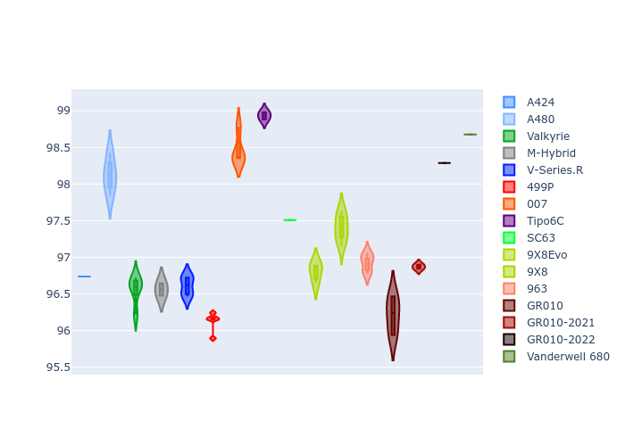
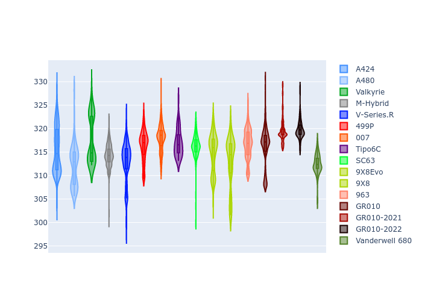

# Combined Plots

## Metadata

- BoP Accuracy: 91.74%
- Overall BoP Grade: A2
- Track: MONZA
- Threshhold: 250.0kph

## BoP Table
| Manufacturer     | Car            | Weight   | Power   | PINC   | E/Stint   | FDS    | RDP    | QDP    | TDP    |
|:-----------------|:---------------|:---------|:--------|:-------|:----------|:-------|:-------|:-------|:-------|
| Alpine           | A424           | 1057kg   | 520.0kw | -0.10% | 914MJ     | -      | 52.35% | 61.85% | 27.84% |
| Alpine           | A480           | 952kg    | 432.0kw | +0.10% | 799MJ     | -      | 54.51% | 76.19% | 54.04% |
| Aston Martin     | Valkyrie       | 1050kg   | 504.0kw | +0.10% | 899MJ     | -      | 53.59% | 53.33% | 21.51% |
| BMW              | M-Hybrid       | 1051kg   | 512.0kw | -0.10% | 907MJ     | -      | 53.26% | 57.23% | 34.54% |
| Cadillac         | V-Series.R     | 1044kg   | 510.0kw | +0.10% | 902MJ     | -      | 47.80% | 56.73% | 19.63% |
| Ferrari          | 499P           | 1073kg   | 508.0kw | -0.10% | 903MJ     | 190kph | 53.02% | 42.32% | 9.88%  |
| Glickenhaus      | 007            | 1040kg   | 520.0kw | -      | 917MJ     | -      | 46.49% | 46.07% | 47.78% |
| Isotta Fraschini | Tipo6C         | 1059kg   | 520.0kw | -      | 917MJ     | 190kph | 43.95% | 47.22% | 31.53% |
| Lamborghini      | SC63           | 1052kg   | 519.0kw | -0.10% | 909MJ     | -      | 46.33% | 59.50% | 29.33% |
| Peugeot          | 9X8Evo         | 1060kg   | 510.0kw | -0.10% | 900MJ     | 190kph | 48.47% | 51.26% | 16.02% |
| Peugeot          | 9X8            | 1040kg   | 520.0kw | -      | 913MJ     | 150kph | 54.07% | 57.08% | 10.80% |
| Porsche          | 963            | 1057kg   | 516.0kw | -0.10% | 909MJ     | -      | 50.87% | 45.25% | 30.77% |
| Toyota           | GR010          | 1090kg   | 512.0kw | -0.10% | 913MJ     | 190kph | 52.43% | 57.12% | 12.82% |
| Toyota           | GR010-2021     | 1075kg   | 513.0kw | +0.10% | 961MJ     | 150kph | 54.09% | 52.67% | 26.37% |
| Toyota           | GR010-2022     | 1090kg   | 512.0kw | +0.10% | 906MJ     | 190kph | 53.48% | 69.44% | 7.86%  |
| Vanwall          | Vanderwell 680 | 1030kg   | 520.0kw | -      | 913MJ     | -      | 53.41% | 56.28% | 29.85% |

## Performance Table
| Manufacturer     | Car            | RP      | QP      | Vavg      |   RDLC | BOP-Grade   | Match   |
|:-----------------|:---------------|:--------|:--------|:----------|-------:|:------------|:--------|
| Alpine           | A424           | 1:38.48 | 1:35.38 | 313.49kph |   1.03 | ~A1         | 99.33%  |
| Alpine           | A480           | 1:37.47 | 1:35.30 | 305.12kph |   1.02 | -C1         | 76.59%  |
| Aston Martin     | Valkyrie       | 1:39.94 | 1:36.19 | 310.05kph |   1.04 | +A2         | 94.04%  |
| BMW              | M-Hybrid       | 1:38.85 | 1:35.39 | 311.42kph |   1.04 | ~A1         | 100.00% |
| Cadillac         | V-Series.R     | 1:39.07 | 1:35.62 | 308.24kph |   1.04 | ~A1         | 99.83%  |
| Ferrari          | 499P           | 1:38.41 | 1:34.54 | 311.99kph |   1.04 | ~A1         | 98.29%  |
| Glickenhaus      | 007            | 1:39.36 | 1:37.06 | 310.37kph |   1.02 | +A2         | 91.44%  |
| Isotta Fraschini | Tipo6C         | 1:39.95 | 1:38.67 | 311.24kph |   1.01 | +B2         | 81.34%  |
| Lamborghini      | SC63           | 1:39.65 | 1:37.05 | 311.71kph |   1.03 | +A2         | 94.69%  |
| Peugeot          | 9X8Evo         | 1:39.16 | 1:35.84 | 313.14kph |   1.03 | ~A1         | 98.79%  |
| Peugeot          | 9X8            | 1:38.59 | 1:35.35 | 304.97kph |   1.03 | ~A1         | 99.30%  |
| Porsche          | 963            | 1:38.72 | 1:35.33 | 312.27kph |   1.04 | ~A1         | 99.77%  |
| Toyota           | GR010          | 1:38.43 | 1:34.46 | 312.16kph |   1.04 | ~A1         | 99.10%  |
| Toyota           | GR010-2021     | 1:38.52 | 1:35.46 | 304.25kph |   1.03 | ~A1         | 99.71%  |
| Toyota           | GR010-2022     | 1:38.49 | 1:36.15 | 309.98kph |   1.02 | ~A1         | 99.85%  |
| Vanwall          | Vanderwell 680 | 1:40.97 | 1:37.38 | 305.33kph |   1.04 | +Ω1         | 35.71%  |

## Race Laptimes

## Quali Laptimes

## Topspeeds

## Laptimes Lineplot

