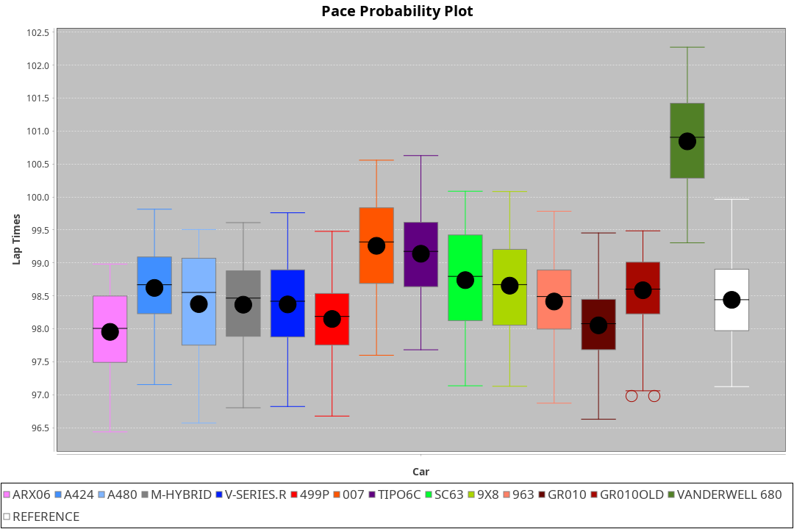
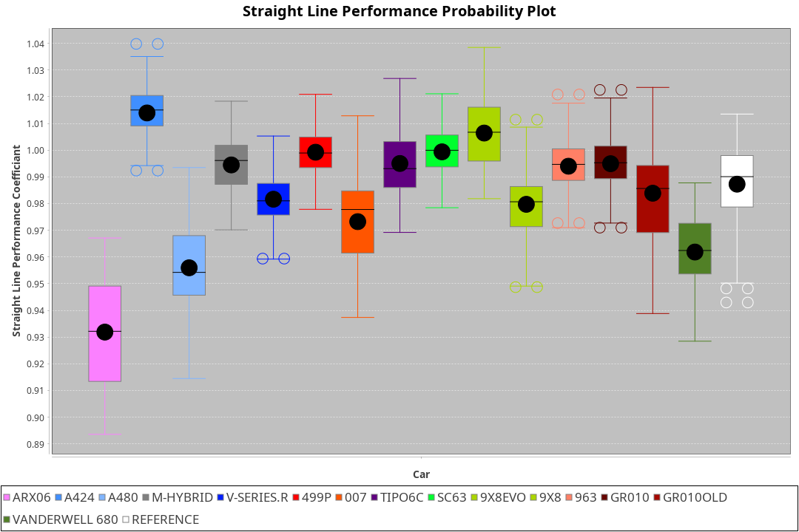
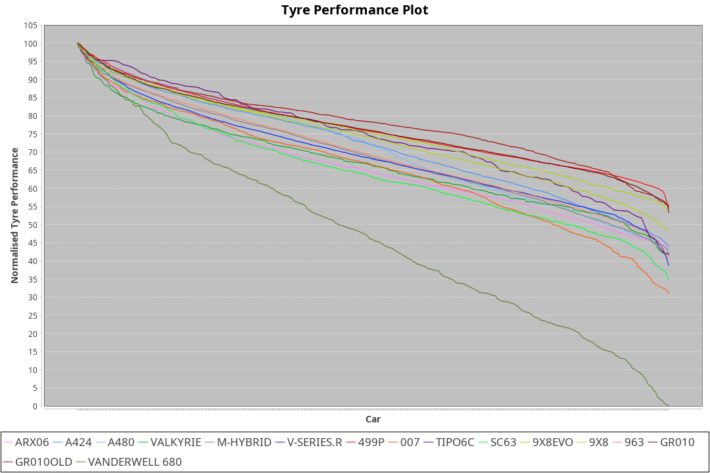

| Manufacturer     | Car            | Weight | Power   | PINC    | E/Stint | FDS     |
|:-|:-|:-|:-|:-|:-|:-|
| Acura            | ARX06          | 1070kg | 512.0kw |    -    | 912MJ   |    -    |
| Alpine           | A424           | 1054kg | 517.0kw | -1.00%  | 910MJ   |    -    |
| Alpine           | A480           | 952kg  | 429.0kw | 1.00%   | 765MJ   |    -    |
| BMW              | M-Hybrid       | 1046kg | 509.0kw | -1.00%  | 901MJ   |    -    |
| Cadillac         | V-Series.R     | 1044kg | 507.0kw | 1.00%   | 898MJ   |    -    |
| Ferrari          | 499P           | 1073kg | 505.0kw | 1.00%   | 895MJ   | 190kph  |
| Glickenhaus      | 007            | 1030kg | 515.0kw |    -    | 905MJ   |    -    |
| Isotta Fraschini | Tipo6C         | 1049kg | 520.0kw |    -    | 918MJ   | 190kph  |
| Lamborghini      | SC63           | 1036kg | 508.0kw |    -    | 898MJ   |    -    |
| Peugeot          | 9X8Evo         | 1060kg | 507.0kw | -1.00%  | 896MJ   | 190kph  |
| Peugeot          | 9X8            | 1031kg | 516.0kw |    -    | 901MJ   | 150kph  |
| Porsche          | 963            | 1057kg | 513.0kw | 1.00%   | 902MJ   |    -    |
| Toyota           | GR010          | 1090kg | 509.0kw | 1.00%   | 904MJ   | 190kph  |
| Toyota           | GR010OLD       | 1073kg | 510.0kw | 1.00%   | 905MJ   | 190kph  |
| Vanwall          | Vanderwell 680 | 1030kg | 520.0kw |    -    | 903MJ   |    -    |

### BoP Accuracy: 80.52%; Overall BoP Grade: B2
| Manufacturer     | Car            | Type  | RP      | QP      | Weight | Power¹  | Threshhold | PINC    | Power²   | E/Stint | AVG Vmax  | FDS     | RDLC | L/Stint | BOP-Grade | Model Accuracy | Model Points | Match%  | SimDiff |
|:-|:-|:-|:-|:-|:-|:-|:-|:-|:-|:-|:-|:-|:-|:-|:-|:-|:-|:-|:-|
| Acura            | ARX06          | LMDH  | 1:39.27 | 1:35.28 | 1070kg | 512.0kw | 210.0kph   |    -    | 512.00kw |  912MJ  | 298.81kph |    -    | 1.00 | 29      | -B2       | 100.00%        | 995          | 84.91%  | #       |
| Alpine           | A424           | LMDH  | 1:39.25 | 1:36.41 | 1054kg | 517.0kw | 210.0kph   | -1.00%  | 511.80kw |  910MJ  | 311.96kph |    -    | 0.99 | 29      | -A2       | 100.00%        | 635          | 93.87%  | #       |
| Alpine           | A480           | LMP1  | 1:38.96 | 1:36.38 |  952kg | 429.0kw | 210.0kph   | 1.00%   | 433.30kw |  765MJ  | 300.73kph |    -    | 0.97 | 27      | -B2       | 94.90%         | 707          | 82.27%  | #       |
| BMW              | M-Hybrid       | LMDH  | 1:39.27 | 1:35.80 | 1046kg | 509.0kw | 210.0kph   | -1.00%  | 503.90kw |  901MJ  | 308.95kph |    -    | 1.01 | 29      | -A2       | 100.00%        | 1696         | 94.18%  | #       |
| Cadillac         | V-Series.R     | LMDH  | 1:38.93 | 1:35.66 | 1044kg | 507.0kw | 210.0kph   | 1.00%   | 512.10kw |  898MJ  | 306.11kph |    -    | 1.01 | 29      | -B2       | 88.64%         | 2076         | 83.17%  | #       |
| Ferrari          | 499P           | LMHHU | 1:38.99 | 1:35.53 | 1073kg | 505.0kw | 210.0kph   | 1.00%   | 510.10kw |  895MJ  | 308.67kph | 190kph  | 1.02 | 29      | -B1       | 91.94%         | 2476         | 85.41%  | #       |
| Glickenhaus      | 007            | LMHNH | 1:39.26 | 1:36.62 | 1030kg | 515.0kw | 210.0kph   |    -    | 515.00kw |  905MJ  | 307.72kph |    -    | 0.96 | 29      | ~A1       | 95.63%         | 1510         | 98.31%  | #       |
| Isotta Fraschini | Tipo6C         | LMHHU | 1:39.35 | 1:37.93 | 1049kg | 520.0kw | 210.0kph   |    -    | 520.00kw |  918MJ  | 311.21kph | 190kph  | 1.05 | 29      | +Ω1       | 100.00%        | 66           | 47.01%  | #       |
| Lamborghini      | SC63           | LMDH  | 1:39.27 | 1:37.60 | 1036kg | 508.0kw | 210.0kph   |    -    | 508.00kw |  898MJ  | 310.25kph |    -    | 1.05 | 29      | -A2       | 100.00%        | 504          | 92.72%  | #       |
| Peugeot          | 9X8Evo         | LMHHU | 1:39.17 | 1:36.78 | 1060kg | 507.0kw | 210.0kph   | -1.00%  | 501.90kw |  896MJ  | 310.13kph | 190kph  | 0.99 | 29      | +B2       | 100.00%        | 249          | 81.55%  | #       |
| Peugeot          | 9X8            | LMHHE | 1:39.27 | 1:36.14 | 1031kg | 516.0kw | 210.0kph   |    -    | 516.00kw |  901MJ  | 307.76kph | 150kph  | 1.03 | 29      | ~A1       | 98.33%         | 2173         | 97.40%  | ±1.41s  |
| Porsche          | 963            | LMDH  | 1:39.22 | 1:35.48 | 1057kg | 513.0kw | 210.0kph   | 1.00%   | 518.10kw |  902MJ  | 308.85kph |    -    | 1.00 | 29      | ~A1       | 90.40%         | 5633         | 99.26%  | #       |
| Toyota           | GR010          | LMHHU | 1:39.21 | 1:35.87 | 1090kg | 509.0kw | 210.0kph   | 1.00%   | 514.10kw |  904MJ  | 306.63kph | 190kph  | 1.00 | 29      | ~A1       | 90.11%         | 3235         | 98.79%  | #       |
| Toyota           | GR010OLD       | LMHHE | 1:39.26 | 1:35.68 | 1073kg | 510.0kw | 210.0kph   | 1.00%   | 515.10kw |  905MJ  | 304.92kph | 190kph  | 1.02 | 29      | ~A1       | 99.03%         | 1536         | 96.62%  | #       |
| Vanwall          | Vanderwell 680 | LMHNH | 1:42.03 | 1:37.98 | 1030kg | 520.0kw | 210.0kph   |    -    | 520.00kw |  903MJ  | 299.70kph |    -    | 1.02 | 29      | +Ω2       | 97.68%         | 632          | -27.64% | #       |

## Power below Threshhold
| N/Nmax    | ARX06   | A424    | M-HYBRID | V-SERIES.R | 499P    | 007     | TIPO6C  | SC63    | 9X8EVO  | 9X8     | 963     | GR010   | GR010OLD | VANDERWELL 680 | ​     | RPM      | A480       |
|:-|:-|:-|:-|:-|:-|:-|:-|:-|:-|:-|:-|:-|:-|:-|:-|:-|:-|
|  0.550    |  252    |  255    |  251     |  250       |  249    |  254    |  256    |  250    |  250    |  254    |  253    |  251    |  251     |  256           |  ​    |   --     |  0.00      |
|  0.575    |  275    |  278    |  274     |  273       |  272    |  277    |  279    |  273    |  273    |  277    |  276    |  274    |  274     |  279           |  ​    |   --     |  0.00      |
|  0.600    |  296    |  298    |  294     |  293       |  292    |  297    |  300    |  293    |  293    |  298    |  296    |  294    |  295     |  300           |  ​    |   --     |  0.00      |
|  0.625    |  317    |  320    |  315     |  314       |  312    |  319    |  322    |  314    |  314    |  319    |  317    |  315    |  316     |  322           |  ​    |   --     |  0.00      |
|  0.650    |  338    |  341    |  336     |  335       |  333    |  340    |  343    |  335    |  335    |  340    |  338    |  336    |  337     |  343           |  ​    |   --     |  0.00      |
|  0.675    |  359    |  363    |  357     |  356       |  355    |  362    |  365    |  357    |  356    |  362    |  360    |  357    |  358     |  365           |  ​    |   --     |  0.00      |
|  0.700    |  381    |  385    |  379     |  377       |  376    |  383    |  387    |  378    |  377    |  384    |  382    |  379    |  380     |  387           |  ​    |   --     |  0.00      |
|  0.725    |  403    |  407    |  400     |  399       |  397    |  405    |  409    |  399    |  399    |  406    |  403    |  400    |  401     |  409           |  ​    |   --     |  0.00      |
|  0.750    |  423    |  427    |  421     |  419       |  417    |  426    |  430    |  420    |  419    |  427    |  424    |  421    |  422     |  430           |  ​    |   --     |  0.00      |
|  0.775    |  442    |  446    |  440     |  438       |  436    |  445    |  449    |  439    |  438    |  446    |  443    |  440    |  441     |  449           |  ​    |  5000    |  253.19    |
|  0.800    |  460    |  464    |  457     |  455       |  454    |  463    |  467    |  456    |  455    |  463    |  461    |  457    |  458     |  467           |  ​    |  5500    |  298.23    |
|  0.825    |  475    |  479    |  472     |  470       |  469    |  478    |  482    |  471    |  470    |  478    |  476    |  472    |  473     |  482           |  ​    |  6000    |  333.26    |
|  0.850    |  486    |  491    |  484     |  482       |  480    |  489    |  494    |  483    |  482    |  490    |  487    |  484    |  485     |  494           |  ​    |  6500    |  377.29    |
|  0.875    |  497    |  502    |  494     |  492       |  490    |  500    |  505    |  493    |  492    |  501    |  498    |  494    |  495     |  505           |  ​    |  7000    |  421.32    |
|  0.900    |  504    |  509    |  501     |  499       |  497    |  507    |  512    |  500    |  499    |  508    |  505    |  501    |  502     |  512           |  ​    |  7500    |  431.33    |
|  0.925    |  509    |  514    |  506     |  504       |  502    |  512    |  517    |  505    |  504    |  513    |  510    |  506    |  507     |  517           |  ​    |  8000    |  427.33    |
| **0.950** | **512** | **517** | **509**  | **507**    | **505** | **515** | **520** | **508** | **507** | **516** | **513** | **509** | **510**  | **520**        | **​** | **8500** | **430.33** |
|  0.975    |  510    |  515    |  507     |  505       |  503    |  513    |  518    |  506    |  505    |  514    |  511    |  507    |  508     |  518           |  ​    |  9000    |  215.17    |
|  1.000    |  506    |  511    |  504     |  502       |  500    |  509    |  514    |  503    |  502    |  510    |  507    |  504    |  505     |  514           |  ​    |   --     |  0.00      |
|  1.025    |  437    |  441    |  435     |  433       |  431    |  440    |  444    |  434    |  433    |  441    |  438    |  435    |  436     |  444           |  ​    |   --     |  0.00      |

## Power above Threshhold
| N/Nmax    | ARX06   | A424       | M-HYBRID   | V-SERIES.R | 499P       | 007     | TIPO6C  | SC63    | 9X8EVO     | 9X8     | 963        | GR010      | GR010OLD   | VANDERWELL 680 | ​     | RPM      | A480       |
|:-|:-|:-|:-|:-|:-|:-|:-|:-|:-|:-|:-|:-|:-|:-|:-|:-|:-|
|  0.550    |  252    |  252.41    |  248.45    |  252.03    |  251.02    |  254    |  256    |  250    |  247.46    |  254    |  255.06    |  253.04    |  254.05    |  256           |  ​    |   --     |  0.00      |
|  0.575    |  275    |  275.45    |  271.49    |  275.04    |  274.03    |  277    |  279    |  273    |  270.50    |  277    |  278.07    |  276.05    |  277.05    |  279           |  ​    |   --     |  0.00      |
|  0.600    |  296    |  295.48    |  291.53    |  296.04    |  295.03    |  297    |  300    |  293    |  290.54    |  298    |  299.08    |  297.05    |  297.06    |  300           |  ​    |   --     |  0.00      |
|  0.625    |  317    |  316.51    |  311.56    |  317.04    |  316.03    |  319    |  322    |  314    |  310.58    |  319    |  321.08    |  318.06    |  319.06    |  322           |  ​    |   --     |  0.00      |
|  0.650    |  338    |  337.55    |  332.60    |  338.05    |  337.03    |  340    |  343    |  335    |  331.61    |  340    |  342.09    |  339.06    |  340.07    |  343           |  ​    |   --     |  0.00      |
|  0.675    |  359    |  359.58    |  353.64    |  359.05    |  358.04    |  362    |  365    |  357    |  352.65    |  362    |  364.09    |  361.06    |  362.07    |  365           |  ​    |   --     |  0.00      |
|  0.700    |  381    |  380.62    |  374.68    |  381.05    |  380.04    |  383    |  387    |  378    |  373.69    |  384    |  386.10    |  383.07    |  383.07    |  387           |  ​    |   --     |  0.00      |
|  0.725    |  403    |  402.65    |  395.71    |  403.06    |  401.04    |  405    |  409    |  399    |  394.73    |  406    |  407.10    |  404.07    |  405.08    |  409           |  ​    |   --     |  0.00      |
|  0.750    |  423    |  422.69    |  416.75    |  423.06    |  422.04    |  426    |  430    |  420    |  414.77    |  427    |  428.11    |  425.07    |  426.08    |  430           |  ​    |   --     |  0.00      |
|  0.775    |  442    |  441.72    |  435.79    |  442.06    |  441.04    |  445    |  449    |  439    |  433.80    |  446    |  447.11    |  444.08    |  445.09    |  449           |  ​    |  5000    |  253.19    |
|  0.800    |  460    |  459.75    |  452.82    |  460.06    |  458.04    |  463    |  467    |  456    |  450.84    |  463    |  465.12    |  462.08    |  463.09    |  467           |  ​    |  5500    |  298.23    |
|  0.825    |  475    |  474.77    |  467.84    |  475.06    |  473.05    |  478    |  482    |  471    |  465.86    |  478    |  480.12    |  477.08    |  478.09    |  482           |  ​    |  6000    |  333.26    |
|  0.850    |  486    |  485.79    |  478.86    |  486.07    |  485.05    |  489    |  494    |  483    |  476.88    |  490    |  492.12    |  488.09    |  489.09    |  494           |  ​    |  6500    |  377.29    |
|  0.875    |  497    |  496.81    |  488.88    |  497.07    |  495.05    |  500    |  505    |  493    |  486.90    |  501    |  503.13    |  499.09    |  500.10    |  505           |  ​    |  7000    |  421.32    |
|  0.900    |  504    |  503.82    |  495.90    |  504.07    |  502.05    |  507    |  512    |  500    |  493.92    |  508    |  510.13    |  506.09    |  507.10    |  512           |  ​    |  7500    |  431.33    |
|  0.925    |  509    |  508.83    |  500.90    |  509.07    |  507.05    |  512    |  517    |  505    |  498.92    |  513    |  515.13    |  511.09    |  512.10    |  517           |  ​    |  8000    |  427.33    |
| **0.950** | **512** | **511.83** | **503.91** | **512.07** | **510.05** | **515** | **520** | **508** | **501.93** | **516** | **518.13** | **514.09** | **515.10** | **520**        | **​** | **8500** | **430.33** |
|  0.975    |  510    |  509.83    |  501.91    |  510.07    |  508.05    |  513    |  518    |  506    |  499.93    |  514    |  516.13    |  512.09    |  513.10    |  518           |  ​    |  9000    |  215.17    |
|  1.000    |  506    |  505.82    |  498.90    |  506.07    |  505.05    |  509    |  514    |  503    |  496.92    |  510    |  512.13    |  508.09    |  509.10    |  514           |  ​    |   --     |  0.00      |
|  1.025    |  437    |  436.71    |  430.78    |  437.06    |  436.04    |  440    |  444    |  434    |  428.79    |  441    |  442.11    |  439.08    |  440.09    |  444           |  ​    |   --     |  0.00      |
