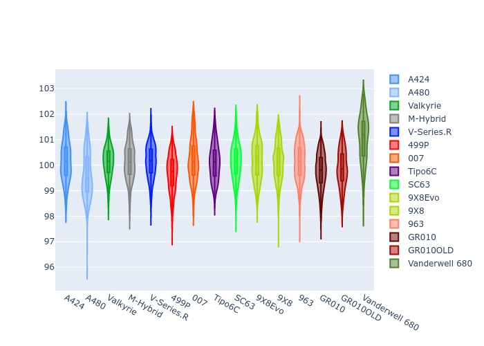
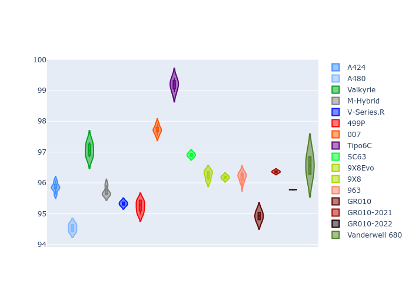
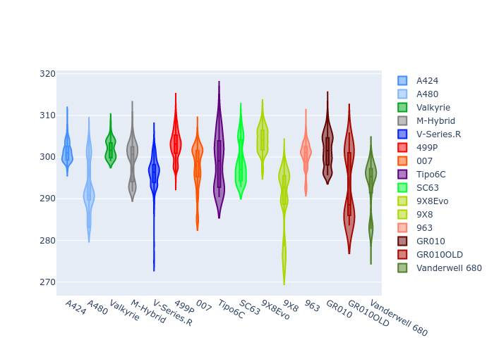
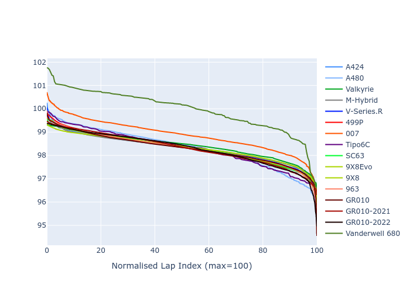

# Combined Plots

## Metadata

- BoP Accuracy: 98.23%
- Overall BoP Grade: A1
- Track: MONZA
- Threshhold: 210.0kph

## BoP Table
| Manufacturer     | Car            | Weight   | Power   | PINC   | E/Stint   | FDS    |
|:-----------------|:---------------|:---------|:--------|:-------|:----------|:-------|
| Alpine           | A424           | 1058kg   | 482.0kw | +1.40% | 882MJ     | -      |
| Alpine           | A480           | 1052kg   | 410.0kw | +6.00% | 786MJ     | -      |
| Aston Martin     | Valkyrie       | 1030kg   | 498.0kw | -3.60% | 886MJ     | -      |
| BMW              | M-Hybrid       | 1060kg   | 482.0kw | +3.20% | 885MJ     | -      |
| Cadillac         | V-Series.R     | 1092kg   | 497.0kw | +4.10% | 901MJ     | -      |
| Ferrari          | 499P           | 1100kg   | 480.0kw | +1.90% | 883MJ     | 200kph |
| Glickenhaus      | 007            | 1055kg   | 515.0kw | -3.30% | 909MJ     | -      |
| Isotta Fraschini | Tipo6C         | 1100kg   | 520.0kw | -0.40% | 921MJ     | 200kph |
| Lamborghini      | SC63           | 1073kg   | 518.0kw | -2.80% | 906MJ     | -      |
| Peugeot          | 9X8Evo         | 1068kg   | 480.0kw | -      | 874MJ     | 190kph |
| Peugeot          | 9X8            | 1090kg   | 498.0kw | +4.40% | 906MJ     | 150kph |
| Porsche          | 963            | 1067kg   | 485.0kw | +2.00% | 885MJ     | -      |
| Toyota           | GR010          | 1100kg   | 480.0kw | +1.40% | 888MJ     | 200kph |
| Toyota           | GR010OLD       | 1100kg   | 480.0kw | +0.20% | 933MJ     | 200kph |
| Vanwall          | Vanderwell 680 | 1030kg   | 520.0kw | -      | 913MJ     | -      |

## Performance Table
| Manufacturer     | Car            | RP      | QP      | Vavg      |   RDLC | BOP-Grade   | Match   |
|:-----------------|:---------------|:--------|:--------|:----------|-------:|:------------|:--------|
| Alpine           | A424           | 1:40.13 | 1:37.06 | 306.20kph |   1.03 | ~A1         | 99.31%  |
| Alpine           | A480           | 1:39.52 | 1:37.50 | 301.79kph |   1.02 | ~A1         | 99.44%  |
| Aston Martin     | Valkyrie       | 1:40.13 | 1:36.37 | 308.07kph |   1.04 | ~A1         | 100.00% |
| BMW              | M-Hybrid       | 1:40.13 | 1:36.74 | 306.19kph |   1.04 | ~A1         | 100.00% |
| Cadillac         | V-Series.R     | 1:40.14 | 1:36.83 | 303.54kph |   1.03 | ~A1         | 99.87%  |
| Ferrari          | 499P           | 1:39.68 | 1:36.25 | 304.44kph |   1.04 | ~A1         | 99.53%  |
| Glickenhaus      | 007            | 1:40.12 | 1:37.79 | 305.23kph |   1.02 | ~A1         | 96.90%  |
| Isotta Fraschini | Tipo6C         | 1:40.11 | 1:38.72 | 306.69kph |   1.01 | ~A1         | 100.00% |
| Lamborghini      | SC63           | 1:40.12 | 1:37.55 | 307.25kph |   1.03 | ~A1         | 99.52%  |
| Peugeot          | 9X8Evo         | 1:40.13 | 1:36.76 | 305.59kph |   1.03 | ~A1         | 98.41%  |
| Peugeot          | 9X8            | 1:40.12 | 1:37.11 | 299.70kph |   1.03 | ~A1         | 99.96%  |
| Porsche          | 963            | 1:40.13 | 1:36.80 | 305.46kph |   1.03 | ~A1         | 99.89%  |
| Toyota           | GR010          | 1:39.76 | 1:36.23 | 304.60kph |   1.04 | ~A1         | 99.87%  |
| Toyota           | GR010OLD       | 1:39.88 | 1:37.54 | 298.03kph |   1.02 | ~A1         | 100.00% |
| Vanwall          | Vanderwell 680 | 1:41.01 | 1:37.38 | 305.33kph |   1.04 | +B2         | 80.80%  |

## Race Laptimes

## Quali Laptimes

## Topspeeds

## Laptimes Lineplot

