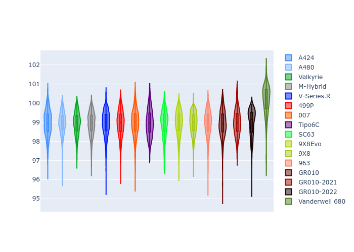
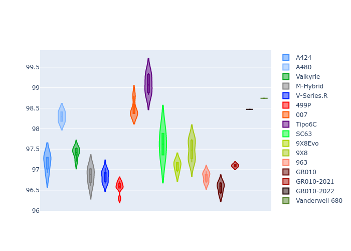
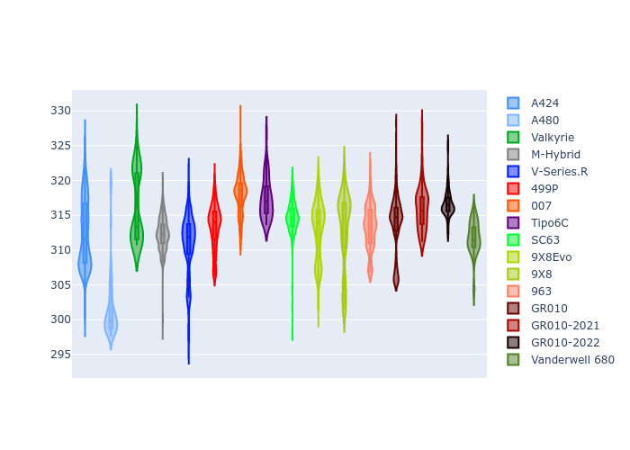
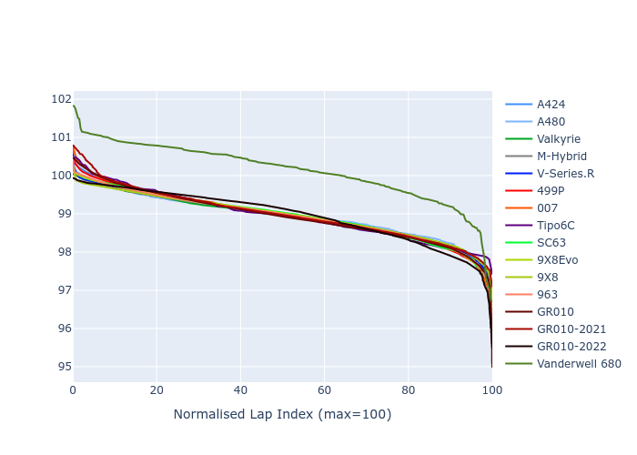

# Combined Plots

## Metadata

- BoP Accuracy: 97.40%
- Overall BoP Grade: A1
- Track: MONZA
- Threshhold: 250.0kph
- Average Laptime: 1:38.70
- Average Quali Laptime: 1:37.55
- Average Topspeed: 313.40kph

## BoP Table
| Manufacturer     | Car            | Weight   | Power   | PINC   | E/Stint   | FDS    | RDP    | QDP    | TDP    |
|:-----------------|:---------------|:---------|:--------|:-------|:----------|:-------|:-------|:-------|:-------|
| Alpine           | A424           | 1079kg   | 508.0kw | +2.30% | 911MJ     | -      | 51.64% | 59.31% | 26.80% |
| Alpine           | A480           | 988kg    | 410.0kw | +0.10% | 782MJ     | -      | 54.81% | 80.56% | 55.69% |
| Aston Martin     | Valkyrie       | 1046kg   | 520.0kw | -      | 913MJ     | -      | 53.50% | 53.33% | 21.51% |
| BMW              | M-Hybrid       | 1076kg   | 512.0kw | +1.50% | 912MJ     | -      | 52.89% | 56.22% | 33.41% |
| Cadillac         | V-Series.R     | 1071kg   | 520.0kw | -      | 914MJ     | -      | 48.63% | 60.80% | 19.01% |
| Ferrari          | 499P           | 1093kg   | 499.0kw | +1.50% | 900MJ     | 190kph | 51.38% | 44.98% | 9.83%  |
| Glickenhaus      | 007            | 1030kg   | 520.0kw | -      | 916MJ     | -      | 46.15% | 49.30% | 41.45% |
| Isotta Fraschini | Tipo6C         | 1045kg   | 520.0kw | -      | 915MJ     | 190kph | 43.95% | 47.22% | 31.53% |
| Lamborghini      | SC63           | 1048kg   | 520.0kw | -      | 910MJ     | -      | 48.33% | 60.95% | 28.65% |
| Peugeot          | 9X8Evo         | 1064kg   | 518.0kw | -3.80% | 900MJ     | 190kph | 48.87% | 52.78% | 15.41% |
| Peugeot          | 9X8            | 1059kg   | 519.0kw | +0.10% | 915MJ     | 150kph | 54.54% | 58.39% | 9.69%  |
| Porsche          | 963            | 1067kg   | 514.0kw | -2.40% | 903MJ     | -      | 50.70% | 44.30% | 29.51% |
| Toyota           | GR010          | 1087kg   | 499.0kw | +0.30% | 902MJ     | 190kph | 51.09% | 52.71% | 11.46% |
| Toyota           | GR010-2021     | 1066kg   | 514.0kw | -3.90% | 953MJ     | 150kph | 53.89% | 50.91% | 25.87% |
| Toyota           | GR010-2022     | 1056kg   | 506.0kw | -5.10% | 887MJ     | 190kph | 53.24% | 64.49% | 9.72%  |
| Vanwall          | Vanderwell 680 | 1030kg   | 520.0kw | -      | 913MJ     | -      | 35.83% | 59.29% | 34.15% |

## Performance Table
| Manufacturer     | Car            | RP      | QP      | Vavg      |   RDLC | BOP-Grade   | Match   |
|:-----------------|:---------------|:--------|:--------|:----------|-------:|:------------|:--------|
| Alpine           | A424           | 1:38.62 | 1:37.16 | 312.41kph |   1.02 | ~A1         | 99.36%  |
| Alpine           | A480           | 1:38.62 | 1:38.44 | 301.52kph |   1    | ~A1         | 97.50%  |
| Aston Martin     | Valkyrie       | 1:38.62 | 1:36.70 | 316.17kph |   1.02 | ~A1         | 100.00% |
| BMW              | M-Hybrid       | 1:38.62 | 1:36.81 | 312.36kph |   1.02 | ~A1         | 100.00% |
| Cadillac         | V-Series.R     | 1:38.62 | 1:36.84 | 310.85kph |   1.02 | ~A1         | 99.93%  |
| Ferrari          | 499P           | 1:38.62 | 1:36.61 | 313.36kph |   1.02 | ~A1         | 99.96%  |
| Glickenhaus      | 007            | 1:38.87 | 1:38.47 | 318.05kph |   1    | ~A1         | 98.40%  |
| Isotta Fraschini | Tipo6C         | 1:38.64 | 1:39.26 | 317.42kph |   0.99 | ~A1         | 96.27%  |
| Lamborghini      | SC63           | 1:38.64 | 1:37.75 | 314.73kph |   1.01 | ~A1         | 100.00% |
| Peugeot          | 9X8Evo         | 1:38.63 | 1:37.07 | 312.94kph |   1.02 | ~A1         | 100.00% |
| Peugeot          | 9X8            | 1:38.62 | 1:37.62 | 312.98kph |   1.01 | ~A1         | 99.96%  |
| Porsche          | 963            | 1:38.63 | 1:36.99 | 313.28kph |   1.02 | ~A1         | 99.91%  |
| Toyota           | GR010          | 1:38.63 | 1:36.60 | 313.77kph |   1.02 | ~A1         | 99.65%  |
| Toyota           | GR010-2021     | 1:38.63 | 1:37.17 | 316.00kph |   1.02 | ~A1         | 99.10%  |
| Toyota           | GR010-2022     | 1:38.63 | 1:38.61 | 316.67kph |   1    | ~A1         | 99.70%  |
| Vanwall          | Vanderwell 680 | 1:39.63 | 1:38.67 | 311.81kph |   1.01 | +D1         | 68.63%  |

## Race Laptimes

## Quali Laptimes

## Topspeeds

## Laptimes Lineplot

