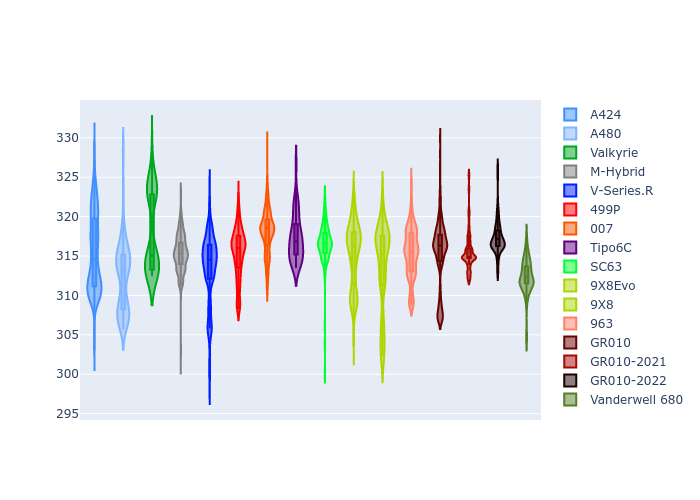

# Combined Plots

## Metadata

- BoP Accuracy: 96.82%
- Overall BoP Grade: A1
- Track: MONZA
- Threshhold: 250.0kph

## BoP Table
| Manufacturer     | Car            | Weight   | Power   | PINC   | E/Stint   | FDS    | RDP    | QDP    | TDP    |
|:-----------------|:---------------|:---------|:--------|:-------|:----------|:-------|:-------|:-------|:-------|
| Alpine           | A424           | 1071kg   | 480.0kw | +0.80% | 881MJ     | -      | 52.35% | 61.85% | 27.84% |
| Alpine           | A480           | 952kg    | 410.0kw | +0.10% | 778MJ     | -      | 54.51% | 76.19% | 54.04% |
| Aston Martin     | Valkyrie       | 1036kg   | 485.0kw | -1.00% | 878MJ     | -      | 53.59% | 53.33% | 21.51% |
| BMW              | M-Hybrid       | 1073kg   | 480.0kw | +2.10% | 884MJ     | -      | 53.26% | 57.23% | 34.54% |
| Cadillac         | V-Series.R     | 1095kg   | 485.0kw | +6.20% | 897MJ     | -      | 47.80% | 56.73% | 19.63% |
| Ferrari          | 499P           | 1100kg   | 480.0kw | +0.70% | 882MJ     | 200kph | 53.02% | 42.32% | 9.88%  |
| Glickenhaus      | 007            | 1040kg   | 481.0kw | +5.00% | 892MJ     | -      | 46.49% | 46.07% | 47.78% |
| Isotta Fraschini | Tipo6C         | 1088kg   | 520.0kw | -1.90% | 916MJ     | 190kph | 43.95% | 47.22% | 31.53% |
| Lamborghini      | SC63           | 1082kg   | 519.0kw | -4.30% | 904MJ     | -      | 46.33% | 59.50% | 29.33% |
| Peugeot          | 9X8Evo         | 1062kg   | 480.0kw | -      | 873MJ     | 190kph | 48.47% | 51.26% | 16.02% |
| Peugeot          | 9X8            | 1098kg   | 488.0kw | +6.50% | 903MJ     | 150kph | 54.07% | 57.08% | 10.80% |
| Porsche          | 963            | 1071kg   | 480.0kw | +1.20% | 880MJ     | -      | 50.87% | 45.25% | 30.77% |
| Toyota           | GR010          | 1100kg   | 480.0kw | -      | 886MJ     | 200kph | 52.43% | 57.12% | 12.82% |
| Toyota           | GR010-2021     | 1100kg   | 480.0kw | +8.30% | 949MJ     | 200kph | 54.09% | 52.67% | 26.37% |
| Toyota           | GR010-2022     | 1100kg   | 480.0kw | +2.60% | 883MJ     | 200kph | 53.48% | 69.44% | 7.86%  |
| Vanwall          | Vanderwell 680 | 1030kg   | 520.0kw | -      | 913MJ     | -      | 53.41% | 56.28% | 29.85% |

## Performance Table
| Manufacturer     | Car            | RP      | QP      | Vavg      |   RDLC | BOP-Grade   | Match   |
|:-----------------|:---------------|:--------|:--------|:----------|-------:|:------------|:--------|
| Alpine           | A424           | 1:40.83 | 1:37.58 | 303.79kph |   1.03 | ~A1         | 98.77%  |
| Alpine           | A480           | 1:38.79 | 1:36.56 | 299.40kph |   1.02 | -C2         | 70.63%  |
| Aston Martin     | Valkyrie       | 1:40.83 | 1:37.01 | 306.37kph |   1.04 | ~A1         | 100.00% |
| BMW              | M-Hybrid       | 1:40.82 | 1:37.22 | 303.67kph |   1.04 | ~A1         | 98.58%  |
| Cadillac         | V-Series.R     | 1:40.83 | 1:37.26 | 302.14kph |   1.04 | ~A1         | 99.62%  |
| Ferrari          | 499P           | 1:40.51 | 1:36.48 | 303.53kph |   1.04 | ~A1         | 99.81%  |
| Glickenhaus      | 007            | 1:40.83 | 1:38.47 | 305.61kph |   1.02 | +A2         | 94.28%  |
| Isotta Fraschini | Tipo6C         | 1:40.83 | 1:39.51 | 306.68kph |   1.01 | ~A1         | 95.52%  |
| Lamborghini      | SC63           | 1:40.83 | 1:38.16 | 305.15kph |   1.03 | ~A1         | 99.52%  |
| Peugeot          | 9X8Evo         | 1:40.83 | 1:37.39 | 306.21kph |   1.04 | ~A1         | 98.41%  |
| Peugeot          | 9X8            | 1:40.83 | 1:37.44 | 297.10kph |   1.03 | ~A1         | 99.94%  |
| Porsche          | 963            | 1:40.83 | 1:37.29 | 303.76kph |   1.04 | ~A1         | 99.37%  |
| Toyota           | GR010          | 1:40.45 | 1:36.32 | 304.01kph |   1.04 | ~A1         | 99.74%  |
| Toyota           | GR010-2021     | 1:40.48 | 1:37.30 | 300.71kph |   1.03 | ~A1         | 100.00% |
| Toyota           | GR010-2022     | 1:40.25 | 1:37.82 | 303.77kph |   1.02 | ~A1         | 100.00% |
| Vanwall          | Vanderwell 680 | 1:40.97 | 1:37.38 | 305.33kph |   1.04 | -A2         | 94.94%  |

## Race Laptimes

## Quali Laptimes

## Topspeeds

## Laptimes Lineplot

