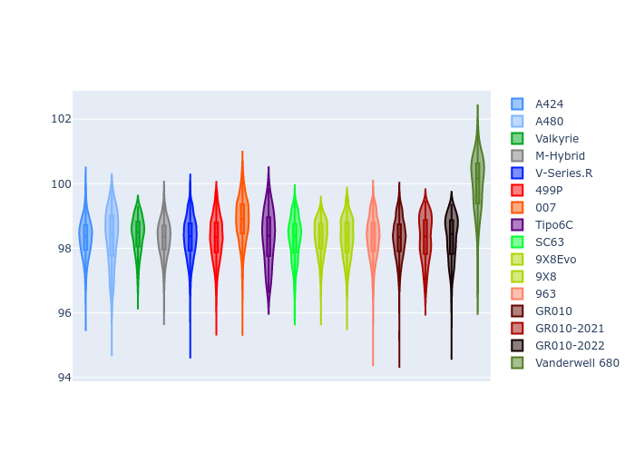
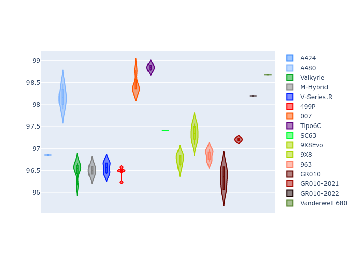

# Combined Plots

## Metadata

- BoP Accuracy: 95.83%
- Overall BoP Grade: A1
- Track: MONZA
- Threshhold: 250.0kph
- Average Laptime: 1:38.46
- Average Quali Laptime: 1:37.32
- Average Topspeed: 315.45kph

## BoP Table
| Manufacturer     | Car            | Weight   | Power   | PINC   | E/Stint   | FDS    | RDP    | QDP    | TDP    |
|:-----------------|:---------------|:---------|:--------|:-------|:----------|:-------|:-------|:-------|:-------|
| Alpine           | A424           | 1040kg   | 498.0kw | +3.70% | 900MJ     | -      | 51.64% | 59.31% | 26.80% |
| Alpine           | A480           | 932kg    | 410.0kw | +4.60% | 784MJ     | -      | 53.05% | 74.07% | 48.97% |
| Aston Martin     | Valkyrie       | 1030kg   | 520.0kw | -      | 911MJ     | -      | 53.50% | 53.33% | 21.51% |
| BMW              | M-Hybrid       | 1042kg   | 503.0kw | +3.20% | 904MJ     | -      | 52.89% | 56.22% | 33.41% |
| Cadillac         | V-Series.R     | 1046kg   | 520.0kw | -      | 911MJ     | -      | 48.63% | 60.80% | 19.01% |
| Ferrari          | 499P           | 1063kg   | 487.0kw | +3.50% | 890MJ     | 190kph | 51.38% | 44.98% | 9.83%  |
| Glickenhaus      | 007            | 1030kg   | 520.0kw | -      | 916MJ     | -      | 46.15% | 49.30% | 41.45% |
| Isotta Fraschini | Tipo6C         | 1046kg   | 520.0kw | -      | 916MJ     | 190kph | 43.95% | 47.22% | 31.53% |
| Lamborghini      | SC63           | 1030kg   | 520.0kw | -      | 908MJ     | -      | 48.33% | 60.95% | 28.65% |
| Peugeot          | 9X8Evo         | 1032kg   | 487.0kw | +3.30% | 883MJ     | 190kph | 48.87% | 52.78% | 15.41% |
| Peugeot          | 9X8            | 1053kg   | 520.0kw | -      | 915MJ     | 150kph | 54.54% | 58.39% | 9.69%  |
| Porsche          | 963            | 1037kg   | 511.0kw | -3.00% | 896MJ     | -      | 50.70% | 44.30% | 29.51% |
| Toyota           | GR010          | 1061kg   | 487.0kw | +2.30% | 893MJ     | 190kph | 51.09% | 52.71% | 11.46% |
| Toyota           | GR010-2021     | 1058kg   | 507.0kw | -5.30% | 942MJ     | 150kph | 54.08% | 54.81% | 9.72%  |
| Toyota           | GR010-2022     | 1056kg   | 514.0kw | -6.60% | 891MJ     | 190kph | 53.45% | 68.83% | 9.58%  |
| Vanwall          | Vanderwell 680 | 1030kg   | 520.0kw | -      | 913MJ     | -      | 49.68% | 60.93% | 34.43% |

## Performance Table
| Manufacturer     | Car            | RP      | QP      | Vavg      |   RDLC | BOP-Grade   | Match   |
|:-----------------|:---------------|:--------|:--------|:----------|-------:|:------------|:--------|
| Alpine           | A424           | 1:38.32 | 1:36.85 | 315.47kph |   1.02 | ~A1         | 99.36%  |
| Alpine           | A480           | 1:38.33 | 1:38.17 | 312.33kph |   1    | ~A1         | 99.73%  |
| Aston Martin     | Valkyrie       | 1:38.42 | 1:36.50 | 317.94kph |   1.02 | ~A1         | 100.00% |
| BMW              | M-Hybrid       | 1:38.32 | 1:36.50 | 315.38kph |   1.02 | ~A1         | 100.00% |
| Cadillac         | V-Series.R     | 1:38.33 | 1:36.56 | 313.52kph |   1.02 | ~A1         | 99.79%  |
| Ferrari          | 499P           | 1:38.31 | 1:36.46 | 315.38kph |   1.02 | ~A1         | 99.98%  |
| Glickenhaus      | 007            | 1:38.87 | 1:38.46 | 318.05kph |   1    | -A2         | 94.03%  |
| Isotta Fraschini | Tipo6C         | 1:38.30 | 1:38.84 | 317.31kph |   0.99 | ~A1         | 100.00% |
| Lamborghini      | SC63           | 1:38.30 | 1:37.42 | 316.72kph |   1.01 | ~A1         | 100.00% |
| Peugeot          | 9X8Evo         | 1:38.33 | 1:36.75 | 315.26kph |   1.02 | ~A1         | 100.00% |
| Peugeot          | 9X8            | 1:38.32 | 1:37.34 | 313.76kph |   1.01 | ~A1         | 100.00% |
| Porsche          | 963            | 1:38.32 | 1:36.86 | 315.36kph |   1.02 | ~A1         | 99.85%  |
| Toyota           | GR010          | 1:38.31 | 1:36.33 | 315.39kph |   1.02 | ~A1         | 99.79%  |
| Toyota           | GR010-2021     | 1:38.31 | 1:37.21 | 315.59kph |   1.01 | ~A1         | 100.00% |
| Toyota           | GR010-2022     | 1:38.31 | 1:38.20 | 317.33kph |   1    | ~A1         | 99.49%  |
| Vanwall          | Vanderwell 680 | 1:39.98 | 1:38.68 | 312.45kph |   1.01 | +Ω1         | 41.23%  |

## Race Laptimes

## Quali Laptimes

## Topspeeds

## Laptimes Lineplot

