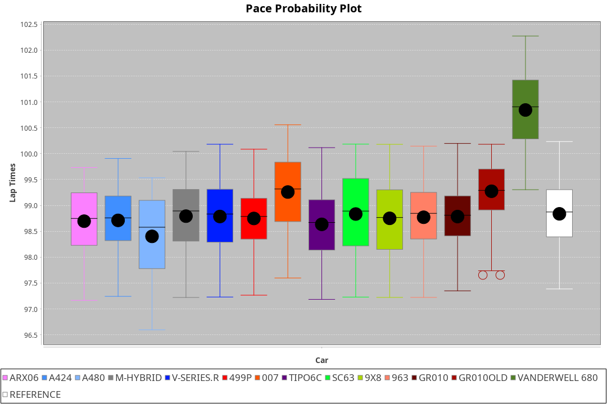
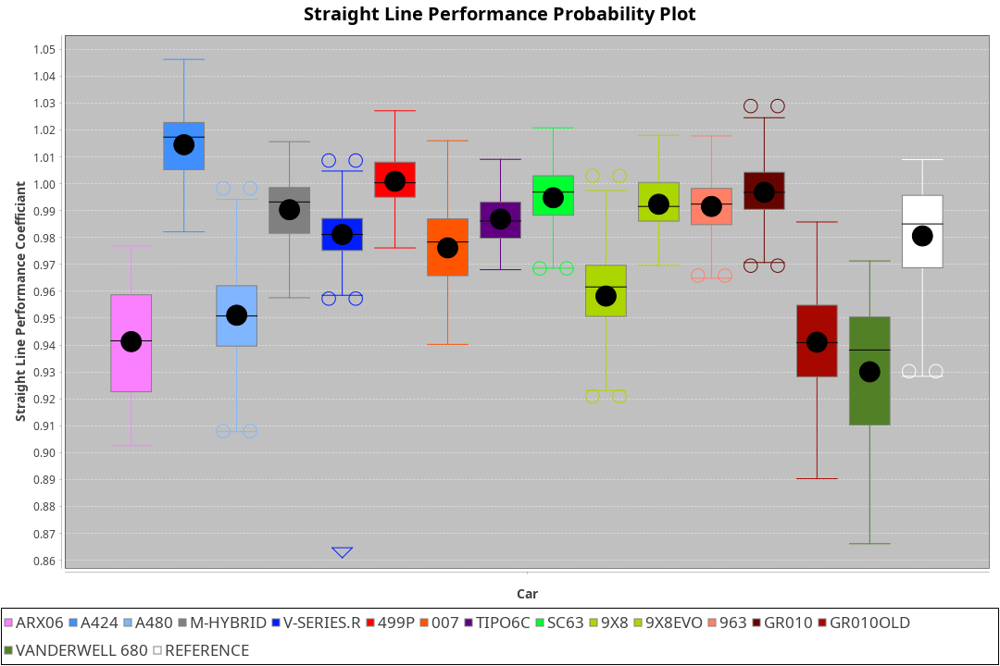
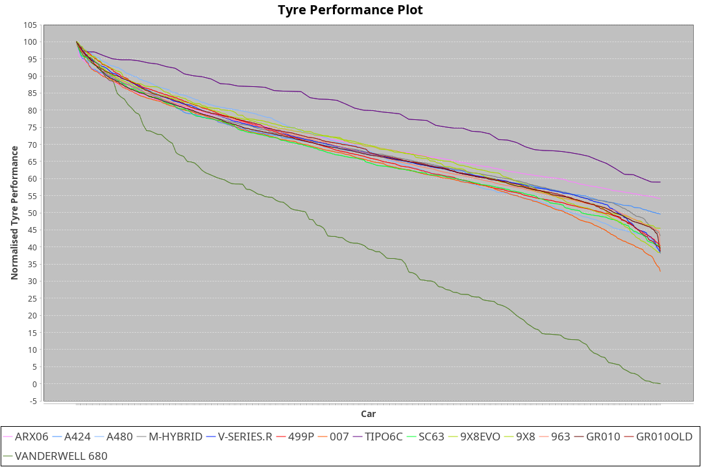

| Manufacturer     | Car            | Weight | Power   | PINC    | E/Stint | FDS     |
|:-|:-|:-|:-|:-|:-|:-|
| Acura            | ARX06          | 1090kg | 480.0kw | 7.20%   | 898MJ   |    -    |
| Alpine           | A424           | 1082kg | 485.0kw | 4.50%   | 894MJ   |    -    |
| Alpine           | A480           | 952kg  | 410.0kw | 5.30%   | 787MJ   |    -    |
| Aston Martin     | Valkyrie       | 1074kg | 497.0kw | 4.60%   | 904MJ   |    -    |
| BMW              | M-Hybrid       | 1100kg | 498.0kw | 4.40%   | 906MJ   |    -    |
| Cadillac         | V-Series.R     | 1086kg | 486.0kw | 6.50%   | 897MJ   |    -    |
| Ferrari          | 499P           | 1100kg | 480.0kw | 1.30%   | 883MJ   | 200kph  |
| Glickenhaus      | 007            | 1030kg | 500.0kw | -3.50%  | 892MJ   |    -    |
| Isotta Fraschini | Tipo6C         | 1100kg | 517.0kw | 0.50%   | 920MJ   | 200kph  |
| Lamborghini      | SC63           | 1100kg | 520.0kw |    -    | 915MJ   |    -    |
| Peugeot          | 9X8Evo         | 1088kg | 480.0kw |    -    | 876MJ   | 190kph  |
| Peugeot          | 9X8            | 1100kg | 493.0kw | 5.40%   | 906MJ   | 150kph  |
| Porsche          | 963            | 1100kg | 491.0kw | 5.90%   | 902MJ   |    -    |
| Toyota           | GR010          | 1100kg | 480.0kw | 3.70%   | 892MJ   | 200kph  |
| Toyota           | GR010OLD       | 1100kg | 480.0kw | 0.20%   | 933MJ   | 200kph  |
| Vanwall          | Vanderwell 680 | 1030kg | 520.0kw |    -    | 913MJ   |    -    |

### BoP Accuracy: 83.40%; Overall BoP Grade: B2
| Manufacturer     | Car            | Type  | RP      | QP      | Weight | Power¹  | Threshhold | PINC    | Power²   | E/Stint | AVG Vmax  | FDS     | RDLC | L/Stint | BOP-Grade | Model Accuracy | Model Points | Match%  | SimDiff |
|:-|:-|:-|:-|:-|:-|:-|:-|:-|:-|:-|:-|:-|:-|:-|:-|:-|:-|:-|:-|
| Acura            | ARX06          | LMDH  | 1:40.48 | 1:36.81 | 1090kg | 480.0kw | 250.0kph   | 7.20%   | 514.60kw |  898MJ  | 295.24kph |    -    | 0.99 | 29      | +B1       | 100.00%        | 996          | 89.34%  | #       |
| Alpine           | A424           | LMDH  | 1:40.47 | 1:36.98 | 1082kg | 485.0kw | 250.0kph   | 4.50%   | 506.80kw |  894MJ  | 295.79kph |    -    | 0.98 | 29      | +A2       | 99.58%         | 1429         | 90.06%  | #       |
| Alpine           | A480           | LMP1  | 1:39.45 | 1:37.23 |  952kg | 410.0kw | 250.0kph   | 5.30%   | 431.70kw |  787MJ  | 295.63kph |    -    | 0.98 | 27      | -E1       | 94.94%         | 1689         | 59.62%  | +0.29   |
| Aston Martin     | Valkyrie       | LMHNH | 1:40.47 | 1:36.90 | 1074kg | 497.0kw | 250.0kph   | 4.60%   | 519.90kw |  904MJ  | 285.24kph |    -    | 1.02 | 29      | +C2       | 100.00%        | 247          | 73.15%  | #       |
| BMW              | M-Hybrid       | LMDH  | 1:40.44 | 1:36.84 | 1100kg | 498.0kw | 250.0kph   | 4.40%   | 519.90kw |  906MJ  | 291.68kph |    -    | 0.99 | 29      | ~A1       | 99.97%         | 2912         | 99.98%  | #       |
| Cadillac         | V-Series.R     | LMDH  | 1:40.47 | 1:37.03 | 1086kg | 486.0kw | 250.0kph   | 6.50%   | 517.60kw |  897MJ  | 295.72kph |    -    | 0.99 | 29      | +B1       | 99.49%         | 5225         | 85.73%  | #       |
| Ferrari          | 499P           | LMHHU | 1:39.82 | 1:36.13 | 1100kg | 480.0kw | 250.0kph   | 1.30%   | 486.20kw |  883MJ  | 296.18kph | 200kph  | 1.00 | 29      | -C2       | 100.00%        | 5378         | 74.13%  | #       |
| Glickenhaus      | 007            | LMHNH | 1:40.47 | 1:37.93 | 1030kg | 500.0kw | 250.0kph   | -3.50%  | 482.50kw |  892MJ  | 298.94kph |    -    | 0.97 | 29      | +B1       | 93.90%         | 2170         | 87.19%  | +0.17   |
| Isotta Fraschini | Tipo6C         | LMHHU | 1:40.08 | 1:38.28 | 1100kg | 517.0kw | 250.0kph   | 0.50%   | 519.60kw |  920MJ  | 292.41kph | 200kph  | 1.03 | 29      | +B2       | 100.00%        | 132          | 84.55%  | #       |
| Lamborghini      | SC63           | LMDH  | 1:40.44 | 1:37.83 | 1100kg | 520.0kw | 250.0kph   |    -    | 520.00kw |  915MJ  | 291.57kph |    -    | 1.01 | 29      | ~A1       | 100.00%        | 784          | 96.83%  | #       |
| Peugeot          | 9X8Evo         | LMHHU | 1:40.48 | 1:37.04 | 1088kg | 480.0kw | 250.0kph   |    -    | 480.00kw |  876MJ  | 297.50kph | 190kph  | 0.97 | 29      | +A2       | 100.00%        | 1459         | 90.87%  | #       |
| Peugeot          | 9X8            | LMHHE | 1:40.46 | 1:37.47 | 1100kg | 493.0kw | 250.0kph   | 5.40%   | 519.60kw |  906MJ  | 289.53kph | 150kph  | 0.98 | 29      | +B1       | 99.18%         | 4817         | 87.99%  | +0.10   |
| Porsche          | 963            | LMDH  | 1:40.41 | 1:36.71 | 1100kg | 491.0kw | 250.0kph   | 5.90%   | 520.00kw |  902MJ  | 292.61kph |    -    | 0.98 | 29      | ~A1       | 99.92%         | 14207        | 100.00% | #       |
| Toyota           | GR010          | LMHHU | 1:39.48 | 1:35.69 | 1100kg | 480.0kw | 250.0kph   | 3.70%   | 497.80kw |  892MJ  | 296.40kph | 200kph  | 1.00 | 29      | -E1       | 99.86%         | 4280         | 59.76%  | #       |
| Toyota           | GR010OLD       | LMHHE | 1:39.86 | 1:37.41 | 1100kg | 480.0kw | 250.0kph   | 0.20%   | 481.00kw |  933MJ  | 295.46kph | 200kph  | 1.00 | 29      | -B2       | 99.46%         | 925          | 80.67%  | +0.91   |
| Vanwall          | Vanderwell 680 | LMHNH | 1:40.99 | 1:37.21 | 1030kg | 520.0kw | 0.0kph     |    -    | 520.00kw |  913MJ  | 301.13kph |    -    | 1.01 | 29      | +C2       | 95.82%         | 642          | 74.48%  | -0.04   |

## Power below Threshhold
| N/Nmax    | ARX06   | A424    | VALKYRIE | M-HYBRID | V-SERIES.R | 499P    | 007     | TIPO6C  | SC63    | 9X8EVO  | 9X8     | 963     | GR010   | GR010OLD | VANDERWELL 680 | ​     | RPM      | A480       |
|:-|:-|:-|:-|:-|:-|:-|:-|:-|:-|:-|:-|:-|:-|:-|:-|:-|:-|:-|
|  0.550    |  236    |  239    |  245     |  245     |  239       |  236    |  246    |  255    |  256    |  236    |  243    |  242    |  236    |  236     |  256           |  ​    |   --     |  0.00      |
|  0.575    |  258    |  261    |  267     |  268     |  261       |  258    |  269    |  278    |  279    |  258    |  265    |  264    |  258    |  258     |  279           |  ​    |   --     |  0.00      |
|  0.600    |  277    |  280    |  287     |  288     |  281       |  277    |  289    |  298    |  300    |  277    |  285    |  284    |  277    |  277     |  300           |  ​    |   --     |  0.00      |
|  0.625    |  297    |  300    |  307     |  308     |  301       |  297    |  309    |  320    |  322    |  297    |  305    |  304    |  297    |  297     |  322           |  ​    |   --     |  0.00      |
|  0.650    |  317    |  320    |  328     |  329     |  321       |  317    |  330    |  341    |  343    |  317    |  325    |  324    |  317    |  317     |  343           |  ​    |   --     |  0.00      |
|  0.675    |  337    |  341    |  349     |  350     |  341       |  337    |  351    |  363    |  365    |  337    |  346    |  345    |  337    |  337     |  365           |  ​    |   --     |  0.00      |
|  0.700    |  358    |  362    |  370     |  371     |  362       |  358    |  372    |  385    |  387    |  358    |  367    |  366    |  358    |  358     |  387           |  ​    |   --     |  0.00      |
|  0.725    |  378    |  382    |  391     |  392     |  383       |  378    |  393    |  407    |  409    |  378    |  388    |  386    |  378    |  378     |  409           |  ​    |   --     |  0.00      |
|  0.750    |  397    |  401    |  411     |  411     |  402       |  397    |  413    |  427    |  430    |  397    |  407    |  406    |  397    |  397     |  430           |  ​    |   --     |  0.00      |
|  0.775    |  415    |  419    |  429     |  430     |  420       |  415    |  432    |  446    |  449    |  415    |  426    |  424    |  415    |  415     |  449           |  ​    |  5000    |  246.08    |
|  0.800    |  431    |  436    |  446     |  447     |  436       |  431    |  449    |  464    |  467    |  431    |  443    |  441    |  431    |  431     |  467           |  ​    |  5500    |  291.09    |
|  0.825    |  445    |  450    |  461     |  462     |  451       |  445    |  464    |  479    |  482    |  445    |  457    |  455    |  445    |  445     |  482           |  ​    |  6000    |  325.11    |
|  0.850    |  456    |  461    |  472     |  473     |  462       |  456    |  475    |  491    |  494    |  456    |  468    |  466    |  456    |  456     |  494           |  ​    |  6500    |  367.12    |
|  0.875    |  466    |  471    |  482     |  483     |  472       |  466    |  485    |  502    |  505    |  466    |  478    |  476    |  466    |  466     |  505           |  ​    |  7000    |  410.13    |
|  0.900    |  472    |  477    |  489     |  490     |  478       |  472    |  492    |  509    |  512    |  472    |  485    |  483    |  472    |  472     |  512           |  ​    |  7500    |  420.14    |
|  0.925    |  477    |  482    |  494     |  495     |  483       |  477    |  497    |  514    |  517    |  477    |  490    |  488    |  477    |  477     |  517           |  ​    |  8000    |  416.14    |
| **0.950** | **480** | **485** | **497**  | **498**  | **486**    | **480** | **500** | **517** | **520** | **480** | **493** | **491** | **480** | **480**  | **520**        | **​** | **8500** | **419.14** |
|  0.975    |  478    |  483    |  495     |  496     |  484       |  478    |  498    |  515    |  518    |  478    |  491    |  489    |  478    |  478     |  518           |  ​    |  9000    |  210.07    |
|  1.000    |  475    |  480    |  492     |  493     |  481       |  475    |  495    |  511    |  514    |  475    |  488    |  486    |  475    |  475     |  514           |  ​    |   --     |  0.00      |
|  1.025    |  410    |  414    |  424     |  425     |  415       |  410    |  427    |  441    |  444    |  410    |  421    |  419    |  410    |  410     |  444           |  ​    |   --     |  0.00      |

## Power above Threshhold
| N/Nmax    | ARX06      | A424       | VALKYRIE   | M-HYBRID   | V-SERIES.R | 499P       | 007        | TIPO6C     | SC63    | 9X8EVO  | 9X8        | 963        | GR010      | GR010OLD   | VANDERWELL 680 | ​     | RPM      | A480       |
|:-|:-|:-|:-|:-|:-|:-|:-|:-|:-|:-|:-|:-|:-|:-|:-|:-|:-|:-|
|  0.550    |  253.28    |  249.41    |  256.43    |  256.45    |  255.29    |  239.12    |  237.25    |  256.29    |  256    |  236    |  256.31    |  256.48    |  245.37    |  236.47    |  256           |  ​    |   --     |  0.00      |
|  0.575    |  276.30    |  272.44    |  279.46    |  279.49    |  278.32    |  261.13    |  259.27    |  279.31    |  279    |  258    |  279.33    |  279.52    |  267.41    |  258.52    |  279           |  ​    |   --     |  0.00      |
|  0.600    |  297.32    |  292.48    |  299.50    |  299.53    |  298.34    |  281.14    |  278.29    |  299.34    |  300    |  277    |  299.36    |  299.56    |  287.44    |  277.55    |  300           |  ​    |   --     |  0.00      |
|  0.625    |  318.35    |  313.51    |  321.53    |  321.56    |  320.37    |  301.15    |  298.31    |  321.36    |  322    |  297    |  321.38    |  321.60    |  307.47    |  297.59    |  322           |  ​    |   --     |  0.00      |
|  0.650    |  339.37    |  334.54    |  342.57    |  342.60    |  341.39    |  321.16    |  318.33    |  342.39    |  343    |  317    |  342.41    |  342.64    |  328.50    |  317.63    |  343           |  ​    |   --     |  0.00      |
|  0.675    |  361.39    |  355.58    |  364.60    |  364.64    |  363.41    |  341.17    |  338.35    |  364.41    |  365    |  337    |  364.44    |  364.68    |  349.53    |  337.67    |  365           |  ​    |   --     |  0.00      |
|  0.700    |  383.42    |  377.61    |  386.64    |  386.68    |  385.44    |  362.18    |  359.37    |  386.44    |  387    |  358    |  386.46    |  386.72    |  370.57    |  358.72    |  387           |  ​    |   --     |  0.00      |
|  0.725    |  404.44    |  398.65    |  408.68    |  408.72    |  407.46    |  383.19    |  380.39    |  408.46    |  409    |  378    |  408.49    |  408.76    |  391.60    |  378.76    |  409           |  ​    |   --     |  0.00      |
|  0.750    |  425.46    |  418.68    |  429.71    |  429.75    |  427.49    |  402.20    |  399.41    |  429.48    |  430    |  397    |  429.51    |  429.80    |  411.63    |  397.79    |  430           |  ​    |   --     |  0.00      |
|  0.775    |  444.48    |  437.71    |  448.74    |  448.79    |  446.51    |  420.21    |  417.43    |  448.50    |  449    |  415    |  448.54    |  448.84    |  429.66    |  415.83    |  449           |  ​    |  5000    |  246.08    |
|  0.800    |  462.50    |  454.74    |  466.77    |  466.82    |  464.53    |  436.22    |  433.45    |  466.53    |  467    |  431    |  466.56    |  466.87    |  446.68    |  431.86    |  467           |  ​    |  5500    |  291.09    |
|  0.825    |  477.52    |  469.76    |  481.80    |  481.85    |  479.55    |  451.22    |  447.46    |  481.54    |  482    |  445    |  481.58    |  481.90    |  461.70    |  445.89    |  482           |  ​    |  6000    |  325.11    |
|  0.850    |  488.53    |  481.78    |  493.82    |  493.87    |  491.56    |  462.23    |  458.48    |  493.56    |  494    |  456    |  493.59    |  493.92    |  472.72    |  456.91    |  494           |  ​    |  6500    |  367.12    |
|  0.875    |  499.54    |  491.80    |  504.84    |  504.89    |  502.57    |  472.23    |  468.49    |  504.57    |  505    |  466    |  504.60    |  504.94    |  482.74    |  466.93    |  505           |  ​    |  7000    |  410.13    |
|  0.900    |  506.55    |  498.81    |  511.85    |  511.90    |  509.58    |  478.24    |  474.49    |  511.58    |  512    |  472    |  511.61    |  511.95    |  489.75    |  472.94    |  512           |  ​    |  7500    |  420.14    |
|  0.925    |  511.56    |  503.82    |  516.86    |  516.91    |  514.59    |  483.24    |  479.50    |  516.58    |  517    |  477    |  516.62    |  516.96    |  494.76    |  477.95    |  517           |  ​    |  8000    |  416.14    |
| **0.950** | **514.56** | **506.82** | **519.86** | **519.91** | **517.59** | **486.24** | **482.50** | **519.58** | **520** | **480** | **519.62** | **519.97** | **497.76** | **480.96** | **520**        | **​** | **8500** | **419.14** |
|  0.975    |  512.56    |  504.82    |  517.86    |  517.91    |  515.59    |  484.24    |  480.50    |  517.58    |  518    |  478    |  517.62    |  517.97    |  495.76    |  478.96    |  518           |  ​    |  9000    |  210.07    |
|  1.000    |  508.55    |  501.82    |  513.85    |  513.90    |  511.58    |  481.24    |  477.49    |  513.58    |  514    |  475    |  513.61    |  513.96    |  492.75    |  475.95    |  514           |  ​    |   --     |  0.00      |
|  1.025    |  439.48    |  432.70    |  443.74    |  443.78    |  441.50    |  415.20    |  412.43    |  443.50    |  444    |  410    |  443.53    |  443.83    |  424.65    |  410.82    |  444           |  ​    |   --     |  0.00      |
