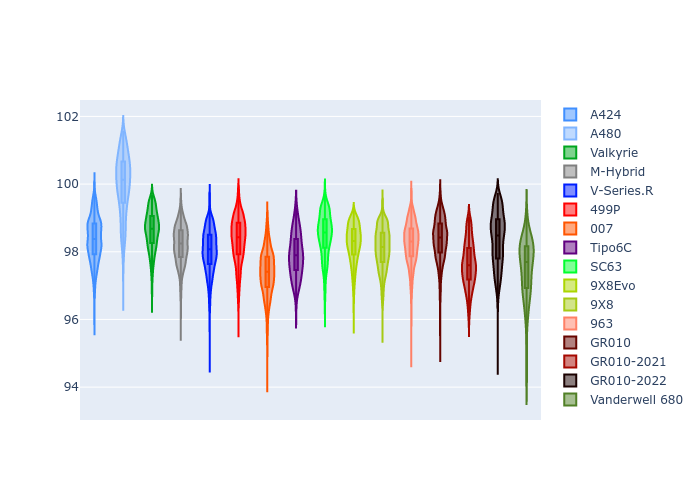
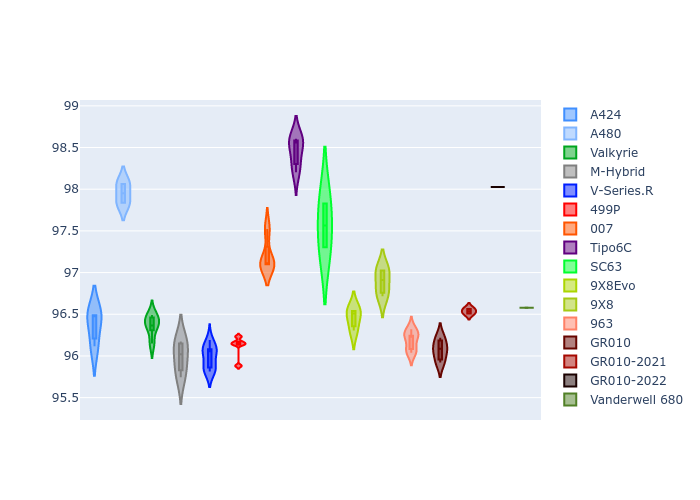
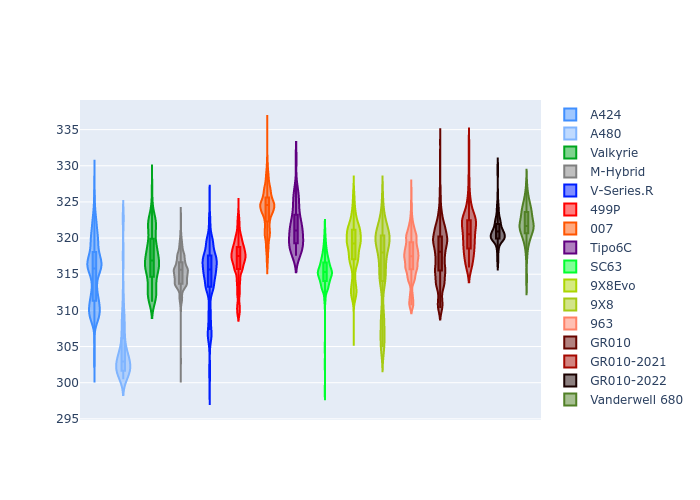
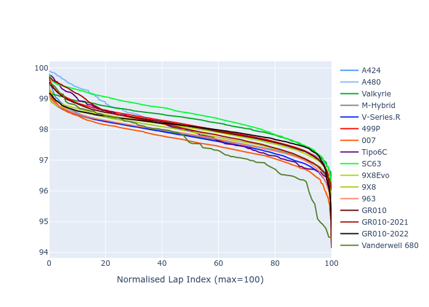

# Combined Plots

## Metadata

- BoP Accuracy: 98.53%
- Overall BoP Grade: A1
- Track: MONZA
- Threshhold: 250.0kph
- Average Laptime: 1:37.92
- Average Quali Laptime: 1:36.80
- Average Topspeed: 317.32kph

## BoP Table
| Manufacturer     | Car            | Weight   | Power   | PINC   | E/Stint   | FDS    | RDP    | QDP    | TDP    |
|:-----------------|:---------------|:---------|:--------|:-------|:----------|:-------|:-------|:-------|:-------|
| Alpine           | A424           | 1048kg   | 515.0kw | +0.70% | 910MJ     | -      | 51.64% | 59.31% | 26.80% |
| Alpine           | A480           | 992kg    | 420.0kw | +0.10% | 792MJ     | -      | 54.81% | 80.56% | 55.69% |
| Aston Martin     | Valkyrie       | 1030kg   | 520.0kw | -      | 911MJ     | -      | 53.50% | 53.33% | 21.51% |
| BMW              | M-Hybrid       | 1040kg   | 517.0kw | -      | 910MJ     | -      | 52.89% | 56.22% | 33.41% |
| Cadillac         | V-Series.R     | 1030kg   | 520.0kw | -      | 909MJ     | -      | 48.63% | 60.80% | 19.01% |
| Ferrari          | 499P           | 1065kg   | 503.0kw | -0.60% | 897MJ     | 190kph | 51.38% | 44.98% | 9.83%  |
| Glickenhaus      | 007            | 1003kg   | 533.0kw | -      | 924MJ     | -      | 46.15% | 49.30% | 41.45% |
| Isotta Fraschini | Tipo6C         | 1015kg   | 523.0kw | -      | 915MJ     | 190kph | 43.95% | 47.22% | 31.53% |
| Lamborghini      | SC63           | 1030kg   | 520.0kw | -1.60% | 905MJ     | -      | 48.33% | 60.95% | 28.65% |
| Peugeot          | 9X8Evo         | 1045kg   | 516.0kw | -1.00% | 901MJ     | 190kph | 48.87% | 52.78% | 15.41% |
| Peugeot          | 9X8            | 1036kg   | 524.0kw | -      | 916MJ     | 150kph | 54.54% | 58.39% | 9.69%  |
| Porsche          | 963            | 1043kg   | 514.0kw | +0.40% | 906MJ     | -      | 50.70% | 44.30% | 29.51% |
| Toyota           | GR010          | 1069kg   | 501.0kw | +1.10% | 904MJ     | 190kph | 51.09% | 52.71% | 11.46% |
| Toyota           | GR010-2021     | 1045kg   | 509.0kw | +0.10% | 954MJ     | 150kph | 53.89% | 50.91% | 25.87% |
| Toyota           | GR010-2022     | 1050kg   | 503.0kw | +0.10% | 894MJ     | 190kph | 53.24% | 64.49% | 9.72%  |
| Vanwall          | Vanderwell 680 | 980kg    | 539.0kw | -      | 924MJ     | -      | 35.83% | 59.29% | 34.15% |

## Performance Table
| Manufacturer     | Car            | RP      | QP      | Vavg      |   RDLC | BOP-Grade   | Match   |
|:-----------------|:---------------|:--------|:--------|:----------|-------:|:------------|:--------|
| Alpine           | A424           | 1:37.79 | 1:36.36 | 315.99kph |   1.01 | ~A1         | 99.57%  |
| Alpine           | A480           | 1:38.12 | 1:37.95 | 303.72kph |   1    | +A2         | 93.25%  |
| Aston Martin     | Valkyrie       | 1:38.27 | 1:36.36 | 317.94kph |   1.02 | ~A1         | 100.00% |
| BMW              | M-Hybrid       | 1:37.76 | 1:35.99 | 316.11kph |   1.02 | ~A1         | 100.00% |
| Cadillac         | V-Series.R     | 1:37.72 | 1:35.98 | 315.28kph |   1.02 | ~A1         | 99.93%  |
| Ferrari          | 499P           | 1:38.10 | 1:36.11 | 315.50kph |   1.02 | ~A1         | 99.34%  |
| Glickenhaus      | 007            | 1:37.57 | 1:37.20 | 324.01kph |   1    | ~A1         | 99.44%  |
| Isotta Fraschini | Tipo6C         | 1:37.83 | 1:38.46 | 321.46kph |   0.99 | ~A1         | 96.27%  |
| Lamborghini      | SC63           | 1:38.44 | 1:37.57 | 315.38kph |   1.01 | ~A1         | 98.18%  |
| Peugeot          | 9X8Evo         | 1:37.99 | 1:36.45 | 316.91kph |   1.02 | ~A1         | 100.00% |
| Peugeot          | 9X8            | 1:37.87 | 1:36.89 | 316.49kph |   1.01 | ~A1         | 99.96%  |
| Porsche          | 963            | 1:37.78 | 1:36.18 | 318.22kph |   1.02 | ~A1         | 99.88%  |
| Toyota           | GR010          | 1:38.07 | 1:36.07 | 316.79kph |   1.02 | ~A1         | 99.67%  |
| Toyota           | GR010-2021     | 1:37.96 | 1:36.54 | 320.55kph |   1.01 | ~A1         | 97.10%  |
| Toyota           | GR010-2022     | 1:38.04 | 1:38.03 | 321.07kph |   1    | ~A1         | 99.78%  |
| Vanwall          | Vanderwell 680 | 1:37.47 | 1:36.58 | 321.63kph |   1.01 | -A2         | 94.12%  |

## Race Laptimes

## Quali Laptimes

## Topspeeds

## Laptimes Lineplot

